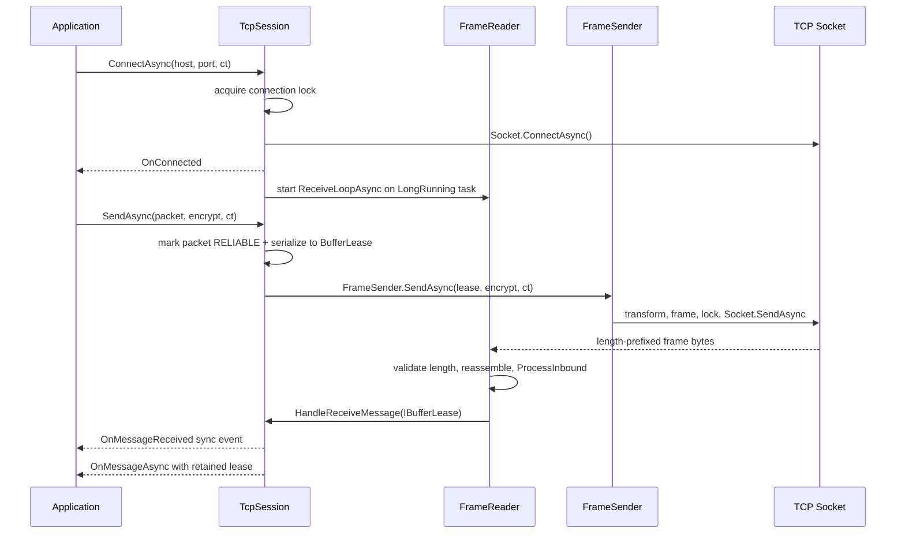

# TCP Session

`TcpSession` is the core TCP client transport in `Nalix.SDK`. It handles the full lifecycle of a client connection, including reconnection logic, packet serialization, framed transport, and asynchronous message dispatching.

!!! important "Client-side transport"
    `TcpSession` is a client-side transport. Do not use it in server listener code. Server TCP connections are owned by `Nalix.Network` listener/connection types and processed through `Nalix.Runtime`.

## Lifecycle Flow



## Source mapping

- `src/Nalix.SDK/Transport/TcpSession.cs`
- `src/Nalix.SDK/Transport/Internal/FrameReader.cs`
- `src/Nalix.SDK/Transport/Internal/FrameSender.cs`
- `src/Nalix.Framework/DataFrames/Transforms/FramePipeline.cs`

## Role and Design

`TcpSession` acts as a high-level wrapper around a raw socket, providing a packet-oriented interface. It integrates with `Nalix.Framework.Memory` to use pooled buffers, minimizing GC pressure for high-throughput clients.

- **Asynchronous Loop**: A background task continuously monitors the socket for incoming frames.
- **Unified Framing**: Shared with the server to ensure consistent `MagicNumber` and `Opcode` processing.
- **Error Handling**: Centralized `OnError` and `OnDisconnected` events for resilient client behavior.
- **Request Helpers**: `RequestAsync<TResponse>()` and the higher-level extension helpers handle subscribe-before-send request flows.

## Public API

### Events
| Member | Description |
|---|---|
| `OnConnected` | Raised when the socket connection is successfully established. |
| `OnDisconnected` | Raised when the connection is closed or lost. |
| `OnMessageReceived` | Synchronous event providing an `IBufferLease` for each frame. |
| `OnMessageAsync` | Asynchronous handler for low-latency or complex processing. |
| `OnError` | Reports general transport or protocol errors. |

### Methods
| Member | Description |
|---|---|
| `ConnectAsync(...)` | Establishes a connection to the primary or override destination. |
| `DisconnectAsync()` | Gracefully shuts down the connection. |
| `SendAsync(IPacket)` | Serializes and sends a packet with standard framing. |
| `SendAsync(payload)` | Sends raw binary data with required framing. |
| `RequestAsync<TResponse>(...)` | Sends a request and waits for a matching typed response. |
| `Dispose()` | Full resource cleanup and socket closure. |

## Basic usage

```csharp
var options = ConfigurationManager.Instance.Get<TransportOptions>();
var catalog = InstanceManager.Instance.GetExistingInstance<IPacketRegistry>();

using var client = new TcpSession(options, catalog);

client.OnConnected += (s, e) => Console.WriteLine("Connected!");
client.OnMessageReceived += (s, lease) => 
{
    using (lease) // Ensure lease return to pool
    {
        Console.WriteLine($"Received {lease.Length} bytes");
    }
};

await client.ConnectAsync();
await client.SendAsync(new LoginPacket { Username = "Ghost" });

var loginResponse = await client.RequestAsync<LoginResponse>(
    new LoginPacket { Username = "Ghost" },
    RequestOptions.Default.WithTimeout(5_000));
```

## Notes

- `OnMessageReceived` provides raw `IBufferLease` access. If you need typed packet handling, use the subscription helpers in [Subscriptions](./subscriptions.md).
- `RequestAsync<TResponse>()` subscribes before sending the packet, which avoids losing fast responses on low-latency servers.
- `OnMessageAsync` is optional and is best for fire-and-forget processing that can safely run on the background receive flow.

## Related APIs

- [SDK Overview](./index.md)
- [UDP Session](./udp-session.md)
- [Transport Session](./transport-session.md)
- [Transport Options](./options/transport-options.md)
