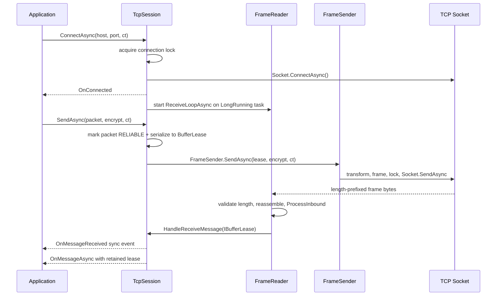

# TCP Session

`TcpSession` is the core TCP client transport in `Nalix.SDK`. It handles the full lifecycle of a client connection, including reconnection logic, packet serialization, framed transport, and asynchronous message dispatching.

!!! important "Client-side transport"
    `TcpSession` is a client-side transport. Do not use it in server listener code. Server TCP connections are owned by `Nalix.Network` listener/connection types and processed through `Nalix.Runtime`.

## Lifecycle Flow


```mermaid
sequenceDiagram
    participant A as Application
    participant S as TcpSession
    participant R as FrameReader
    participant W as FrameSender
    participant N as TCP Socket

    A->>S: ConnectAsync(host, port, ct)
    S->>S: acquire connection lock
    S->>N: Socket.ConnectAsync()
    S-->>A: OnConnected
    S->>R: start ReceiveLoopAsync on LongRunning task
    A->>S: SendAsync(packet, encrypt, ct)
    S->>S: mark packet RELIABLE + serialize to BufferLease
    S->>W: FrameSender.SendAsync(lease, encrypt, ct)
    W->>N: transform, frame, lock, Socket.SendAsync
    N-->>R: length-prefixed frame bytes
    R->>R: validate length, reassemble, ProcessInbound
    R->>S: HandleReceiveMessage(IBufferLease)
    S-->>A: OnMessageReceived sync event
    S-->>A: OnMessageAsync with retained lease
```

## Source mapping

- `src/Nalix.SDK/Transport/TcpSession.cs`
- `src/Nalix.SDK/Transport/Internal/FrameReader.cs`
- `src/Nalix.SDK/Transport/Internal/FrameSender.cs`
- `src/Nalix.Codec/Transforms/FramePipeline.cs`

## Role and Design

`TcpSession` acts as a high-level wrapper around a raw socket, providing a packet-oriented interface. It uses pooled `BufferLease` memory and the shared frame helpers to minimize GC pressure for high-throughput clients.

- **Asynchronous Loop**: `ConnectAsync(...)` starts a long-running receive task through `FrameReader.ReceiveLoopAsync(...)`.
- **Unified Framing**: Outbound and inbound payloads go through `FrameSender`, `FrameReader`, and `FramePipeline`.
- **Error Handling**: Centralized `OnError` and `OnDisconnected` events for resilient client behavior.
- **Request Helpers**: `RequestAsync<TResponse>()` and the higher-level extension helpers handle subscribe-before-send request flows.

## Public API

### Events

| Member | Description |
| --- | --- |
| `OnConnected` | Raised when the socket connection is successfully established. |
| `OnDisconnected` | Raised when the connection is closed or lost. |
| `OnMessageReceived` | Synchronous event providing an `IBufferLease` for each frame. |
| `OnMessageAsync` | Async callback receiving `ReadOnlyMemory<byte>` after the transport retains the underlying lease. |
| `OnError` | Reports general transport or protocol errors. |

### Methods

| Member | Description |
| --- | --- |
| `ConnectAsync(...)` | Establishes a connection to the primary or override destination. |
| `DisconnectAsync()` | Gracefully shuts down the connection. |
| `SendAsync(IPacket)` | Serializes and sends a packet with standard framing. |
| `SendAsync(payload)` | Sends raw binary data with required framing. |
| `RequestAsync<TResponse>(...)` | Sends a request and waits for a matching typed response. |
| `Dispose()` | Full resource cleanup and socket closure. |

## Basic usage

```csharp
var options = ConfigurationManager.Instance.Get<TransportOptions>();
// 1. Build the packet registry (populated by Source Generators)
PacketRegistry.Build();
var catalog = PacketRegistry.Instance;

using var client = new TcpSession(options, catalog);

client.OnConnected += (s, e) => Console.WriteLine("Connected!");
client.OnMessageReceived += (s, lease) => 
{
    Console.WriteLine($"Received {lease.Length} bytes");
};

await client.ConnectAsync();
await client.HandshakeAsync();
await client.SendAsync(new LoginPacket { Username = "Ghost" });

var loginResponse = await client.RequestAsync<LoginResponse>(
    new LoginPacket { Username = "Ghost" },
    RequestOptions.Default.WithTimeout(5_000));
```

## Notes

- `OnMessageReceived` provides raw `IBufferLease` access. Do not dispose the original lease inside the handler unless you first called `Retain()`; `src/Nalix.SDK/Transport/TcpSession.cs` keeps ownership of the original callback lifetime.
- `RequestAsync<TResponse>()` subscribes before sending the packet, which avoids losing fast responses on low-latency servers.
- `OnMessageAsync` is optional and receives `lease.Memory`, not a packet object. Use it for custom async processing on the receive flow.

## Related APIs

- [SDK Overview](./index.md)
- [UDP Session](./udp-session.md)
- [Transport Session](./transport-session.md)
- [Transport Options](../options/sdk/transport-options.md)
