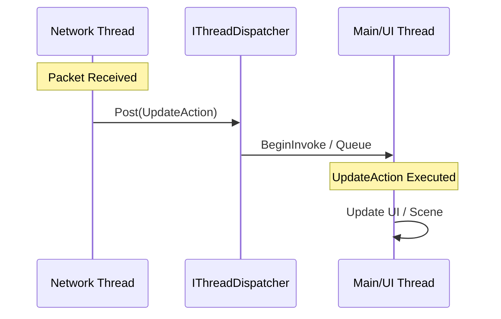

# Thread Dispatching

`Nalix.SDK` uses a lightweight `IThreadDispatcher` interface to bridge the gap between high-performance background networking threads and single-threaded application contexts like UI frameworks or game engines.

## Dispatch Flow



## Source mapping

- `src/Nalix.SDK/IThreadDispatcher.cs`
- `src/Nalix.SDK/InlineDispatcher.cs`

## Role and Design

Networking in Nalix is naturally asynchronous and runs on dedicated background threads. However, most UI frameworks (WPF, MAUI, WinForms) and game engines (Unity, Godot) restrict state changes to a specific "Main Thread".

`IThreadDispatcher` provides a clean abstraction to marshal these background callbacks back to the safe thread without coupling the core SDK to any specific platform.

- **Minimal Surface**: Only one method (`Post`) to maintain maximum compatibility.
- **Pluggable**: Easily swap between platform-specific dispatchers during application startup.
- **Transparent**: The `InlineDispatcher` is provided for headless or console applications where thread marshalling is unnecessary.

## Implementation Examples

### Unity (Main Thread)
```csharp
public sealed class UnityDispatcher : IThreadDispatcher
{
    public void Post(Action action) => UnityMainThreadDispatcher.Enqueue(action);
}
```

### .NET MAUI
```csharp
public sealed class MauiDispatcher : IThreadDispatcher
{
    public void Post(Action action) => MainThread.BeginInvokeOnMainThread(action);
}
```

### WPF / WinForms (SynchronizationContext)
```csharp
public sealed class SynchronizationContextDispatcher : IThreadDispatcher
{
    private readonly SynchronizationContext _context = SynchronizationContext.Current;

    public void Post(Action action) => _context.Post(_ => action(), null);
}
```

## Basic usage

```csharp
IThreadDispatcher dispatcher = GetPlatformDispatcher();

client.OnMessageReceived += (s, lease) => 
{
    // We are on a background thread here
    dispatcher.Post(() => 
    {
        // Now safely on the Main Thread
        myLabel.Text = "Updated!";
    });
};
```

## Common pitfalls

- **Direct UI Mutation**: Forgetting to use `Post` and touching UI components directly will typically cause a cross-thread exception or a silent crash.
- **Deadlocks**: Avoid using `BlockingCollection` or synchronous waits inside the dispatched action.
- **Capturing Scoped Data**: Be careful when capturing variables in the `Post` lambda; ensure they are still valid when the action eventually runs.

## Related APIs

- [SDK Overview](./index.md)
- [TCP Session](./tcp-session.md)
- [Handshake Extensions](./handshake-extensions.md)
