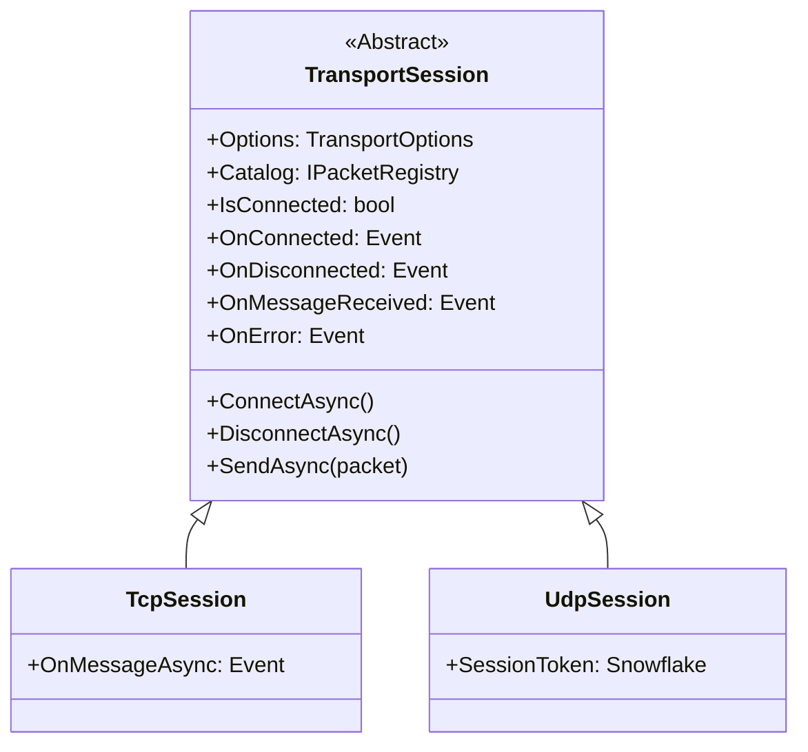

# Transport Session

`TransportSession` is the primary abstract contract for all client-side transport implementations in `Nalix.SDK`. It defines a unified lifecycle for connecting, disconnecting, and exchanging framed messages, allowing application logic to remain agnostic of the underlying protocol (TCP vs UDP).

## Inheritance Hierarchy

## Source mapping

- `src/Nalix.SDK/Transport/TransportSession.cs`

## Role and Design

The abstract session provides the glue between the high-level application events and the low-level byte-oriented socket operations. By depending on `TransportSession` instead of a concrete class, features like request matching, subscriptions, and diagnostic logging can be implemented once and reused across different transport types.

- **Unified Lifecycle**: All transport sessions follow a standard `Connect` -> `Send/Receive` -> `Disconnect` -> `Dispose` pattern.
- **Pooled Buffers**: Integration with `IBufferLease` ensures that message payloads are handled with minimal heap allocations.
- **Pluggable Protocols**: Easily switch between standard TCP for reliability and UDP for performance-critical updates.

## API Reference

### Properties
| Member | Description |
|---|---|
| `Options` | Read-only access to the `TransportOptions` configured at construction. |
| `Catalog` | Access to the `IPacketRegistry` used to resolve packet metadata. |
| `IsConnected` | Thread-safe check of the current connection status. |

### Events
| Member | Description |
|---|---|
| `OnConnected` | Raised when the transport bridge is successfully established. |
| `OnDisconnected` | Raised when the connection is intentionally closed or unexpectedly dropped. |
| `OnMessageReceived` | Surfaces decrypted and decompressed payload for each inbound frame. |
| `OnError` | Reports general transport or protocol errors. |

### Methods
| Member | Description |
|---|---|
| `ConnectAsync(...)` | Initiates the connection sequence. |
| `DisconnectAsync()` | Orchestrates a graceful shutdown. |
| `SendAsync(IPacket)` | Serializes and frames a packet for transport. |
| `SendAsync(payload)` | Frames and sends a raw binary payload. |

## Related APIs

- [TCP Session](./tcp-session.md)
- [UDP Session](./udp-session.md)
- [SDK Overview](./index.md)
- [Transport Options](./options/transport-options.md)
