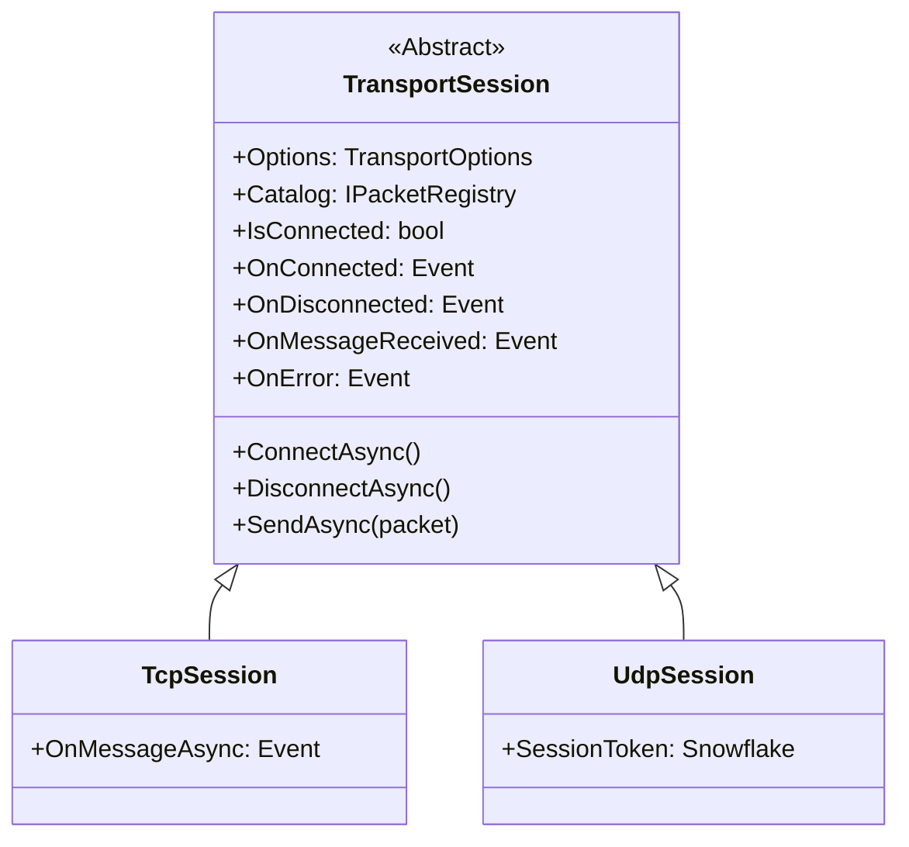

# Transport Session

`TransportSession` is the abstract client transport contract used by `Nalix.SDK`. It gives the SDK a common shape for connection state, packet registry access, raw packet sends, and receive-event wiring, while concrete sessions add protocol-specific behavior.

## Inheritance Hierarchy

## Source mapping

- `src/Nalix.SDK/Transport/TransportSession.cs`

## Role and Design

The abstract session sits between application code and the socket layer. It keeps higher-level code focused on packets instead of byte buffers, and it lets the SDK build request/response helpers, subscriptions, handshake flows, and diagnostics on top of the same contract.

- **Unified lifecycle**: `ConnectAsync()` -> send/receive -> `DisconnectAsync()` -> `Dispose()`.
- **Shared packet registry**: `Catalog` resolves packet types for both raw and typed helpers.
- **Raw and typed receive paths**: `OnMessageReceived` exposes `IBufferLease`, while typed helpers like `On<T>()` and `RequestAsync<TResponse>()` live in extension APIs.
- **Protocol-specific overrides**: `TcpSession` adds reliable stream semantics, while `UdpSession` stays datagram-oriented.

## API Reference

### Properties

| Member | Description |
| --- | --- |
| `Options` | Read-only access to the `TransportOptions` configured at construction. |
| `Catalog` | Access to the `IPacketRegistry` used to resolve packet metadata. |
| `IsConnected` | Thread-safe check of the current connection status. |

### Events

| Member | Description |
| --- | --- |
| `OnConnected` | Raised when the transport bridge is successfully established. |
| `OnDisconnected` | Raised when the connection is intentionally closed or unexpectedly dropped. |
| `OnMessageReceived` | Surfaces decrypted and decompressed payload for each inbound frame. |
| `OnError` | Reports general transport or protocol errors. |

### Methods

| Member | Description |
| --- | --- |
| `ConnectAsync(...)` | Initiates the connection sequence. |
| `DisconnectAsync()` | Orchestrates a graceful shutdown. |
| `SendAsync(IPacket, CancellationToken)` | Serializes and frames a packet for transport. |
| `SendAsync(IPacket, bool? encrypt, CancellationToken)` | Serializes and frames a packet with optional encryption override. |
| `SendAsync(ReadOnlyMemory<byte>, bool? encrypt, CancellationToken)` | Frames and sends a raw binary payload with optional encryption override. |

### Extension Methods

| Member | Description |
| --- | --- |
| `RequestAsync<TResponse>(...)` | Sends a request and waits for a matching typed response. Defined in `RequestExtensions`. |

## Related APIs

- [TCP Session](./tcp-session.md)
- [UDP Session](./udp-session.md)
- [SDK Overview](./index.md)
- [Subscriptions](./subscriptions.md)
- [Request Options](../options/sdk/request-options.md)
- [Transport Options](../options/sdk/transport-options.md)
