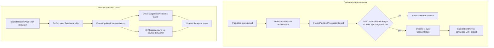

# UDP Session

`UdpSession` is a high-performance, datagram-oriented client transport in `Nalix.SDK`. It is designed for low-latency scenarios where packet loss is acceptable but speed is critical. It uses a 7-byte session token mechanism to allow the server to multiplex thousands of concurrent UDP streams.

!!! important "Client-side datagram transport"
    `UdpSession` is a client-side datagram transport. Server UDP receive paths should use `Nalix.Network` UDP listeners, not SDK sessions.

## Datagram Architecture



## Source mapping

- `src/Nalix.SDK/Transport/UdpSession.cs`
- `src/Nalix.Framework/DataFrames/Transforms/FramePipeline.cs`
- `src/Nalix.Framework/DataFrames/Transforms/PacketCipher.cs`
- `src/Nalix.Framework/DataFrames/Transforms/PacketCompression.cs`

## Role and Design

Unlike TCP, `UdpSession` is connectionless at the socket level but "session-aware" at the framework level. Every outbound datagram is prepended with a 7-byte `Snowflake` identifier, which the server uses to map the packet to a trusted session.

- **Zero-Allocation Receive**: Uses pooled `BufferLease` memory and direct `ReceiveAsync` to eliminate per-datagram allocations.
- **MTU Enforcement**: Automatically prevents sending datagrams larger than `MaxUdpDatagramSize` (default: 1400 bytes) to avoid IP fragmentation.
- **AEAD Integrated**: Automatically applies encryption if configured, utilizing the shared `FramePipeline` (Framework layer).
- **Fail-Safe Cleanup**: Socket or receive-loop errors force a disconnect so the session never stays half-open.

## Public API

### Events

| Member | Description |
| --- | --- |
| `OnConnected` | Raised when the UDP socket is initialized and bound to the remote endpoint. |
| `OnMessageReceived` | Surfaces decrypted and decompressed payload for each inbound datagram. |
| `OnError` | Reports socket or transformation faults. |
| `OnDisconnected` | Uses `NetworkException` to report transport-level disconnects consistently. |

### Properties

| Member | Description |
| --- | --- |
| `SessionToken` | The 7-byte identifier used to authenticate outbound datagrams. |
| `IsConnected` | True if the socket is open and bound. |
| `Options` | Access to transport options like `MaxUdpDatagramSize` and `Secret`. |

### Methods

| Member | Description |
| --- | --- |
| `ConnectAsync(...)` | Initializes the socket and binds to the server address. |
| `DisconnectAsync()` | Shuts down the socket and stops the receive loop. |
| `SendAsync(IPacket)` | Serializes, transforms (encrypts/compresses), and sends the packet. |

## Basic usage

```csharp
var client = new UdpSession(options, catalog);

// Essential: must match the session identifier assigned during TCP login
client.SessionToken = mySessionSnowflake;

client.OnMessageReceived += (s, lease) => 
{
    using (lease)
    {
        // Handle low-latency update
    }
};

await client.ConnectAsync();
await client.SendAsync(new PlayerInputPacket { Velocity = 1.0f });
```

## Related APIs

- [SDK Overview](./index.md)
- [TCP Session](./tcp-session.md)
- [Transport Session](./transport-session.md)
- [Transport Options](./options/transport-options.md)
