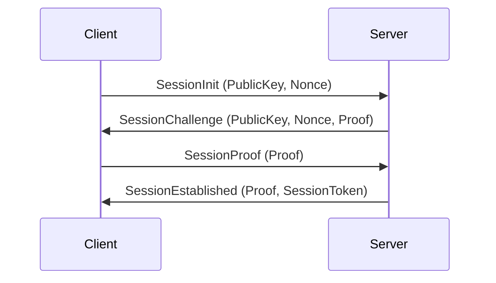

# Handshake

Nalix implements an authenticated X25519-based handshake using session protocol frames (`SessionInit`, `SessionChallenge`, `SessionProof`, `SessionEstablished`), `HandshakeHandlers` on the server, and `HandshakeExtensions` on the SDK side.

## Source Mapping

- `src/Nalix.Codec/ProtocolFrames/Session/SessionInit.cs`
- `src/Nalix.Codec/ProtocolFrames/Session/SessionChallenge.cs`
- `src/Nalix.Codec/ProtocolFrames/Session/SessionProof.cs`
- `src/Nalix.Codec/ProtocolFrames/Session/SessionEstablished.cs`
- `src/Nalix.Codec/ProtocolFrames/Session/SessionTofu.cs`
- `src/Nalix.Codec/Security/HandshakeX25519.cs`
- `src/Nalix.Runtime/Handlers/HandshakeHandlers.cs`
- `src/Nalix.SDK/Transport/Extensions/HandshakeExtensions.cs`

## 1. Handshake Flow

The handshake is a 4-message exchange using dedicated session protocol frames managed by `HandshakeHandlers`.

| Step | Direction | Frame | Key Payload |
| --- | --- | --- | --- |
| 1 | Client → Server | `SessionInit` | `PublicKey` (ephemeral), `Nonce` |
| 2 | Server → Client | `SessionChallenge` | `PublicKey` (ephemeral), `Nonce`, `Proof` |
| 3 | Client → Server | `SessionProof` | `Proof` |
| 4 | Server → Client | `SessionEstablished` | `Proof`, `SessionToken` |



---

## 2. Trust on First Use (TOFU)

If the client's `TransportOptions.ServerPublicKey` is empty or null, the client executes a TOFU flow before the X25519 handshake:

1. The client sends a `SessionTofu` request to the server.
2. The server replies with `SessionTofu` containing its static public key.
3. The client validates and stores the server public key in `ConfigurationManager` for future connections.
4. With the server public key available, the client proceeds with the standard handshake sequence.

---

## 3. Cryptographic Construction

`HandshakeX25519` derives the master secret, transcript hash, proofs, and final session key used by the transport after a successful handshake.

### Hashing Strategy (`HandshakeX25519`)

The protocol derives its master secret from:

- ephemeral-ephemeral agreement
- static-ephemeral agreement against the pinned server key

| Purpose | Label | Components |
| --- | --- | --- |
| **Master Secret** | `nalix-handshake/master-secret` | `SharedSecret_EE`, `SharedSecret_SE` |
| **Server Proof** | `nalix-handshake/server-proof` | `MasterSecret`, `TranscriptHash` |
| **Client Proof** | `nalix-handshake/client-proof` | `MasterSecret`, `TranscriptHash` |
| **Server Finish** | `nalix-handshake/server-finish` | `MasterSecret`, `TranscriptHash` |
| **Session Key** | `nalix-handshake/session` | `MasterSecret`, `ClientNonce`, `ServerNonce`, `TranscriptHash` |

---

## 4. Server Implementation

The server-side state machine is implemented in `HandshakeHandlers`. It tracks negotiation state through `connection.Attributes`, specifically `ConnectionAttributes.HandshakeState` during the handshake and `ConnectionAttributes.HandshakeEstablished` once the handshake completes.

### Handler Methods

- `HandleSessionInitAsync(IPacketContext<SessionInit>)`: Processes `SessionInit`, generates server ephemeral keys, computes shared secret, replies with `SessionChallenge`.
- `HandleSessionProofAsync(IPacketContext<SessionProof>)`: Verifies client proof, derives session key, sets `connection.Secret` and `connection.Algorithm`, persists session state, replies with `SessionEstablished`.

### Cryptographic Methods (`HandshakeX25519`)

- `ComputeMasterSecret(Bytes32, Bytes32)`: Combines ephemeral-ephemeral and static-ephemeral shared secrets into the master secret.
- `ComputeServerProof(Bytes32, Bytes32)`: Generates the proof for `SessionChallenge`.
- `ComputeClientProof(Bytes32, Bytes32)`: Generates the proof for `SessionProof`.
- `ComputeServerFinishProof(Bytes32, Bytes32)`: Generates the final acknowledgement proof for `SessionEstablished`.
- `DeriveSessionKey(Bytes32, Bytes32, Bytes32, Bytes32)`: Derives the 32-byte session key from the shared secret, client nonce, server nonce, and transcript hash.
- `ComposeTranscriptBuffer(Bytes32, Bytes32, Bytes32, Bytes32)`: Composes the raw transcript buffer from public keys and nonces. Callers should wipe the returned buffer after hashing.
- `ComputeTranscriptHash(Bytes32, Bytes32, Bytes32, Bytes32)`: Computes the handshake transcript hash from public keys and nonces, securely clearing the temporary buffer.

### Handling Logic

Upon `SessionProof` verification, the handler:

1. Derives the 32-byte session key.
2. Sets `connection.Secret` and `connection.Algorithm` (ChaCha20Poly1305).
3. Marks the connection as established through the built-in connection attribute key.
4. Persists resumable session state through `IConnectionHub.SessionService.SaveSessionAsync(connection)` when a hub is available.
5. Returns a `SessionToken` to the client in `SessionEstablished`.

---

## 5. Client SDK Usage

The `Nalix.SDK` provides an automated extension to perform the handshake after connection.

```csharp
using Nalix.SDK.Transport;
using Nalix.SDK.Transport.Extensions;

await session.ConnectAsync("127.0.0.1", 5000);

// Executes the X25519 handshake flow (performs TOFU if no public key is pinned)
await session.HandshakeAsync(cancellationToken);

// Session is now transparently encrypted
await session.SendAsync(new SecurePacket());
```

---

## 6. Security Notes

- **Identity Authentication**: By configuring `ServerPublicKey` on the client and a server certificate path on the server, the handshake performs a key agreement that lets the client pin the server identity. **Anonymous handshakes are strictly forbidden** to prevent MitM attacks.
- **Mandatory Identity**: The client must be configured with `TransportOptions.ServerPublicKey` to pin the server identity. On the server, the identity key is loaded from `certificate.private` in the configuration directory by default, or from a custom path supplied through hosting configuration.
- **Structural Validation**: All session frames implement `IPacketValidatable` to prevent malformed packets or stage confusion attacks before any cryptography is performed.
- **Pooled packets**: Server replies are created through `PacketBase<T>.Create()` (pooled) in `src/Nalix.Runtime/Handlers/HandshakeHandlers.cs`.
- **Transcript Integrity**: Any modification to keys or nonces during transit will cause a `TranscriptHash` mismatch, resulting in an immediate `ProtocolReason.CHECKSUM_FAILED` rejection.
- **Resume Token**: The handshake finish sets `SessionToken` in `SessionEstablished`. Treat the token as resumable session state, not as a cryptographic secret by itself.

---

## Related Topics

- [AEAD & Envelope Encryption](./aead-and-envelope.md)
- [X25519 Primitives](./cryptography.md)
- [Snowflake Identifiers](../framework/snowflake.md)
- [Session Resume](./session-resume.md)
