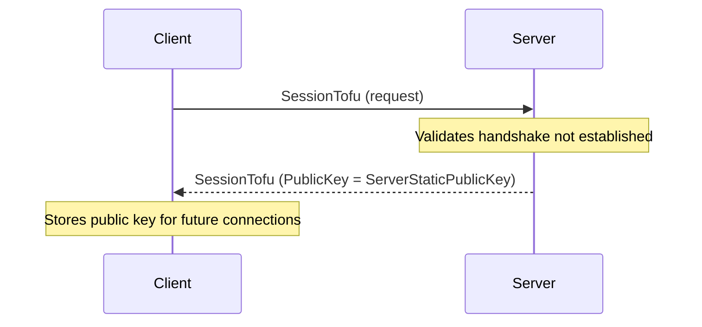

# Trust-On-First-Use (TOFU) Key Exchange

The TOFU key exchange allows clients to retrieve the server's static public key before initiating the X25519 handshake. This uses the `SessionTofu` protocol frame.

## Source Mapping

- `src/Nalix.Codec/ProtocolFrames/Session/SessionTofu.cs`
- `src/Nalix.Runtime/Handlers/HandshakeHandlers.cs`

## Overview

The TOFU flow occurs at the very beginning of connection establishment, before the handshake. It is needed when the client does not yet have the server's static public key pinned in `TransportOptions.ServerPublicKey`.

If a client attempts TOFU after a handshake has already been established, the server rejects the request.

### Protocol Flow



## API Reference

### SessionTofu Packet

`SessionTofu` is a Trust-On-First-Use packet where the server returns its static public key.

```csharp
namespace Nalix.Codec.ProtocolFrames;

[Packet]
[GenerateFormatter]
[SerializePackable(SerializeLayout.Explicit)]
public sealed partial class SessionTofu : PacketBase<SessionTofu>, IFixedSizeSerializable, IPacketValidatable
```

#### Properties

* `PublicKey` (`Bytes32`) — the server's static public key (populated in the server response).

#### Methods

* `Initialize(Bytes32 publicKey)` — sets opcode (`SYSTEM_CONTROL`), priority, flags, and public key.
* `Validate(out string?)` — ensures `PublicKey` is not zero.

## Client-Side Usage

The TOFU flow is typically handled automatically by `HandshakeExtensions.HandshakeAsync()` when `TransportOptions.ServerPublicKey` is not configured. The SDK manages the key exchange, stores the received public key in `ConfigurationManager`, and then proceeds with the standard handshake.

```csharp
// If ServerPublicKey is not set, HandshakeAsync will perform TOFU automatically
await session.HandshakeAsync(cancellationToken);
```

## See Also

* [Handshake Protocol](handshake.md)
* [Session Resume](./session-resume.md)
