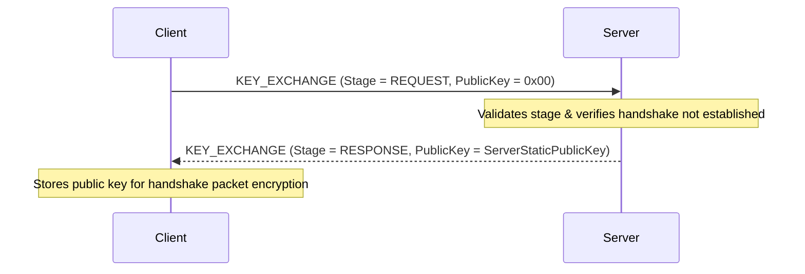

# Key Exchange Protocol

The Key Exchange protocol implements a Trust-On-First-Use (TOFU) cryptographic exchange model that allows clients to securely retrieve the server's public key prior to initiating a handshake session.

## Overview

The Key Exchange process occurs at the very beginning of connection establishment, before the handshake has occurred. It is a prerequisite for security handshakes because the client needs the server's static public key to encrypt the handshake request frame (typically under algorithms like Curve25519 / ChaCha20-Poly1305).

If a client requests a key exchange after a handshake has already been established, the server will flag this as a state violation and immediately disconnect the connection.

### Protocol Flow



## API Reference

### KeyExchange Packet

The packet layout is explicitly serialized for maximum efficiency.

```csharp
namespace Nalix.Codec.ProtocolFrames;

[Packet]
[SerializePackable(SerializeLayout.Explicit)]
public sealed class KeyExchange : PacketBase<KeyExchange>, IFixedSizeSerializable, IPacketValidatable
```

#### Properties

* `public KeyExchangeStage Stage { get; set; }`  
  Gets or sets the current stage of the key exchange sequence.

* `public Bytes32 PublicKey { get; set; }`  
  Gets or sets the public key payload (only populated by the server in the `RESPONSE` stage).

#### Methods

* `public void Initialize(KeyExchangeStage stage, Bytes32 publicKey = default)`  
  Helper to set opcode (`ProtocolOpCode.KEY_EXCHANGE`), priority, flags, stage, and public key.

* `public bool Validate(out string? failureReason)`  
  Ensures that:

  - In `REQUEST` stage, `PublicKey` is all zeroes.
  - In `RESPONSE` stage, `PublicKey` is NOT all zeroes.

---

### KeyExchangeStage Enum

```csharp
namespace Nalix.Codec.ProtocolFrames;

public enum KeyExchangeStage : byte
{
    NONE = 0x00,
    REQUEST = 0x01,
    RESPONSE = 0x02
}
```

---

### KeyExchangeHandlers Class

The runtime controller class that intercepts the key exchange packets.

```csharp
namespace Nalix.Runtime.Handlers;

[PacketController("Lib.KeyExchange")]
public sealed class KeyExchangeHandlers
```

#### Methods

* `[ReservedOpcodePermitted]`  
  `[PacketEncryption(false)]`  
  `[PacketPermission(PermissionLevel.NONE)]`  
  `[PacketOpcode((ushort)ProtocolOpCode.KEY_EXCHANGE)]`  
  `public static async ValueTask HandleAsync(IPacketContext<KeyExchange> context)`  
  Processes incoming key exchange requests. If the client sends a `REQUEST` stage, the server replies with a `RESPONSE` stage containing `HandshakeHandlers.ServerPublicKey`. If any other stage is sent or if a handshake has already been completed, the server disconnects the client.

## Usage Example

### Client-Side Key Exchange Retrieval

The following example shows how a client SDK or custom client requests the key exchange:

```csharp
using System;
using System.Threading.Tasks;
using Nalix.Abstractions.Networking.Packets;
using Nalix.Codec.ProtocolFrames;
using Nalix.SDK.Transport;

public async Task RetrieveServerKeyAsync(WebSocketSession session)
{
    var request = new KeyExchange();
    request.Initialize(KeyExchangeStage.REQUEST);

    // Register a one-time message handler or await the specific frame
    await session.SendAsync(request);
    
    // Once KEY_EXCHANGE Response is received:
    // Bytes32 serverKey = response.PublicKey;
}
```

## See Also

* [Handshake Protocol](handshake.md)
* [WebSocket Connection](../network/websocket-connection.md)
