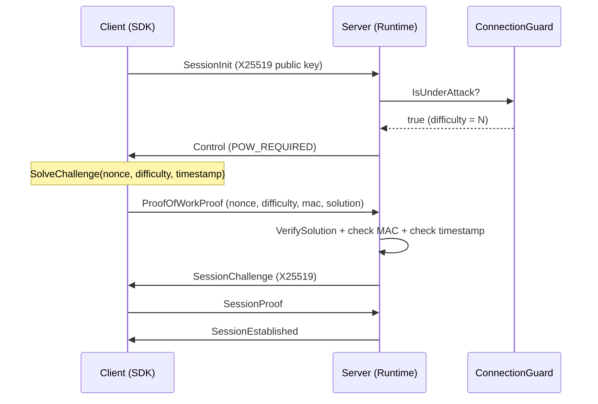

# Proof-of-Work

Nalix includes an adaptive Proof-of-Work (PoW) system as an anti-DDoS mechanism integrated into the handshake flow. When the server detects elevated connection rates, it requires clients to solve a cryptographic puzzle before establishing a session.

## Source Mapping

- `src/Nalix.Codec/Security/ProofOfWork.cs` — Challenge generation and solution verification
- `src/Nalix.Codec/Security/ProofOfWorkSolver.cs` — Client-side puzzle solver
- `src/Nalix.Codec/ProtocolFrames/Security/ProofOfWorkChallenge.cs` — Challenge packet
- `src/Nalix.Codec/ProtocolFrames/Security/ProofOfWorkProof.cs` — Proof packet
- `src/Nalix.Abstractions/Security/IProofOfWorkPolicy.cs` — Dynamic difficulty interface
- `src/Nalix.Runtime/Handlers/ProofOfWorkHandlers.cs` — Server-side proof verification handler
- `src/Nalix.Network/RateLimiting/Connection.Guard.cs` — Implements `IProofOfWorkPolicy`

## How It Works

### Adaptive Difficulty

`ConnectionGuard` implements `IProofOfWorkPolicy`. It computes PoW difficulty from the EWMA (exponentially weighted moving average) connection rate:

```text
rate <= AdaptivePowStartRate  →  difficulty = AdaptivePowMinDifficulty (trivial or zero)
rate >= AdaptivePowMaxRate    →  difficulty = AdaptivePowMaxDifficulty
otherwise                     →  linear interpolation
```

When difficulty exceeds the minimum, `IsUnderAttack` returns `true` and the handshake flow enforces PoW.

### Challenge-Response Flow



### Challenge Construction

The server generates a challenge bound to the specific connection:

- **Nonce**: 32 random bytes (CSPRNG)
- **Difficulty**: Number of required leading zero bits in the Keccak-256 hash
- **Timestamp**: Current `Environment.TickCount64`
- **MAC**: HMAC-Keccak-256 over `(Nonce | Difficulty | Timestamp | ConnectionId)` to prevent forgery

### Client Solver

The client brute-forces a `long` counter appended to the puzzle payload until the Keccak-256 hash has the required leading zero bits:

```csharp
long solution = ProofOfWorkSolver.SolveChallenge(
    nonce: challenge.Nonce.AsSpan(),
    difficulty: challenge.Difficulty,
    timestampTicks: challenge.TimestampTicks);
```

!!! warning "Blocking call"
    `SolveChallenge` blocks until a solution is found. On a typical client (~500 hashes/ms), difficulty 16 takes ~130 seconds. Difficulty 20 takes ~35 minutes. Use difficulty values appropriate for your client hardware.

### Server Verification

The server verifies:

1. **MAC validity** — ensures the challenge was generated by the server for this connection
2. **Timestamp freshness** — rejects proofs older than 30 seconds or with future timestamps
3. **Mathematical solution** — Keccak-256 hash of the puzzle payload has the required leading zero bits

On success, `connection.Level` is set to `PermissionLevel.POW_VERIFIED`.

### Protocol Packets

| Packet | OpCode | Direction | Fields |
| --- | --- | --- | --- |
| `ProofOfWorkChallenge` | `POW_CHALLENGE` | Server → Client | `Nonce`, `Difficulty`, `TimestampTicks`, `Mac` |
| `ProofOfWorkProof` | `POW_PROOF` | Client → Server | `Nonce`, `Difficulty`, `TimestampTicks`, `Mac`, `Solution` |

## Configuration

PoW is configured through `ConnectionQuotaOptions`:

| Property | Default | Description |
| --- | ---: | --- |
| `EnableAdaptiveMode` | `false` | Enables adaptive PoW difficulty scaling |
| `AdaptivePowMinDifficulty` | `0` | Minimum difficulty (0 = disabled) |
| `AdaptivePowMaxDifficulty` | `24` | Maximum difficulty under DDoS |
| `AdaptivePowStartRate` | `10` | Connection rate (req/s) to begin scaling |
| `AdaptivePowMaxRate` | `100` | Connection rate (req/s) for max difficulty |

## Security Notes

- The PoW challenge is stateless — no server-side storage is needed per challenge
- The HMAC key is generated once per process via CSPRNG and kept in memory
- The MAC binds the challenge to the specific `ConnectionId`, preventing cross-connection replay
- The timestamp window (30 seconds past, 5 seconds future) limits the challenge lifetime
- The `POW_PROOF` handler only processes reliable (TCP) transports to prevent replay
- Difficulty 0 is treated as trivial (skip verification)

## Related APIs

- [Connection Quota Options](../options/network/connection-quota-options.md)
- [Permission Levels](./permission-level.md)
- [Connection Guard](../network/connection/connection-guard.md)
- [Handshake Protocol](./handshake.md)
