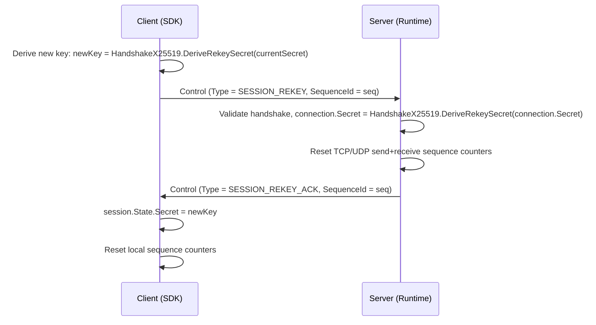

# Session Rekey

Session rekey allows mid-session symmetric key rotation to prevent sequence counter overflows and limit the cryptographic exposure window of long-lived connections.

## Source Mapping

- `src/Nalix.SDK/Transport/Extensions/RekeyExtensions.cs` — Client SDK extension
- `src/Nalix.Runtime/Handlers/SystemControlHandlers.cs` — Server-side control handler

## How It Works

### Key Rotation Flow



### When to Rekey

- **Sequence counter overflow**: 16-bit sequence counters wrap after 65,535 frames. Rekey resets them.
- **Exposure window reduction**: Rotating keys limits the data encrypted under a single key.
- **Long-lived sessions**: Game servers, IoT connections, and persistent dashboards should rekey periodically.

### Client-Side Usage

The SDK provides `RekeyAsync()` on `TransportSession`:

```csharp
using Nalix.SDK.Transport;

// Rekey after every 50,000 packets or on a timer
await session.RekeyAsync();
```

The extension method:

1. Derives the new session key from the current secret using HKDF.
2. Sends a `Control` packet with `Type = SESSION_REKEY`.
3. Awaits the `SESSION_REKEY_ACK` from the server (correlated by `SequenceId`).
4. Switches the local session secret and resets sequence counters.

### Server-Side Behavior

The `SystemControlHandlers.HandleSessionRekey` handler:

1. Confirms the handshake has been established (`ConnectionAttributes.HandshakeEstablished`).
2. Computes the next key generation: `connection.Secret = HandshakeX25519.DeriveRekeySecret(connection.Secret)`.
3. Resets TCP and (if applicable) UDP send/receive sequence counters.
4. Responds with `Control(SESSION_REKEY_ACK)` using the same `SequenceId` for correlation.

### Protocol Packet

| Packet | OpCode | Direction | Fields |
| --- | --- | --- | --- |
| `Control` | `SYSTEM_CONTROL` | Client → Server | `Type = SESSION_REKEY`, `SequenceId` |
| `Control` | `SYSTEM_CONTROL` | Server → Client | `Type = SESSION_REKEY_ACK`, `SequenceId` matches request |

## Security Notes

- The control packet travels encrypted (`[PacketEncryption(true)]` on connection) — it travels under the current session cipher.
- Both parties derive the new key using HKDF-Expand with a static label `nalix-session/rekey`. No keys are sent directly over the wire, providing perfect forward secrecy for session rekeying.
- Only reliable (TCP) transport is accepted for Rekey signals.
- If the handshake has not been established, the connection is disconnected immediately.
- Sequence counter reset prevents stale or replayed frames from the previous key period from being accepted.

## Related APIs

- [Session Resume](./session-resume.md)
- [Handshake Protocol](./handshake.md)
- [AEAD and Envelope](./aead-and-envelope.md)
