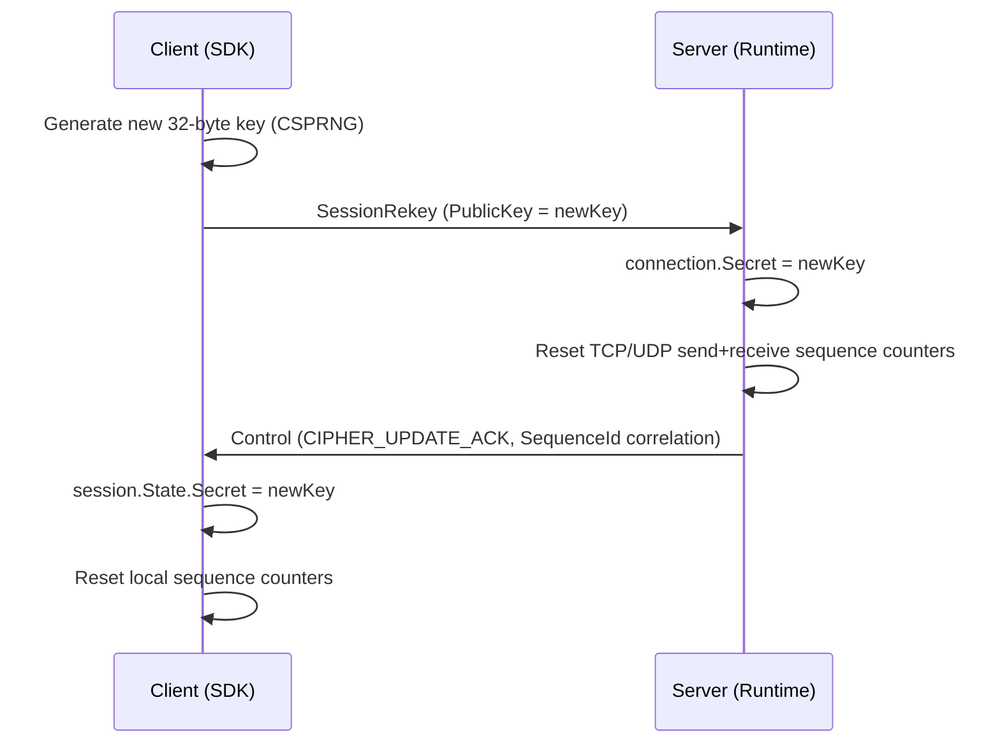

# Session Rekey

Session rekey allows mid-session symmetric key rotation to prevent sequence counter overflows and limit the cryptographic exposure window of long-lived connections.

## Source Mapping

- `src/Nalix.Codec/ProtocolFrames/Session/SessionRekey.cs` — Rekey packet
- `src/Nalix.Runtime/Handlers/SessionRekeyHandlers.cs` — Server-side handler
- `src/Nalix.SDK/Transport/Extensions/RekeyExtensions.cs` — Client SDK extension

## How It Works

### Key Rotation Flow



### When to Rekey

- **Sequence counter overflow**: 16-bit sequence counters wrap after 65,535 frames. Rekey resets them.
- **Exposure window reduction**: Rotating keys limits the data encrypted under a single key.
- **Long-lived sessions**: Game servers, IoT connections, and persistent dashboards should rekey periodically.

### Client-Side Usage

The SDK provides `RekeyAsync()` on `TransportSession`:

```csharp
using Nalix.SDK.Transport;

// Rekey after every 50,000 packets or on a timer
await session.RekeyAsync();
```

The extension method:

1. Generates a new 32-byte key via CSPRNG
2. Sends a `SessionRekey` packet with the new public key
3. Awaits the `CIPHER_UPDATE_ACK` from the server (correlated by `SequenceId`)
4. Switches the local session secret and resets sequence counters

### Server-Side Behavior

The `SessionRekeyHandlers` handler:

1. Validates the packet structure
2. Confirms the handshake has been established (`ConnectionAttributes.HandshakeEstablished`)
3. Sets `connection.Secret` to the new key
4. Resets TCP and (if applicable) UDP send/receive sequence counters
5. Responds with `Control(CIPHER_UPDATE_ACK)` using the same `SequenceId` for correlation

### Protocol Packet

| Packet | OpCode | Direction | Fields |
| --- | --- | --- | --- |
| `SessionRekey` | `SESSION_REKEY` | Client → Server | `PublicKey` (Bytes32) |
| `Control` | `SYSTEM_CONTROL` | Server → Client | `Type = CIPHER_UPDATE_ACK`, `SequenceId` matches request |

## Security Notes

- The rekey packet is encrypted (`[PacketEncryption(true)]`) — it travels under the current session cipher
- The handler requires `PermissionLevel.NONE` (reserved opcode) — it is processed before normal permission checks
- Only reliable (TCP) transport is accepted — the handler silently ignores rekey attempts from unreliable (UDP) paths
- If the handshake has not been established, the connection is disconnected immediately
- The new key is applied immediately on the server side; the client switches after receiving the ACK
- Sequence counter reset prevents stale or replayed frames from the previous key period from being accepted

## Related APIs

- [Session Resume](./session-resume.md)
- [Handshake Protocol](./handshake.md)
- [AEAD and Envelope](./aead-and-envelope.md)
