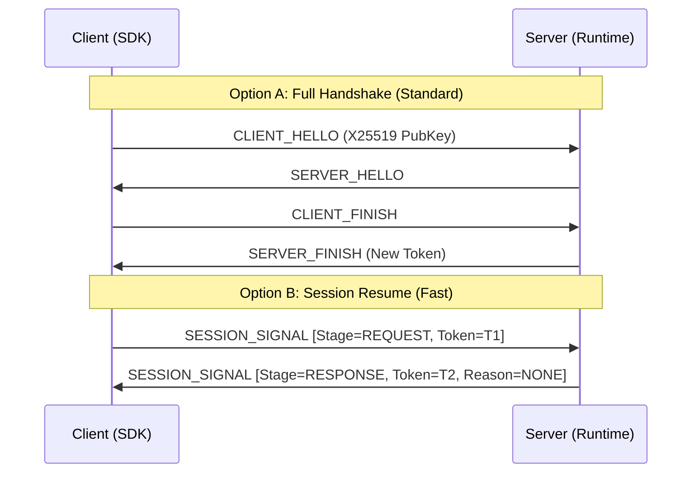

# Session Resumption Protocol

Session resumption enables low-latency reconnection by bypassing the full X25519 handshake. It allows clients to re-establish a secure session using previously negotiated symmetric secrets and a valid session token.

## Source Mapping

- `src/Nalix.Framework/DataFrames/SignalFrames/SessionResume.cs`
- `src/Nalix.Runtime/Handlers/SessionHandlers.cs`
- `src/Nalix.Network/Sessions/SessionStoreBase.cs`
- `src/Nalix.Common/Networking/Sessions/ISessionStore.cs`
- `src/Nalix.SDK/Transport/Extensions/ResumeExtensions.cs`

## 1. Design & Rationale

Nalix utilizes a **Unified Signal Flow** (introduced in v1.2) to manage session state. By consolidating the legacy `SessionResume` and `SessionResumeAck` packets into a single `SESSION_SIGNAL` packet with a `Stage` state machine, the protocol reduces complexity and ensures atomic state transitions.

- **Atomic Resumption**: The server applies the restored session snapshot and returns the (possibly rotated) token in a single round-trip.
- **Stateless Re-entry**: UDP sessions can be resumed immediately as long as the 7-byte `SessionToken` and its associated `Secret` are valid.
- **Token Rotation**: The server may issue a new `SessionToken` in every successful response to prevent long-term token leakage.

---

## 2. Handshake vs. Resumption

---

## 3. Protocol Specification

### Header & Payload
The `SESSION_SIGNAL` packet is a fixed-size frame of **52 bytes**.

| Offset | Field | Type | size | Description |
|---|---|---|---|---|
| 0 | `MagicNumber` | `int` | 4 | Fixed protocol magic. |
| 4 | `OpCode` | `ushort` | 2 | `0x0002` (SESSION_SIGNAL). |
| 6 | `Flags` | `byte` | 1 | Framing flags. |
| 7 | `Priority` | `byte` | 1 | Fixed at `0x03` (URGENT). |
| 8 | `SequenceId` | `ushort` | 2 | Correlation identifier. |
| 10 | `Stage` | `byte` | 1 | `0x01` (REQUEST), `0x02` (RESPONSE). |
| 11 | `SessionToken` | `Snowflake` | 7 | The 56-bit unique session identifier. |
| 18 | `Reason` | `ushort` | 2 | `ProtocolReason` result (`ProtocolReason.NONE` = success). |
| 20 | `Proof` | `Bytes32` | 32 | HMAC-Keccak256 proof-of-possession for the session secret. |

---

## 4. Implementation Details

### Server Handling Logic
When a `SESSION_SIGNAL` request arrives at `SessionHandlers.Handle`:
1. The server extracts the `SessionToken` from the payload.
2. It atomically consumes a valid `SessionEntry` via the active `ISessionStore` (`ConsumeAsync`) to prevent token replay.
3. It validates `Proof` using HMAC-Keccak256 over the 7-byte session token and the stored session secret.
4. If validation succeeds, the runtime restores the connection's `Secret`, `Level`, and `Attributes`.
5. A rotated session token is generated and stored, then a `RESPONSE` is sent with `ProtocolReason.NONE`.
6. If token lookup or proof validation fails, the server sends an error reason (for example `SESSION_EXPIRED` or `TOKEN_REVOKED`) and disconnects.

---

## 5. Security & Operations

- **Token Confidentiality**: While the token is not a replacement for the symmetric secret, it should be treated as sensitive material as it identifies an active session.
- **Rotation Policy**: Clients must update their local `TransportOptions.SessionToken` immediately upon receiving a successful `RESPONSE`.
- **Invalidation**: Sessions are invalidated upon explicit disconnect or after the configured session-store TTL (Time-To-Live) expires.

---

## Related Documentation
- [Handshake Protocol (X25519)](./handshake.md)
- [Session Contracts](../common/session-contracts.md)
- [Snowflake Identifiers](../framework/runtime/snowflake.md)
- [SDK Resume Extensions](../sdk/resume-extensions.md)
