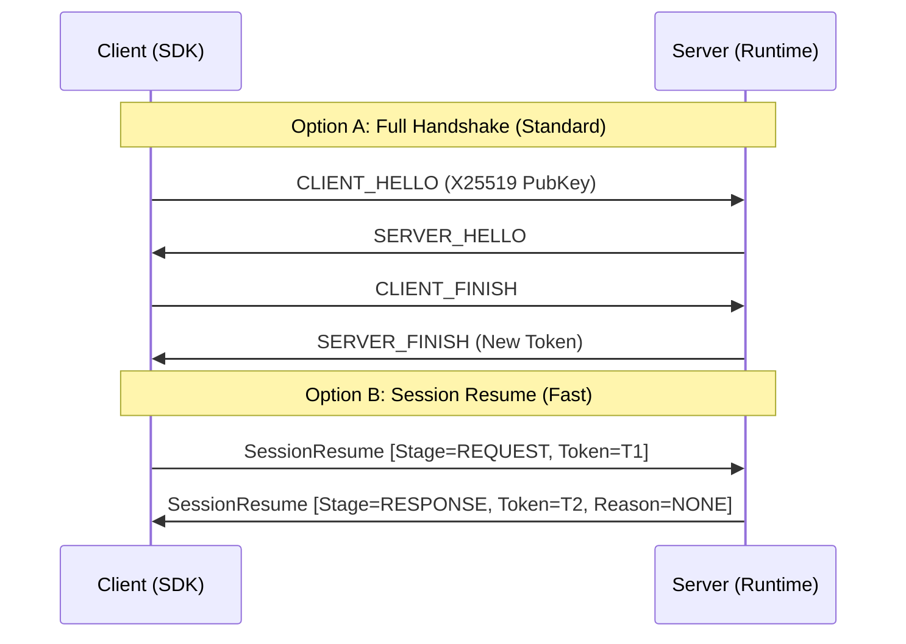

# Session Resumption Protocol

Session resumption enables low-latency reconnection by bypassing the full X25519 handshake. It allows clients to re-establish a secure session using previously negotiated symmetric secrets and a valid session token.

## Source Mapping

- `src/Nalix.Codec/ProtocolFrames/SessionResume.cs`
- `src/Nalix.Runtime/Handlers/SessionHandlers.cs`
- `src/Nalix.Runtime/Sessions/SessionService.cs`
- `src/Nalix.Abstractions/Networking/Sessions/ISessionService.cs`
- `src/Nalix.Abstractions/Networking/Sessions/ISessionFactory.cs`
- `src/Nalix.Abstractions/Networking/Sessions/ISessionStore.cs`
- `src/Nalix.SDK/Transport/Extensions/ResumeExtensions.cs`

## 1. Design & Rationale

Nalix uses the `SessionResume` packet with a `Stage` state machine to manage session state. The packet supports `REQUEST` and `RESPONSE` stages so the server can restore or reject a session in a single round-trip.

- **Atomic Resumption**: The server applies the restored session snapshot and returns a fresh response token in a single round-trip.
- **Stateless Re-entry**: A session can be resumed immediately as long as the 8-byte `SessionToken` and its associated `Secret` are valid.
- **Token Rotation**: The server can return a rotated `SessionToken` in a successful response.

---

## 2. Handshake vs. Resumption

```mermaid
sequenceDiagram
    participant C as Client (SDK)
    participant S as Server (Runtime)
    
    Note over C, S: Option A: Full Handshake (Standard)
    C->>S: CLIENT_HELLO (X25519 PubKey)
    S->>C: SERVER_HELLO
    C->>S: CLIENT_FINISH
    S->>C: SERVER_FINISH (New Token)
    
    Note over C, S: Option B: Session Resume (Fast)
    C->>S: SessionResume [Stage=REQUEST, Token=T1]
    S->>C: SessionResume [Stage=RESPONSE, Token=T2, Reason=NONE]
```

---

## 3. Protocol Specification

### Packet Shape

`SessionResume` is a fixed-size signal packet carrying the stage, session token, proof, and result reason needed for resumption.

---

## 4. Implementation Details

### Server Handling Logic

When a `SessionResume` request arrives at `SessionHandlers.Handle`:

1. The incoming packet is validated to ensure the `Stage`, `SessionToken`, and `Proof` fields are structurally sound for a `REQUEST`.
2. The server extracts the `SessionToken` from the payload.
3. It resolves and validates a resumable `SessionEntry` through the active `ISessionService`.
4. It validates `Proof` using `HmacKeccak256` over the 8-byte session token and the stored session secret.
5. If validation succeeds, the runtime restores the connection's `Secret`, `Algorithm`, `Level`, and saved `Attributes`, then marks `ConnectionAttributes.HandshakeEstablished = true`.
6. The runtime stores the live connection back into `IConnectionHub.SessionService` via `SaveSessionAsync(...)`, computes a response proof for the new token, and sends a `RESPONSE` with `ProtocolReason.NONE`.
7. If validation, token lookup, or proof verification fails, the server sends an error reason and disconnects.

---

## 5. Security & Operations

- **Token Confidentiality**: While the token is not a replacement for the symmetric secret, it should be treated as sensitive material as it identifies an active session.
- **Rotation Policy**: Clients must update their local `TransportOptions.SessionToken` immediately upon receiving a successful `RESPONSE`. The SDK already does this in `src/Nalix.SDK/Transport/Extensions/ResumeExtensions.cs`.
- **Invalidation**: Sessions are invalidated upon explicit disconnect or after the configured session-store TTL (Time-To-Live) expires.

---

## Related Documentation

- [Handshake Protocol (X25519)](./handshake.md)
- [Session Contracts](../abstractions/session-contracts.md)
- [Snowflake Identifiers](../framework/snowflake.md)
- [SDK Resume Extensions](../sdk/resume-extensions.md)

