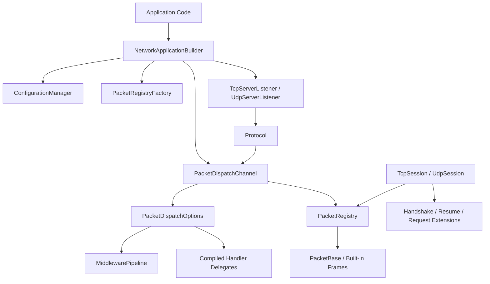
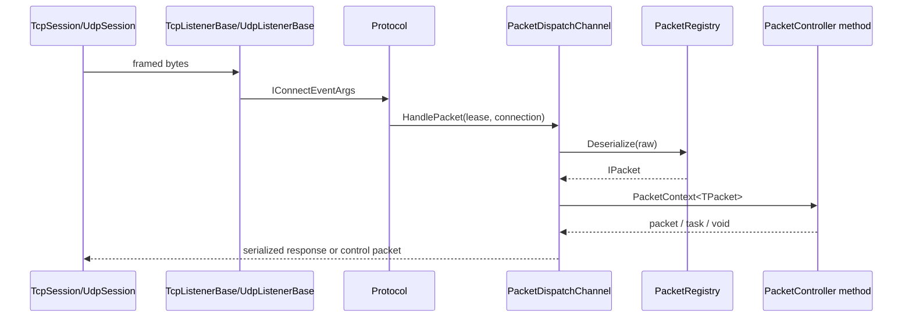

Nalix is organized as a layered .NET stack. The builder and application lifecycle live in `Nalix.Network.Hosting`, transport listeners and connection state live in `Nalix.Network`, packet execution lives in `Nalix.Runtime`, packet definitions and registries live in `Nalix.Framework`, and the client-facing transport layer lives in `Nalix.SDK`.

## Module Relationships

The startup path begins in [NetworkApplication.CreateBuilder](/workspace/home/nalix/src/Nalix.Network.Hosting/NetworkApplication.cs) and the concrete fluent methods in [NetworkApplicationBuilder.cs](/workspace/home/nalix/src/Nalix.Network.Hosting/NetworkApplicationBuilder.cs). The builder stores protocol bindings, option mutators, handler registrations, metadata providers, and packet discovery instructions inside a hosting context. At `Build()` time it does not immediately open sockets; instead it composes a `NetworkApplication` that knows how to prepare shared services, create an `IPacketDispatch`, and construct TCP or UDP listeners on activation.

Transport concerns are isolated under [src/Nalix.Network](/workspace/home/nalix/src/Nalix.Network). `Connection` owns the socket transport and per-connection state such as `Secret`, `Algorithm`, `Attributes`, event bridges, and error counters. `ConnectionHub` owns active connection lookup, sharding, session persistence, broadcast operations, and capacity policies. `Protocol` is the bridge between raw transport callbacks and packet dispatch, which is why the common pattern is a small derived class that forwards `args.Lease` and `args.Connection` to `IPacketDispatch.HandlePacket(...)`.

Execution concerns are isolated under [src/Nalix.Runtime](/workspace/home/nalix/src/Nalix.Runtime). `PacketDispatchChannel` takes retained `IBufferLease` buffers, pushes them into a dispatch queue, wakes worker loops, resolves the packet type from the registry, builds a pooled `PacketContext<TPacket>`, runs middleware, executes the compiled handler delegate, and uses `PacketSender` to emit any return value. The handler registration side is defined by `PacketDispatchOptions<TPacket>`, which stores handlers by opcode and configures middleware, logging, and error handling before any network traffic arrives.

Shared packet infrastructure lives in [src/Nalix.Framework/DataFrames](/workspace/home/nalix/src/Nalix.Framework/DataFrames). `FrameBase` defines the common packet header shape. `PacketBase<TSelf>` supplies automatic magic number assignment, serialization, deserialization, pooling, and reset behavior. `PacketRegistryFactory` scans explicit packet types, assemblies, or namespaces, then freezes a `PacketRegistry` used by both the server dispatch path and the client SDK.

The client layer in [src/Nalix.SDK/Transport](/workspace/home/nalix/src/Nalix.SDK/Transport) mirrors that split. `TransportSession` is the shared abstraction, `TcpSession` and `UdpSession` implement concrete connectivity, and extension modules such as [RequestExtensions.cs](/workspace/home/nalix/src/Nalix.SDK/Transport/Extensions/RequestExtensions.cs) and [HandshakeExtensions.cs](/workspace/home/nalix/src/Nalix.SDK/Transport/Extensions/HandshakeExtensions.cs) add typed request/reply and secure session establishment without baking those flows into the base transport classes.

## Request And Data Lifecycle

The data lifecycle is deliberately split so each layer can stay simple. Listener classes manage socket acceptance and receive loops. `Protocol` decides what to do with transport events. The runtime owns deserialization, metadata, middleware, and handler execution. The framework owns packet identity and serialization. The SDK reuses the same packet catalog on the client side, which removes the usual duplication between client parsers and server parsers.

## Key Design Decisions

### 1. Builder state is collected first and activated later

`NetworkApplicationBuilder.Build()` in [NetworkApplicationBuilder.cs](/workspace/home/nalix/src/Nalix.Network.Hosting/NetworkApplicationBuilder.cs) returns a `NetworkApplication` that still has not opened sockets. That design keeps configuration deterministic and lets activation register the logger, apply typed options, initialize handshake certificate state, and create the packet dispatcher in the correct order. It also makes `RunAsync`, `ActivateAsync`, and `DeactivateAsync` symmetrical in [NetworkApplication.cs](/workspace/home/nalix/src/Nalix.Network.Hosting/NetworkApplication.cs), which matters for hosted services and clean shutdown.

### 2. Transport is separate from dispatch

`Protocol` in [Protocol.Core.cs](/workspace/home/nalix/src/Nalix.Network/Protocols/Protocol.Core.cs) does not know how handlers are discovered or executed. `PacketDispatchChannel` in [PacketDispatchChannel.cs](/workspace/home/nalix/src/Nalix.Runtime/Dispatching/PacketDispatchChannel.cs) does not know how sockets are accepted. That split keeps transport changes, packet execution changes, and hosting changes isolated from one another. It is why the same runtime can sit behind both TCP and UDP listeners and why the SDK can reuse the packet registry without depending on server listener code.

### 3. Packet registries are immutable

`PacketRegistry` stores deserializers in `FrozenDictionary` instances in [PacketRegistry.cs](/workspace/home/nalix/src/Nalix.Framework/DataFrames/PacketRegistry.cs). The cost of discovery is paid once in `PacketRegistryFactory.CreateCatalog()`, after which hot-path lookups are immutable and safe for concurrent read access. The trade-off is that packet registration is a startup concern, not something you do lazily after the server is already processing traffic.

### 4. Contexts and packets are pooled on the server

`PacketBase<TSelf>` and `PacketContext<TPacket>` both participate in pooling through `ObjectPoolManager` in [PacketBase.cs](/workspace/home/nalix/src/Nalix.Framework/DataFrames/PacketBase.cs) and [PacketContext.cs](/workspace/home/nalix/src/Nalix.Runtime/Dispatching/PacketContext.cs). That choice reduces allocation pressure on the server hot path, but it means handlers and subscribers must respect ownership rules and dispose pooled packets when appropriate. The SDK deliberately disables packet pooling by default in [Bootstrap.cs](/workspace/home/nalix/src/Nalix.SDK/Bootstrap.cs), which simplifies client usage where throughput pressure is usually lower.

### 5. Security primitives are integrated into the protocol flow

Handshake, resume, control, and time sync are represented as actual frames in `Nalix.Framework.DataFrames.SignalFrames`. The SDK extensions build on top of those frames rather than hiding them behind an opaque transport. That keeps the wire protocol explicit, allows the same packet registry to understand built-in control packets, and lets handlers or custom middleware observe those frames when necessary.

## How The Pieces Fit Together

For a server, the normal path is:

1. Define packet contracts with `PacketBase<TSelf>`.
2. Mark controllers with `[PacketController]` and `[PacketOpcode]`.
3. Build a registry indirectly through the hosting builder.
4. Host one or more `Protocol` implementations over TCP or UDP.
5. Let `PacketDispatchChannel` route inbound traffic into controllers.

For a client, the normal path is:

1. Build the same `PacketRegistry`.
2. Open `TcpSession` or `UdpSession`.
3. Run `HandshakeAsync()` or `ConnectWithResumeAsync()` when using secure TCP.
4. Use `RequestAsync<TResponse>()`, `On<TPacket>()`, or control helpers to communicate.

That layered model is what makes Nalix feel cohesive without collapsing all concerns into one abstraction. Continue with [Packet Model](/workspace/home/codedocs-template/content/docs/packet-model.mdx), [Dispatch Pipeline](/workspace/home/codedocs-template/content/docs/dispatch-pipeline.mdx), and [Transport Sessions](/workspace/home/codedocs-template/content/docs/transport-sessions.mdx) to read each layer in detail.
