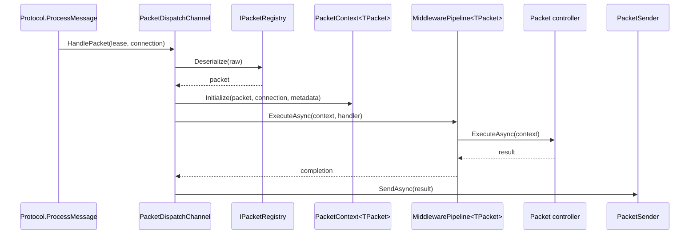

The dispatch pipeline is the execution engine of a Nalix server. It starts with an inbound `IBufferLease`, resolves the packet type, builds a pooled execution context, runs middleware, invokes the handler, and optionally sends the handler result back to the connection.

## What This Concept Is

The main types are `IPacketDispatch`, `PacketDispatchChannel`, `PacketDispatchOptions<TPacket>`, `PacketContext<TPacket>`, `PacketSender`, `PacketMetadataBuilder`, and `PacketMetadataProviders`. They live in [src/Nalix.Runtime/Dispatching](/workspace/home/nalix/src/Nalix.Runtime/Dispatching) and [src/Nalix.Runtime/Middleware](/workspace/home/nalix/src/Nalix.Runtime/Middleware).

This layer exists so transport code does not need to know anything about controllers, middleware, permissions, timeouts, or return types.

## How It Relates To Other Concepts

- It consumes the [Packet Model](/workspace/home/codedocs-template/content/docs/packet-model.mdx) through `IPacketRegistry`.
- It is usually configured by the [Hosting Bootstrap](/workspace/home/codedocs-template/content/docs/hosting-bootstrap.mdx) via `ConfigureDispatch(...)`.
- It serves the server side of the same packet contracts used by [Transport Sessions](/workspace/home/codedocs-template/content/docs/transport-sessions.mdx).

## How It Works Internally

`PacketDispatchChannel` in [PacketDispatchChannel.cs](/workspace/home/nalix/src/Nalix.Runtime/Dispatching/PacketDispatchChannel.cs) is both `IPacketDispatch` and `IActivatable`. `HandlePacket(...)` retains the inbound `IBufferLease`, pushes it into an internal dispatch channel, and wakes one of the worker loops. Activation starts several worker loops through `TaskManager`, using either the explicit `DispatchLoopCount` from `PacketDispatchOptions<TPacket>` or an automatic value derived from CPU count.

`PacketDispatchOptions<TPacket>` in [PacketDispatchOptions.PublicMethods.cs](/workspace/home/nalix/src/Nalix.Runtime/Dispatching/Options/PacketDispatchOptions.PublicMethods.cs) stores handlers keyed by opcode and compiles them once up front. `WithHandler(...)` scans a controller marked with `[PacketController]`, uses `PacketHandlerCompiler` internally, resolves metadata for each handler method, and records the expected packet type and return handling strategy. At runtime, `ExecuteResolvedHandlerAsync(...)` rents a `PacketContext<TPacket>`, initializes it with the packet, connection, metadata, and cancellation token, then hands that context to the pipeline and the handler delegate.

`MiddlewarePipeline<TPacket>` in [MiddlewarePipeline.cs](/workspace/home/nalix/src/Nalix.Runtime/Middleware/MiddlewarePipeline.cs) sorts middleware by order and stage, snapshots the pipeline, and reuses pooled runner objects for execution. That means middleware registration is a startup concern and middleware execution is a hot-path concern with no reflection.



## Basic Usage

This is the direct-runtime setup pattern behind the hosting builder.

```csharp
using Microsoft.Extensions.Logging;
using Nalix.Common.Networking.Packets;
using Nalix.Network.Routing;
using Nalix.Runtime.Dispatching;

[PacketController("AccountHandlers")]
public sealed class AccountHandlers
{
    [PacketOpcode(0x2001)]
    public LoginResponse Login(IPacketContext<LoginRequest> context)
        => new() { Success = true, Message = $"Hello {context.Packet.UserName}" };
}

PacketDispatchChannel dispatch = new(options =>
{
    options.WithLogging(logger)
           .WithHandler(() => new AccountHandlers());
});

dispatch.Activate();
```

## Advanced Usage

Use middleware, custom error handling, and an explicit loop count when the server is latency-sensitive or when handlers need common policy logic.

```csharp
using Nalix.Common.Middleware;
using Nalix.Common.Networking.Packets;
using Nalix.Network.Routing;
using Nalix.Runtime.Dispatching;

public sealed class AuditMiddleware : IPacketMiddleware<IPacket>
{
    public async ValueTask InvokeAsync(
        PacketContext<IPacket> context,
        Func<CancellationToken, ValueTask> next,
        CancellationToken cancellationToken = default)
    {
        Console.WriteLine($"opcode=0x{context.Packet.OpCode:X4}");
        await next(cancellationToken);
    }
}

PacketDispatchChannel dispatch = new(options =>
{
    options.WithDispatchLoopCount(8)
           .WithLogging(logger)
           .WithMiddleware(new AuditMiddleware())
           .WithErrorHandling((exception, opcode) =>
           {
               logger.LogError(exception, "Dispatch failed for opcode 0x{Opcode:X4}", opcode);
           })
           .WithErrorHandlingMiddleware(continueOnError: false)
           .WithHandler(() => new AccountHandlers());
});
```

That flow maps directly to the source paths in `PacketDispatchOptions` and `MiddlewarePipeline`.

<Callout type="warn">Be careful with unbounded or oversized queue settings. `DispatchOptions.MaxPerConnectionQueue = 0` disables the bound entirely, and the source comment in [DispatchOptions.cs](/workspace/home/nalix/src/Nalix.Runtime/Options/DispatchOptions.cs) explicitly says that is not recommended for production because it reopens memory DoS risk.</Callout>

<Accordions>
<Accordion title="More dispatch loops vs simpler scheduling">
Increasing `DispatchLoopCount` can reduce backlog and improve throughput on multi-core hosts because `PacketDispatchChannel` will start more workers in `Activate(...)`. The trade-off is not just CPU usage; more loops also mean more contention on shared queues and more opportunities for out-of-order completion when handlers perform asynchronous work. The default auto mode is a reasonable baseline because it clamps loop count to the host processor count and the option limits. Override it only after you have measured queue depth or latency under real traffic.
</Accordion>
<Accordion title="Continue middleware on error vs fail fast">
`WithErrorHandlingMiddleware(...)` controls whether middleware failures terminate the chain or let later middleware run. Continuing can be useful when you have non-critical instrumentation middleware and still want the business handler to execute. The downside is state ambiguity: a partially failed middleware chain can leave metadata, authentication context, or side-effect expectations in a surprising state for the handler. If middleware enforces security, quotas, or request normalization, fail fast is the safer default.
</Accordion>
<Accordion title="Return values vs side-effect handlers">
Nalix supports handlers that return packets, tasks, strings, raw bytes, or nothing, and `PacketDispatchOptions.Execution.cs` routes those shapes through a return handler. Returning packets is convenient because the runtime serializes and sends them through `PacketSender` automatically. Side-effect-only handlers are sometimes clearer when the result is broadcast elsewhere or when the connection should not receive a direct reply. The trade-off is discoverability: explicit return values make request/reply flows easier to reason about in code review, while side effects can hide response behavior in helper methods or connection extensions.
</Accordion>
</Accordions>

## Source Files To Read

- [PacketDispatchChannel.cs](/workspace/home/nalix/src/Nalix.Runtime/Dispatching/PacketDispatchChannel.cs)
- [PacketDispatchOptions.cs](/workspace/home/nalix/src/Nalix.Runtime/Dispatching/Options/PacketDispatchOptions.cs)
- [PacketDispatchOptions.PublicMethods.cs](/workspace/home/nalix/src/Nalix.Runtime/Dispatching/Options/PacketDispatchOptions.PublicMethods.cs)
- [PacketDispatchOptions.Execution.cs](/workspace/home/nalix/src/Nalix.Runtime/Dispatching/Options/PacketDispatchOptions.Execution.cs)
- [PacketContext.cs](/workspace/home/nalix/src/Nalix.Runtime/Dispatching/PacketContext.cs)
- [MiddlewarePipeline.cs](/workspace/home/nalix/src/Nalix.Runtime/Middleware/MiddlewarePipeline.cs)
