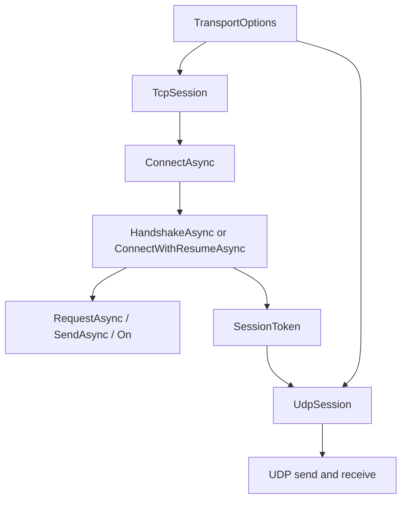

Nalix clients are built around `TransportSession`, concrete `TcpSession` and `UdpSession` implementations, and an extension layer for request/reply, handshake, resume, ping, control, and subscriptions.

## What This Concept Is

`TransportSession` in [TransportSession.cs](/workspace/home/nalix/src/Nalix.SDK/Transport/TransportSession.cs) is the shared abstraction. It defines the connection lifecycle, packet send methods, and transport events. `TcpSession` and `UdpSession` provide the concrete behavior. Their behavior is then extended through files under [src/Nalix.SDK/Transport/Extensions](/workspace/home/nalix/src/Nalix.SDK/Transport/Extensions).

This concept exists so applications can share one packet catalog and still choose the right transport for the job: reliable framed streams over TCP or token-bound datagrams over UDP.

## How It Relates To Other Concepts

- It consumes the [Packet Model](/workspace/home/codedocs-template/content/docs/packet-model.mdx) by requiring an `IPacketRegistry`.
- It interoperates with the server-side [Dispatch Pipeline](/workspace/home/codedocs-template/content/docs/dispatch-pipeline.mdx) because both ends speak the same packet and control frame types.
- It is usually configured through `TransportOptions`, which are bootstrapped by [Nalix.SDK/Bootstrap.cs](/workspace/home/nalix/src/Nalix.SDK/Bootstrap.cs).

## How It Works Internally

`TcpSession` composes a `FrameSender` and `FrameReader` in [TcpSession.cs](/workspace/home/nalix/src/Nalix.SDK/Transport/TcpSession.cs). `ConnectAsync(...)` opens a socket, applies the configured timeout, raises `OnConnected`, and starts a background receive loop. `SendAsync(IPacket, bool? encrypt, CancellationToken)` serializes a packet into a `BufferLease` and sends it through the frame sender. Incoming frames raise both the raw `OnMessageReceived` event and the optional asynchronous `OnMessageAsync` hook.

`UdpSession` in [UdpSession.cs](/workspace/home/nalix/src/Nalix.SDK/Transport/UdpSession.cs) is different because it requires a 7-byte session token before you can send application packets. Outbound UDP frames are wrapped as `[SessionToken | Payload]`, and the session validates datagram size against `TransportOptions.MaxUdpDatagramSize`.

The extension layer adds higher-level flows:

- `RequestAsync<TResponse>(...)` subscribes before sending, then waits for a correlated reply.
- `HandshakeAsync()` performs the X25519 handshake and enables encryption on success.
- `ConnectWithResumeAsync()` tries session resume first, then falls back to handshake.
- `UpdateCipherAsync()` coordinates runtime cipher changes.
- `PingAsync()`, `SyncTimeAsync()`, `AwaitControlAsync()`, and `SendControlAsync()` cover common control flows.
- `On<TPacket>()`, `OnExact<TPacket>()`, and `OnOnce<TPacket>()` add typed subscriptions over the raw message stream.



## Basic Usage

Use `TcpSession` with a shared packet catalog for the normal client path.

```csharp
using Nalix.Framework.DataFrames;
using Nalix.SDK.Options;
using Nalix.SDK.Transport;
using Nalix.SDK.Transport.Extensions;

PacketRegistryFactory factory = new();
factory.RegisterPacket<LoginRequest>()
       .RegisterPacket<LoginResponse>();

PacketRegistry catalog = factory.CreateCatalog();

TransportOptions options = new()
{
    Address = "127.0.0.1",
    Port = 57206,
    ServerPublicKey = "A1B2C3D4..."
};

using TcpSession client = new(options, catalog);
await client.ConnectAsync();
await client.HandshakeAsync();

LoginResponse response = await client.RequestAsync<LoginResponse>(
    new LoginRequest { UserName = "demo", Password = "secret" });
```

## Advanced Usage

Use TCP for handshake and resume, then open UDP for low-latency payloads with the session token established by the secure control path.

```csharp
using Nalix.Framework.DataFrames;
using Nalix.SDK.Options;
using Nalix.SDK.Transport;
using Nalix.SDK.Transport.Extensions;

PacketRegistry catalog = new PacketRegistry(factory =>
{
    factory.IncludeNamespaceRecursive("MyApp.Contracts");
});

TransportOptions options = new()
{
    Address = "127.0.0.1",
    Port = 57206,
    ResumeEnabled = true,
    ResumeFallbackToHandshake = true,
    ServerPublicKey = "A1B2C3D4..."
};

using TcpSession tcp = new(options, catalog);
bool resumed = await tcp.ConnectWithResumeAsync();

using UdpSession udp = new(options, catalog)
{
    SessionToken = options.SessionToken
};

await udp.ConnectAsync();
await udp.SendAsync(new PositionUpdate { X = 12, Y = 9 }, encrypt: true);
```

That pattern matches the source behavior in [ResumeExtensions.cs](/workspace/home/nalix/src/Nalix.SDK/Transport/Extensions/ResumeExtensions.cs) and [UdpSession.cs](/workspace/home/nalix/src/Nalix.SDK/Transport/UdpSession.cs).

<Callout type="warn">Do not touch UI objects directly from `RequestAsync(...)` callbacks or typed subscriptions. `RequestExtensions.cs` states that callbacks run on the `FrameReader` background thread, so UI frameworks need a dispatcher such as `IThreadDispatcher` or their own synchronization primitive.</Callout>

<Accordions>
<Accordion title="TCP vs UDP in Nalix">
`TcpSession` is the safer default because it works with request/reply, handshake, cipher updates, control packets, and resume flows out of the box. `UdpSession` is useful when you already have a trusted session token and you care more about latency and loss tolerance than ordered delivery. The trade-off is visible in the source: UDP enforces MTU-style limits, requires a session token before sending, and treats reliability differently by setting `PacketFlags.UNRELIABLE`. Use TCP for authentication and stateful control traffic, then layer UDP on top only for workloads that benefit from it.
</Accordion>
<Accordion title="RequestAsync vs long-lived subscriptions">
`RequestAsync<TResponse>(...)` is ideal when one outbound packet should correlate with one inbound response because it subscribes before sending and closes the race window. Long-lived subscriptions such as `On<TPacket>()` are better for event streams, push updates, and server broadcasts that are not tied to a single request. The downside of subscriptions is lifecycle management: you need to hold and dispose the returned `IDisposable`, and you need to think about thread marshalling if the handler touches UI state. For simple command/response flows, `RequestAsync` is usually easier to reason about.
</Accordion>
<Accordion title="Resume first vs handshake every time">
`ConnectWithResumeAsync()` can reduce reconnect cost because it tries to reuse the session token and shared secret already stored in `TransportOptions`. When resume succeeds, you skip the full handshake and keep the connection setup fast. The trade-off is operational complexity: the client must preserve resume state correctly, the server must have a session store entry, and failure paths must still be able to fall back to `HandshakeAsync()`. Nalix handles that fallback in the source, but you still need to decide whether stale session state is worth the extra reconnect optimization for your application.
</Accordion>
</Accordions>

## Source Files To Read

- [TransportSession.cs](/workspace/home/nalix/src/Nalix.SDK/Transport/TransportSession.cs)
- [TcpSession.cs](/workspace/home/nalix/src/Nalix.SDK/Transport/TcpSession.cs)
- [UdpSession.cs](/workspace/home/nalix/src/Nalix.SDK/Transport/UdpSession.cs)
- [RequestExtensions.cs](/workspace/home/nalix/src/Nalix.SDK/Transport/Extensions/RequestExtensions.cs)
- [HandshakeExtensions.cs](/workspace/home/nalix/src/Nalix.SDK/Transport/Extensions/HandshakeExtensions.cs)
- [ResumeExtensions.cs](/workspace/home/nalix/src/Nalix.SDK/Transport/Extensions/ResumeExtensions.cs)
- [TcpSessionSubscriptions.cs](/workspace/home/nalix/src/Nalix.SDK/Transport/Extensions/TcpSessionSubscriptions.cs)
