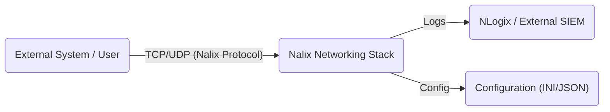
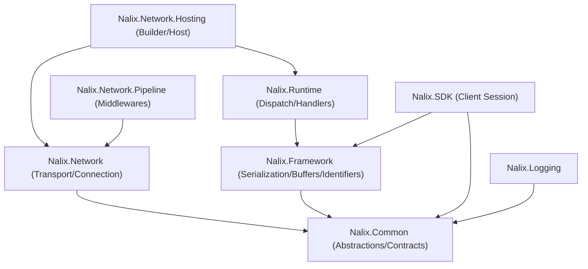
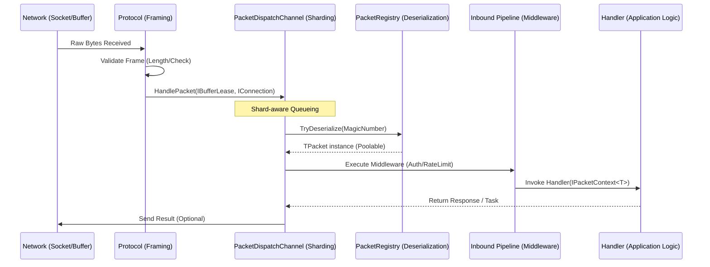

# Architecture

The Nalix architecture is designed for high-throughput, low-latency networking with a focus on zero-allocation data paths and shard-aware execution. It consists of four primary layers: **Transport**, **Protocol**, **Dispatch**, and **Application Logic**.

## High-Level Landscape

Nalix uses a modular package architecture. Below is the System Context and Physical component layout.

### System Context (C4 Level 1)

### Physical Component Layout

## Mental Model: Server vs. Client

Nalix enforces a clear separation of concerns between the server host and the client SDK:

- **Server-Side (Thick Host)**: The host owns the socket listeners, connection hubs, and the shard-aware dispatch channel. It is responsible for scale and security (admission control, rate limiting).
- **Client-Side (Thin SDK)**: The SDK focuses on session management, automated request/response correlation, and transparent encryption/compression.
- **Shared Contracts**: Packet definitions (POCOs) should live in a shared `Contracts` assembly, annotated with `[SerializePackable]` attributes.

## The Packet Journey

Understanding how a packet moves through the system is critical for optimizing performance.

## Core Building Blocks

### 1. Transport & Listeners
- **TcpServerListener**: High-concurrency listener using `SocketAsyncEventArgs` or `IOThreads`.
- **UdpServerListener**: Session-less listener with built-in authenticated session mapping.
- **Connection Guard**: Early-stage admission control to reject malicious endpoints at the socket level.

### 2. Protocol (The Bridge)
The `IProtocol` interface translates raw network streams into discrete message leases. It ensures that the `PacketDispatchChannel` only receives complete, valid packet fragments.

### 3. Shard-Aware Dispatch
`PacketDispatchChannel` is the engine of Nalix. It utilizes:
- **Worker Sharding**: Multiple worker loops (parallel to CPU cores) to prevent head-of-line blocking.
- **Wake-Signaling**: A coalesced signaling mechanism using `System.Threading.Channels` to minimize thread context switching under high load.
- **Prioritization**: Native support for `PacketPriority` (Emergency, System, High, Normal, Low).

### 4. Instance Management
Nalix uses a custom `InstanceManager` (Service Locator pattern optimized for performance) instead of standard DI to ensure allocation-free service resolution during hot-path execution.

## Protection and Pressure Control

The network runtime is designed to run with pressure controls enabled by default:

- **TokenBucketLimiter**: Protects against request spikes.
- **ConcurrencyGate**: Limits the number of in-flight handlers to prevent thread pool exhaustion.
- **TimingWheel**: Handles millions of concurrent timeouts with O(1) complexity.

## Recommended Next Pages

- [Performance Optimizations](./performance-optimizations.md)
- [Real-time Engine](./real-time.md)
- [Middleware](./middleware.md)
- [Production End-to-End](../guides/production-end-to-end.md)

