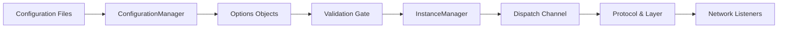

# Configuration and Runtime

!!! info "Learning Signals"
    - :fontawesome-solid-layer-group: **Level**: Intermediate
    - :fontawesome-solid-clock: **Time**: 10–15 minutes
    - :fontawesome-solid-book: **Prerequisites**: [Introduction](../introduction.md)

This page explains how configuration becomes a running Nalix server. It covers the startup wiring sequence, option validation, service registration, and the relationship between configuration, dispatch, and transport.

## The Short Version

Nalix startup follows a strict deterministic sequence to ensure that shared infrastructure is ready before traffic starts.

!!! success "Why the order matters"
    Most network components assume validated options and shared services (like `ILogger` or `IPacketRegistry`) already exist in the `InstanceManager`. Resolve early to fail fast.

---

## 🏗️ Configuration Pillars

### ConfigurationManager
`ConfigurationManager` is the central entry point for configuration values and option binding. It handles loading from sources, binding to strongly-typed classes, and caching resolved instances.

### Options Classes
Nalix uses focused, granular option types instead of a monolithic "Settings" object. This keeps runtime concerns (like timing wheels vs. socket limits) isolated.

| Option | Purpose |
|---|---|
| `NetworkSocketOptions` | Buffer sizes, ports, and IP properties |
| `DispatchOptions` | Worker count, middleware, and handler logic |
| `ConnectionLimitOptions` | Security thresholds for the `ConnectionGuard` |
| `TimingWheelOptions`| O(1) timeout scheduling for idle connections |

!!! tip "Validation Habit"
    Always call `Validate()` on your options immediately after binding. Use the configuration layer to prevent the server from starting with "garbage" values.

---

## 🔧 Runtime Registry

### InstanceManager (DI)
`InstanceManager` is the runtime registry for shared services. It is not complex dependency injection; it is a fast, thread-safe service locator designed for networking hot paths.

- **Logger**: Centralized diagnostic output.
- **Packet Registry**: The "Catalog" that maps opcodes to types.
- **Custom Helpers**: Shared database bridges or game-state managers.

!!! important "Service Availability"
    Once `NetworkApplication.Activate()` is called, the `InstanceManager` should be treated as **frozen**. Changing primary services while traffic is flowing can lead to inconsistent handler state.

---

## 🚀 The Transport Shell

After configuration and shared services are ready, the dispatch and transport layers are initialized.

- **Dispatch**: Where the application becomes "real". It holds middleware and handlers.
- **Listener**: The binary shell. It owns socket acceptance, receive loops, and the `FramePipeline` (AEAD).
- **Protocol**: The bridge that receives "clean" messages from the listener and routes them to dispatch.

### A Safe Startup Pattern
For most teams, this is the safest default wiring:

1. **Bind and Validate** options.
2. **Register** Logger and Packet Registry.
3. Build **Dispatch** (Middleware + Handlers).
4. Build **Protocol** and **Listener**.
5. **Activate** Dispatch, then start the **Listener**.

---

## Recommended Next Pages

- [Server Blueprint](../guides/server-blueprint.md) { .md-button }
- [Production Checklist](../guides/production-checklist.md) { .md-button }
- [Configuration API](../api/framework/runtime/configuration.md) { .md-button }

