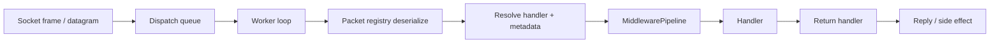

# Packet Lifecycle

This page traces the complete journey of a network request from raw socket bytes to handler invocation and reply. Understanding this path is essential for effective debugging, middleware placement, and performance optimization.

## Request Path Overview

## Step 1. Traffic enters through a listener

The runtime starts with a listener:

- `TcpListenerBase` for reliable ordered traffic
- `UdpListenerBase` for authenticated low-latency datagrams

The listener accepts traffic and forwards it into the active protocol.

## Step 2. Protocol forwards data into dispatch

`Protocol` is the bridge between transport and application dispatch.

Its job is to:

- accept or reject live connections
- receive framed traffic
- forward inbound data into `PacketDispatchChannel`

At this point, the runtime still has bytes, not a packet object.
That flow remains the same whether the eventual handler works with built-in packets or your own custom packet type.

## Step 3. Dispatch deserializes the packet

Once the frame enters the application layer, `PacketDispatchChannel` first queues the work, then its worker loop uses the packet registry to deserialize it into an `IPacket`.

Before this happens, the **Listeners** may have already applied decryption or decompression via the `FramePipeline`.

This is the transition from transport-level work to application-level work.

After this point, middleware and handlers can reason about:

- packet type
- opcode
- connection state
- handler metadata

## Step 5. Handler metadata is resolved

Before packet middleware runs, the runtime resolves the metadata attached to the matched handler.

That metadata usually comes from:

- packet attributes on the handler method
- custom `IPacketMetadataProvider` implementations

Examples:

- `PacketOpcode`
- `PacketPermission`
- `PacketTimeout`
- `PacketRateLimit`
- custom tenant or feature attributes

## Step 6. Packet middleware applies policy

Packet middleware runs with a full `PacketContext<TPacket>`.
`TPacket` can be a built-in packet or a custom packet type.

This is where application-aware checks happen:

- permission checks
- timeout handling
- rate limiting
- concurrency limits
- audit and policy decisions

By this stage, the runtime knows both the packet and the handler metadata.

## Step 7. The handler runs

If middleware allows the request through, the handler executes.

Handlers can:

- return a packet
- return a supported async result
- send manually through the connection
- perform side effects without replying

## Step 8. The return handler decides what to send

Nalix supports multiple handler return shapes.

The internal return handler converts them into outbound behavior, for example:

- send a reply packet
- send text or bytes
- skip outbound work
- complete with no response

This is why the handler does not need to manually build every reply path.

## Summary

The request path is easiest to reason about in three phases:

| Phase | Components | Your extension point |
| :--- | :--- | :--- |
| **Transport** | Listener → Protocol → FramePipeline | Custom `Protocol` validation |
| **Dispatch** | Queue → Worker → Deserialize → Metadata → Middleware | `MiddlewarePipeline`, metadata providers |
| **Application** | Handler → Return handler → Reply | Handler classes, return type selection |

If you know which phase your problem belongs to, you usually know which Nalix component to customize.

## See it in action

- [Quickstart](../../quickstart.md) — Follow a Ping/Pong packet through the entire lifecycle.
- [TCP Request/Response](../../guides/networking/tcp-patterns.md) — See the lifecycle applied to a standard request/reply pattern.
- [Production End-to-End](../../guides/deployment/production-example.md) — Observe the lifecycle in a high-performance environment.
