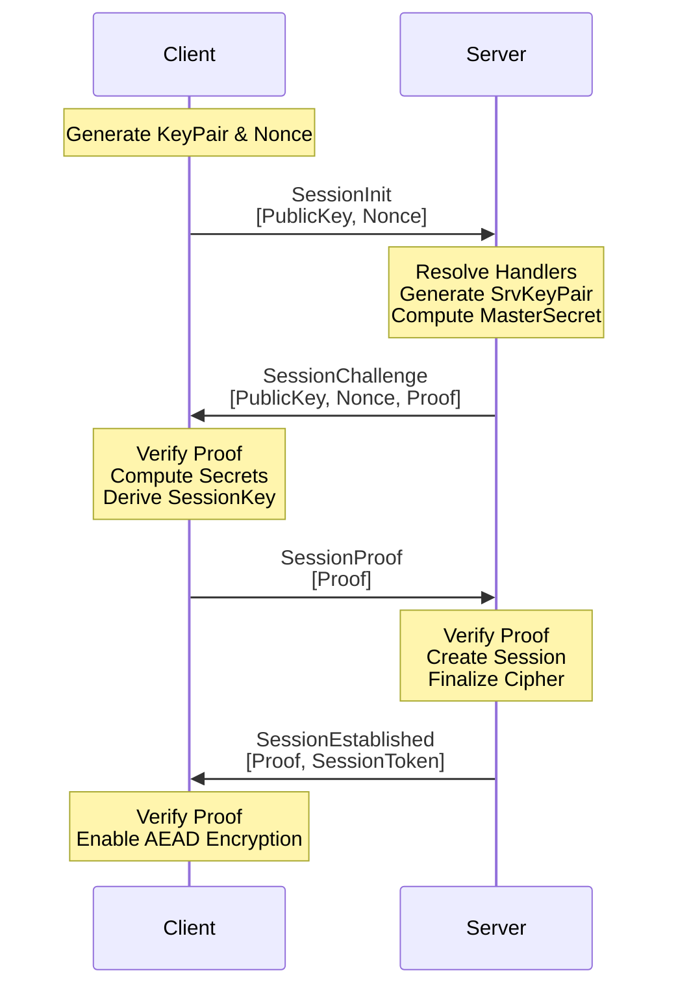

# Handshake Protocol

Nalix implements a high-security, zero-trust handshake protocol based on **X25519 (Curve25519)** Elliptic Curve Diffie-Hellman (ECDH). This protocol ensures that every session is encrypted with a unique session key that is never transmitted over the wire.

## Source Mapping

- `src/Nalix.Codec/ProtocolFrames/Session/SessionInit.cs`
- `src/Nalix.Codec/ProtocolFrames/Session/SessionChallenge.cs`
- `src/Nalix.Codec/ProtocolFrames/Session/SessionProof.cs`
- `src/Nalix.Codec/ProtocolFrames/Session/SessionEstablished.cs`
- `src/Nalix.Codec/Security/HandshakeX25519.cs`
- `src/Nalix.Runtime/Handlers/HandshakeHandlers.cs`
- `src/Nalix.SDK/Transport/Extensions/HandshakeExtensions.cs`

## Security Guarantees

- **Mutual Agreement**: Both client and server contribute to the final session key.
- **Perfect Forward Secrecy (PFS)**: Ephemeral keys are used for every session.
- [x] **Identity Verification**: Requires pinned server public keys to prevent Man-in-the-Middle (MitM) attacks. Anonymous server handshakes are not supported.
- [x] **Adaptive Proof-of-Work**: When enabled, the server may require clients to solve a PoW puzzle before the handshake proceeds, throttling automated connection floods. See [Proof-of-Work](../../api/security/proof-of-work.md).

!!! critical "Mandatory Identity"
    Every Nalix server must possess a `certificate.private` file. By default, the host loads it from `Directories.ConfigurationDirectory`. You can override this path using `builder.ConfigureCertificate("path/to/certificate.private")` during host construction.

    Clients should load the hex public key from `certificate.public` into `TransportOptions.ServerPublicKey` to enable public-key pinning.

- [x] **Transcript Integrity**: All handshake messages are hashed into a transcript to prevent tampering or replay attacks.

## The Handshake Workflow

The diagram below illustrates the communication between the **Nalix SDK** and the **Nalix Server** handlers.

## Protocol Stages

### 1. SessionInit

The SDK initiates by sending its ephemeral public key and a cryptographically secure random nonce via a `SessionInit` frame. No sensitive data is sent here.

### 2. SessionChallenge

The server responds with its own ephemeral public key and a `Proof` via a `SessionChallenge` frame. The proof is a keyed digest computed over the handshake transcript using the derived master secret (via `HandshakeX25519.ComputeServerProof`), proving the server possesses the corresponding private key without revealing it.

### 3. SessionProof

The SDK validates the server's proof. If valid, it computes its own `ClientProof` and sends it back via a `SessionProof` frame. This confirms to the server that the client has successfully derived the same shared secret.

### 4. SessionEstablished

Final confirmation. The server sends a `SessionEstablished` frame containing the `SessionToken`. The SDK uses that token for UDP datagram authentication, and the connection is now fully encrypted using the derived session key.

## Implementation Details

- **Encryption**: `src/Nalix.Runtime/Handlers/HandshakeHandlers.cs` and `src/Nalix.SDK/Transport/Extensions/HandshakeExtensions.cs` set the active cipher to `CipherSuiteType.Chacha20Poly1305` for the established session.
- **Resume Token**: `SessionEstablished` returns the current `SessionToken`, which the SDK later stores in `SessionState.SessionToken`.

## Related Topics

- [Session Resumption](./session-resumption.md)
- [Encryption Model](./encryption-model.md)
- [Zero-Allocation Design](../internals/zero-allocation.md)
