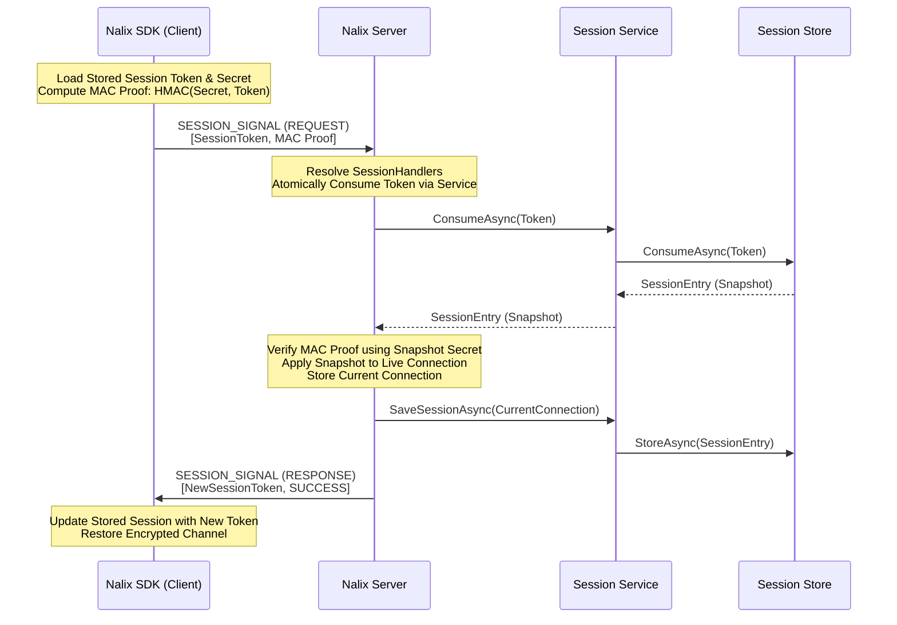

# Session Resumption

Session Resumption is a high-performance protocol in Nalix that allows clients to reconnect and restore their previous state without performing a full [X25519 Handshake](./handshake-protocol.md). This is critical for mobile applications where network switching (e.g., Wi-Fi to 5G) or brief disconnections are common.

## Source Mapping

- `src/Nalix.Codec/ProtocolFrames/SessionResume.cs`
- `src/Nalix.Runtime/Handlers/SessionHandlers.cs`
- `src/Nalix.SDK/Transport/Extensions/ResumeExtensions.cs`
- `src/Nalix.Runtime/Sessions/SessionService.cs`

## Key Features

- **Fast Reconnection**: Resumption happens in a single request-response cycle.
- **State Persistence**: Restores authentication level, permissions, and custom connection attributes.
- **Token Rotation**: Every successful resume returns a fresh session token for the next reconnect attempt.
- **Zero-Trust Validation**: Uses HMAC-based proof-of-possession to verify the client owns the session secret.

## The Resume Workflow

The following diagram illustrates how the **Nalix SDK** uses a stored token to resume a session on the **Nalix Server**.

## Atomic Token Consumption

To prevent **Race Conditions** and **Double-Resume** attacks, Nalix uses "Atomic Consumption". When a resume request arrives:

1. The server attempts to remove the token from the `ISessionService` immediately through `ConsumeAsync(...)`.
2. If the token was already used or doesn't exist, the request is rejected instantly.
3. This ensures that a stolen token cannot be used twice, even if two requests arrive at the same millisecond.

## Rotation and Security

The `SessionToken` is a "moving target". After a successful resumption:

- The old token is invalidated by atomic consumption.
- A fresh token is issued to the client.
- The secret (derived during the original handshake) remains the same, maintaining the secure entropy for the encryption layer.

## Implementation Guide

By default, the Nalix Hosting model handles session resumption automatically. However, you can control the behavior by implementing a custom `ISessionStore` (e.g., using Redis for distributed clusters).

To make resume work end to end:

1. Register session support on the server with `UseSessions()`.
2. Register a store with `UseSessionStore(...)` when the default in-memory service is not enough.
3. Set `SessionStoreOptions.MinAttributesForPersistence` low enough for the metadata your authenticated sessions actually carry.
4. Set `SessionStoreOptions.SessionTtl` to the disconnected-session resume window you want.
5. Keep `TransportOptions.ResumeEnabled` enabled on the client, and keep the client `SessionState` token and secret between reconnect attempts.

!!! note "Idle timeout is not the resume window"
    `TimingWheelOptions.IdleTimeoutMs` closes a live connection that stops sending traffic. `SessionStoreOptions.SessionTtl` decides how long its disconnected session state remains resumable after the connection is gone. Neither setting implies the other.

## Replay Window Policy

The resume proof is `HMAC-Keccak256(Secret, SessionToken || (UnixSecondsNow() / 30))` — a 30-second time bucket, checked against `t-1`, `t`, `t+1` to tolerate clock skew. Within that ~90-second window the proof itself is deterministic and reproducible, but replaying it does not grant a second resume: the `SessionToken` is atomically consumed (`ISessionService.ConsumeAsync` → `ConcurrentDictionary.TryRemove`) on the **first** successful attempt, so a second resume with the same token — even with a byte-identical, still-valid proof — is rejected with `SESSION_EXPIRED`. The token, not the time bucket, is the single-use nonce.

See `tests/Nalix.Network.Tests/InMemorySessionStoreTests.cs::ConsumeAsync_ReplayedTokenWithinSameTimeBucket_RejectedOnSecondAttempt` and `tests/Nalix.Framework.Tests/Cryptography/SessionResumeProofTests.cs` for the two halves of this guarantee (nonce consumption vs. proof determinism).

## Sequence Counter Wrap Policy

Each transport direction is protected by a monotonic `SequenceCounter` used as part of the AEAD nonce. `SequenceCounter.Next()` throws `CipherException` if incrementing would wrap past `uint.MaxValue`, refusing to ever reuse a nonce. To avoid hitting that guard as a live failure, every send path (`TcpFrameSender`, `UdpFrameSender`, `WsFrameSender` on the client; `PacketPipeline.ProcessAndSendAsync` on the server) now checks `ISequenceCounter.IsApproachingOverflow(margin: 1_000_000)` **before** reserving the next sequence number:

- Client-side: throws `CipherException`, which the existing non-fatal exception handling reports via `OnError` and disconnects — the client is expected to reconnect and re-handshake, or call `RekeyExtensions.RekeyAsync` proactively before this point to rotate the key and reset counters.
- Server-side: calls `IConnection.Disconnect(...)` directly for a clean close instead of throwing mid-send.

`ResumeFrom(lastKnownSeq, safetyGap)` (used when restoring a session) saturates at `uint.MaxValue` instead of wrapping, so a resumed counter can never silently drop below its last known value and reissue nonces — the very next `Next()` call fails loudly via the same overflow guard.

## Related Topics

- [Handshake Protocol](./handshake-protocol.md)
- [Network Model](./architecture.md)
- [Session Store APIs](../../api/network/session-store.md)
