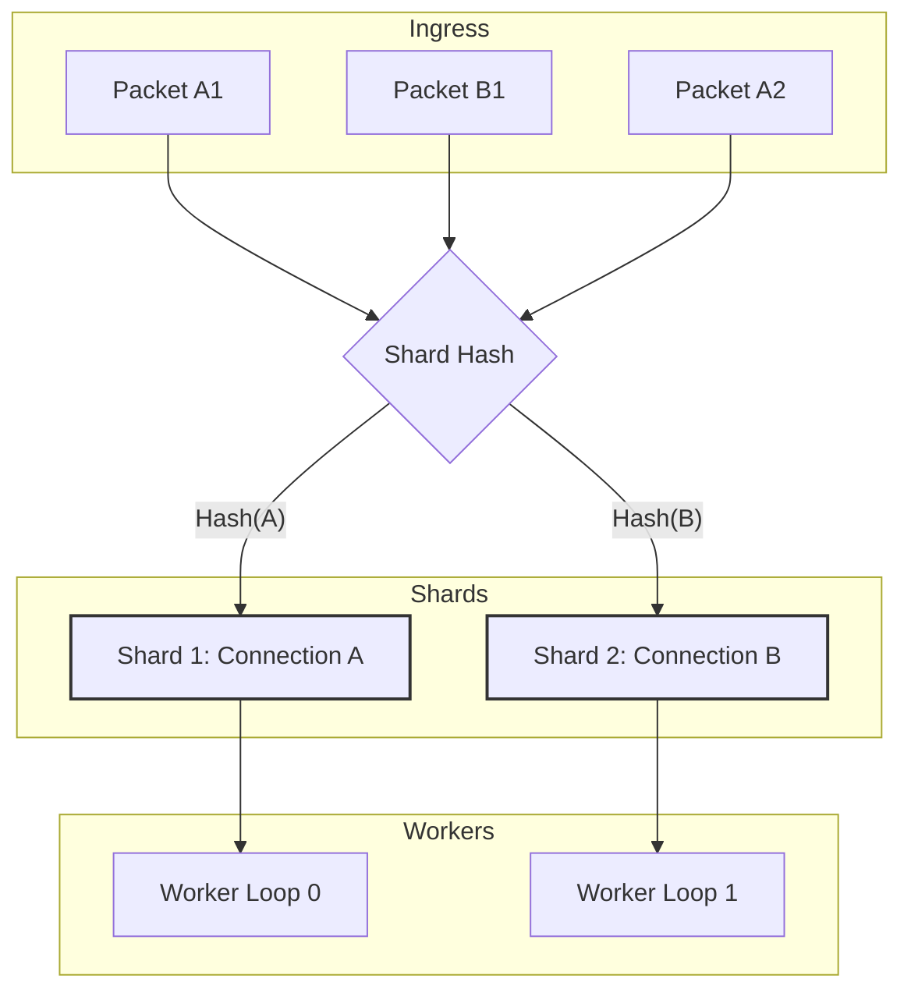

# Shard-Aware Dispatch

!!! warning "Advanced Topic"
    This page describes multi-threaded synchronization and complex parallel scaling architectures. If you are just getting started, please see the [Quickstart](../../quickstart.md).

!!! info "Learning Signals"
    - :fontawesome-solid-layer-group: **Level**: Advanced
    - :fontawesome-solid-clock: **Time**: 15 minutes
    - :fontawesome-solid-book: **Prerequisites**: [Architecture](../fundamentals/architecture.md)

Nalix uses a shard-aware dispatch architecture to scale packet processing across multiple CPU cores while maintaining strict delivery order for individual connections.

!!! note "Server-Side Backbone"
    The sharding and dispatch system is part of the `Nalix.Runtime` layer, which serves as the high-performance backbone for Nalix-based servers. While the SDK handles transport and framing, the Runtime orchestration ensures that server-side handlers can scale across many cores without data races or sequential consistency issues.


## 1. The Affinity Model

A core challenge in high-performance networking is maintaining the order of packets within a session (e.g., TCP stream or UDP session) while scaling workers. Nalix solves this using **Hashed Connection Affinity**.

### How it works

1. When a packet arrives, the `PacketDispatchChannel` identifies the source `IConnection`.
2. The connection is mapped to a specific internal **shard queue** based on its hash.
3. Each shard is exclusively processed by one of the configured **Worker Loops** at any given time.
4. This ensures that packets from Connection A never "leapfrog" each other, even if the server has 64 cores.



---

## 2. Configuring Shards for Production

You can tune the parallelism of your application by adjusting the number of shards (worker loops) in the hosting builder.

### Production Optimization Checklist

| Option | Default | Tuning Strategy |
| --- | --- | --- |
| `DispatchLoopCount` | `null` (auto) | Set explicitly for deterministic loop count, or keep auto mode. |
| `MinDispatchLoops` / `MaxDispatchLoops` | `1` / `64` | Clamp auto loop selection based on host capacity. |
| `MaxDrainPerWake` | `2,048` | Upper cap for drain budget. Actual drain uses `Clamp(ProcessorCount * MaxDrainPerWakeMultiplier, MinDrainPerWake, MaxDrainPerWake)`. |
| `MaxDrainPerWakeMultiplier` | `8` | Multiplier applied to `ProcessorCount` to compute the actual drain budget per wake cycle. |

```csharp
using Nalix.Hosting;

var builder = NetworkApplication.CreateBuilder();

builder.ConfigureDispatch(options =>
{
    // 1. Core Affinity: Match physical cores to avoid context switching
    options.WithDispatchLoopCount(Environment.ProcessorCount / 2);
    
    // 2. Auto-mode guardrails (used only when DispatchLoopCount is null)
    options.MinDispatchLoops = 2;
    options.MaxDispatchLoops = 32;
    
    // 3. Throughput Tuning: Process 16 packets per wake to improve cache locality
    options.MaxDrainPerWakeMultiplier = 16; 
});
```

---

## 3. Advanced Interaction

### Influencing Shard Priority

While a shard processes packets sequentially, it is **Priority-Aware**. Each shard maintains multiple internal queues (Urgent, High, Normal, Low).

A custom `Protocol` can influence which queue a packet lands in by setting the **Priority Byte** in the Nalix header before hand-off:

```csharp
using Nalix.Abstractions.Networking;
using Nalix.Abstractions.Networking.Packets;
using Nalix.Framework.Memory.Buffers;

public override void ProcessMessage(object sender, IConnectEventArgs args)
{
    IBufferLease lease = args.Lease;
    
    // Example: Elevate priority for Handshake or Control packets
    if (IsHighPriority(lease))
    {
        // 7 is the Priority offset in the Nalix header (Magic:4, Op:2, Flags:1)
        lease.Span[7] = (byte)PacketPriority.HIGH;
    }
    
    _dispatch.HandlePacket(lease, args.Connection);
}
```

### Custom Sharding Logic & Shard Keys

The dispatch system determines the "Shard Key" by the **Object Identity** of the `IConnection` instance passed to the dispatcher. By default, each physical socket connection has its own identity and thus its own shard.

To implement custom sharding logic (e.g., User-based affinity or Room-based affinity), you must use a **Shard Proxy** (also known as a Virtual Connection).

#### How to implement a Shard Proxy:

1. **Define a Shared Instance**: Create a single instance of an object that represents your shard (e.g., a `UserContext` or `RoomContext`).
2. **Pass the Proxy to Dispatch**: Instead of passing the raw physical connection to `_dispatch.HandlePacket`, pass the shared proxy instance.
3. **Sequential Guarantee**: Because both physical connections share the same proxy instance, they share the same internal `ConnectionState` in the dispatcher, guaranteeing they are never processed in parallel.

#### Production Scenario: User-Based Affinity

If a player logs in from multiple devices (e.g., Phone and Tablet), and you need to ensure their state is updated sequentially across all devices to avoid race conditions in your database or game logic.

```csharp
using Nalix.Abstractions.Networking;
using Nalix.Framework.Memory.Buffers;

// A minimal proxy that the dispatcher uses as a Shard Key
public sealed class UserShardProxy : IConnection
{
    // The physical connection we are currently wrapping (if needed for sending)
    public IConnection PhysicalConnection { get; }
    public long UserID { get; }

    public UserShardProxy(long userId, IConnection physical)
    {
        UserID = userId;
        PhysicalConnection = physical;
    }

    // DISPATCHER NOTE: The dispatcher uses RuntimeHelpers.GetHashCode(connection)
    // for bucket selection. For the proxy to work as a shard key, you MUST
    // reuse the SAME object instance for all connections belonging to the same Shard.
    
    // Delegate required members...
    public ISnowflake ID => PhysicalConnection.ID;
    public INetworkEndpoint NetworkEndpoint => PhysicalConnection.NetworkEndpoint;
    // ... other IConnection members
}

// In your Protocol or Middleware:
public void RouteToUserShard(IConnection rawConnection, IBufferLease packet)
{
    // Retrieve the shared proxy instance from your session manager.
    // Ensure this returns the EXACT SAME instance for the same UserID.
    var proxy = SessionManager.GetOrCreateUserShard(rawConnection.UserID);
    
    // The dispatcher now treats all packets for this 'proxy' instance 
    // as a single sequential stream (Shard).
    _dispatch.HandlePacket(packet, proxy);
}
```

!!! tip "Full Implementation Guide"
    For a complete, step-by-step example of implementing a `ShardProxy` and registering a custom router in the hosting builder, see the [Custom Packet Router Guide](../../guides/extensibility/custom-packet-router.md).

---

## 4. Error Handling & Backpressure

A robust production setup must handle dispatch failures and per-packet exceptions gracefully.

### Global Error Hook

Register a global observer to capture exceptions that escape handler logic before they trigger a protocol-level failure:

```csharp
using Nalix.Hosting;
using Nalix.Abstractions.Networking.Packets;

builder.ConfigureDispatch(options =>
{
    options.WithErrorHandling((exception, opCode) => 
    {
        Log.Error($"Dispatch failed for OpCode 0x{opCode:X4}: {exception.Message}");
    });
});
```

### Backpressure with DispatchOptions + DropPolicy

Per-connection queue backpressure is controlled by `DispatchOptions` (`MaxPerConnectionQueue` + `DropPolicy`):

- **DropNewest**: Rejects the incoming packet. Safest for real-time latency.
- **DropOldest**: Removes the head of the queue to make room. Ensures data freshness.
- **Coalesce**: Drops duplicate packets (by key) and keeps only the latest. Useful for state-snapshot workloads.
- **Block**: Stalls the calling thread (usually the protocol reader). Highest reliability, but can lead to socket timeouts if handlers are slow.

!!! warning
    Use `DropPolicy.Block` with caution. If a background worker stalls, it can trigger a backpressure ripple that eventually blocks the TCP accept loop.

---

## 5. Monitoring Shard Health

Use the built-in diagnostic reports to identify hotspots or imbalanced shards.

```csharp
// Get a human-readable report of shard status
string report = dispatchChannel.GenerateReport();
Console.WriteLine(report);
```

The report provides:

- **Total Packets**: Total load across all shards.
- **Ready Connections**: Connections waiting for a worker to pick them up.
- **Top Connections**: Connections with the most pending work in their shard queue.

---

## Best Practices

- **Avoid Shard Blocking**: Never use `Thread.Sleep()` or long synchronous blocks in a handler. Since a worker processes one shard at a time, a blocked worker freezes all connections assigned to its shard.
- **CPU Scaling**: Aim for a `DispatchLoopCount` near your physical core count for CPU-bound logic.
- **Batching**: Use `MaxDrainPerWake` settings to tune the "granularity" of the worker loops. Larger batches improve cache locality but can introduce jitter.
