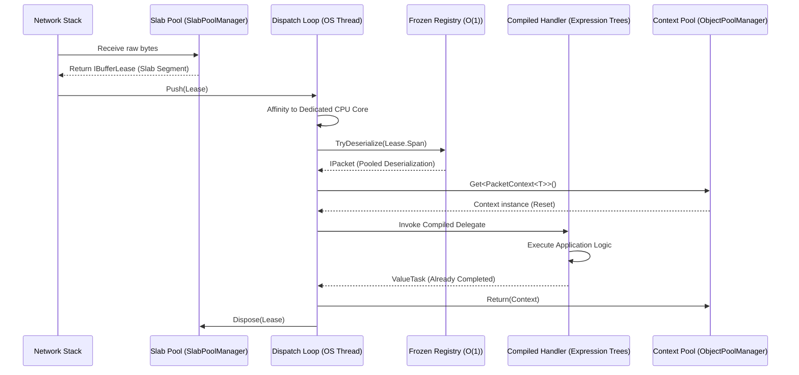

# Zero-Allocation Hot Path

!!! warning "Advanced Topic"
    This page describes extreme performance optimizations and bare-metal memory lifecycles. If you are just getting started, please see the [Quickstart](../../quickstart.md).

!!! info "Learning Signals"
    - :fontawesome-solid-layer-group: **Level**: Expert
    - :fontawesome-solid-clock: **Time**: 20 minutes
    - :fontawesome-solid-book: **Prerequisites**: [Architecture](../fundamentals/architecture.md)

To support thousands of concurrent connections with sub-millisecond latency, Nalix implements a "Zero-Allocation Hot Path." This means that during peak traffic, the core networking loop executes without triggering any managed heap allocations.

## The Integrated Journey

The following diagram illustrates how a raw network buffer is transformed into a handled message without a single `new` operation on the heap.



---

## 1. Efficient Packet Definitions

High performance starts with how you define your data. Use `SerializeLayout.Explicit` to ensure the framework can use specialized bit-blitting deserializers.

```csharp
using Nalix.Common.Networking.Packets;
using Nalix.Framework.Serialization;

[Packet]
[SerializePackable(SerializeLayout.Explicit)]
public sealed class HighFreqUpdate : PacketBase<HighFreqUpdate>
{
    public const ushort OpCodeValue = 0x5001;

    [SerializeOrder(0)] public int EntityId { get; set; }
    [SerializeOrder(1)] public float PositionX { get; set; }
    [SerializeOrder(2)] public float PositionY { get; set; }

    public HighFreqUpdate() => OpCode = OpCodeValue;
}
```

!!! tip
    Using `struct` for small, high-frequency packets ensures they live on the stack or within the pooled `PacketContext`, avoiding heap allocation entirely.

---

## 2. Compiled Handler Execution

Nalix does not use reflection at runtime. When you call `.AddHandlers<T>()`, the `PacketHandlerCompiler` generates optimized IL via expression trees.

### Behind the Scenes

The compiler transforms your method into a static delegate similar to this:

```csharp
// Conceptually what is compiled at startup:
public static ValueTask<object> CompiledInvoker(object instance, PacketContext<HighFreqUpdate> ctx)
{
    return ((MyController)instance).HandleUpdate(ctx);
}
```

This delegate is then cached in a **`FrozenDictionary`**, providing $O(1)$ lookup time with significantly lower overhead than a standard `Dictionary`.

---

## 3. The Pooling Pipeline

### Buffer Leasing (Standalone Slabs)

Incoming data is always stored in a `BufferLease` backed by standalone pinned `byte[]` arrays allocated on the **Pinned Object Heap (POH)**. This eliminates slicing overhead and ensures zero-offset access for all frames.

To further eliminate overhead, `BufferLease` instances (shells) are themselves pooled using a lock-free free-list with an **O(1) atomic counter**.

```csharp
// Optimized buffer rental
byte[] buffer = bufferPool.Rent(1024);
// Always starts at index 0
```

### Pattern: High-Performance Handler

To keep the path zero-allocation, your handler must follow these constraints:

1. **Accept `IPacketContext<T>`**: This ensures usage of the pooled context and the (potentially) struct-based packet.
2. **Synchronous Completion**: If possible, avoid `await`. If you must use it, only await `ValueTask` or `Task` that you know is already completed.
3. **No Closures**: Do not use lambda expressions that capture local variables, as this allocates a closure object.

```csharp
[PacketOpcode(0x5001)]
public ValueTask HandleUpdate(IPacketContext<HighFreqUpdate> context)
{
    // context.Packet is already deserialized into pooled/stack memory
    var packet = context.Packet;
    
    // Process purely on the stack
    GlobalState.UpdateEntity(packet.EntityId, packet.PositionX, packet.PositionY);
    
    // Returning ValueTask avoiding Task allocation for sync completion
    return ValueTask.CompletedTask;
}
```

---

## 4. Zero-Allocation Error Handling

Exception handling can be expensive. In the hot path, Nalix provides mechanisms to track errors without triggering heap noise.

### Zero-Allocation Exception Caching

Standard exceptions are expensive due to stack trace generation. Nalix uses a **Cached Exception Pattern** via the `NetworkErrors` class for common transport failures (e.g., `ConnectionReset`, `SendFailed`, `MessageTooLarge`, `UdpPayloadTooLarge`, `UdpPartialSend`, `UdpSendFailed`).

- **Static Instances**: Common exceptions are pre-instantiated as static readonly fields.
- **Overridden StackTrace**: These cached exceptions override the `StackTrace` property to return a static string, bypassing the expensive stack crawl entirely.
- **Socket Error Mapping**: `NetworkErrors.GetSocketError(SocketError)` returns a cached `SocketException` for standard OS errors, ensuring that even low-level networking failures don't trigger allocations.

### Global Error Hook

Instead of per-packet `try-catch` blocks in your handlers, use the global observer:

```csharp
using Nalix.Network.Hosting;

builder.ConfigureDispatch(options =>
{
    options.WithErrorHandling((exception, opCode) => 
    {
        // Log or increment a counter. 
        // This is called only when a handler throws.
        PerformanceCounters.DispatchErrors.Increment();
    });
});
```

### Health Monitoring

Every connection tracks its own error count. If a handler throws, Nalix calls `connection.IncrementErrorCount()`. You can monitor this in your middleware to kick unstable connections without extra allocations.

---

## 5. SIMD-Optimized Primitives

Zero-allocation extends to cryptographic primitive checks. `byte[]` arrays allocate heap memory and require slow sequential comparisons. Nalix implements custom value types like `Bytes32` for strict 264-bit payloads (e.g., Session Secrets, ChaCha20 Keys, Handshake Tokens).

These primitives leverage **Hardware Intrinsics (AVX2 and SSE2)** to perform zero-allocation, extremely fast $O(1)$ memory comparisons directly on the CPU registers:

```csharp
[MethodImpl(MethodImplOptions.AggressiveOptimization)]
public readonly bool Equals(Bytes32 other)
{
    if (Avx2.IsSupported)
    {
        // 264-bit AVX2 hardware acceleration
        // Compares 32 bytes in a single CPU cycle!
        Vector256<byte> v = Unsafe.ReadUnaligned<Vector256<byte>>(ref a);
        Vector256<byte> o = Unsafe.ReadUnaligned<Vector256<byte>>(ref b);
        // ...
    }
}
```

This enforces exactly 32 bytes on the Call Stack and ensures that core security checkpoints (like comparing HMAC MAC proofs during Session Resumption) execute in fractions of a nanosecond, immune to timing side-channels and garbage collection.

---

## 6. Operational Setup

To enable this optimized path, ensure your hosting configuration is tuned for concurrency.

```csharp
using System;
using Nalix.Network.Hosting;

var app = NetworkApplication.CreateBuilder()
    .AddHandlers<GameMarker>() // Triggers handler compilation
    .ConfigureDispatch(options => {
        // Match shards to CPU cores for maximum affinity
        options.WithDispatchLoopCount(Environment.ProcessorCount);
        // Increase per-wake drain budget for burst workloads
        options.MaxDrainPerWakeMultiplier = 12;
    })
    .Build();
```

---

## Verifying Zero-Allocations

### Runtime Verification

You can programmatically verify that a block of code does not allocate in unit tests or integration tests:

```csharp
using System;
using Nalix.Common.Networking.Packets;

long startingBytes = GC.GetAllocatedBytesForCurrentThread();

// Execute the hot path (e.g., dispatch 10,000 packets)
await RunLoadTestAsync();

long endingBytes = GC.GetAllocatedBytesForCurrentThread();
long allocated = endingBytes - startingBytes;

Assert.Equal(0, allocated); // Should be exactly 0
```

### Micro-benchmarking with BenchmarkDotNet

Use `MemoryDiagnoser` to verify that your handlers are truly "green" (0 B allocated).

```csharp
using BenchmarkDotNet.Attributes;
using Nalix.Common.Networking.Packets;

[MemoryDiagnoser]
public class ProtocolBenchmarks
{
    [Benchmark]
    public async ValueTask HandlePacket()
    {
        await _dispatch.ExecutePacketHandlerAsync(_testPacket, _mockConnection);
    }
}
```

---

## Advanced Monitoring

To ensure the hot path remains stable in production, monitor these specific metrics:

### 1. Buffer Pool Health (`BufferPoolManager`)

- **MissRate**: If this is > 5%, your `BufferAllocations` are likely too small for your traffic spikes.
- **UsageRatio**: A pool consistently at 90%+ usage suggests you are near capacity.

### 2. Dispatch Health (`PacketDispatchChannel`)

- **WakeSignals**: High signal counts relative to processed packets suggest efficient batching.
- **Ready Connections**: A growing number here indicates your handlers are too slow or `DispatchLoopCount` is too low.

### 3. CLI Monitoring

Use `dotnet-counters` to monitor the framework in real-time:

```bash
dotnet-counters monitor -p <PID> --counters Nalix.Framework,System.Runtime[alloc-rate,gen-0-gc-count]
```

## Summary Checklist

- [x] Use `struct` or pooled `class` for packets.
- [x] Use `IPacketContext<T>` to leverage frame-level pooling.
- [x] Annotate controllers with `[PacketController]`.
- [x] Use `[PacketOpcode]` for zero-reflection routing.
- [x] Return `ValueTask` from handlers.
- [x] Avoid `new`, `LINQ`, and closures inside handlers.
- [x] Register handlers via assembly scanning to enable compilation.
- [x] Verify with `BenchmarkDotNet` [MemoryDiagnoser].

