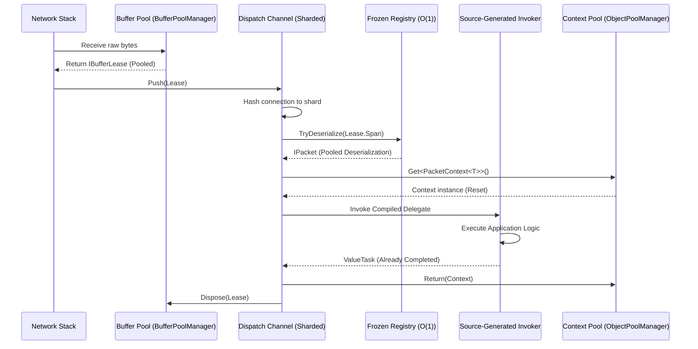

# Zero-Allocation Hot Path

!!! warning "Advanced Topic"
    This page describes extreme performance optimizations and bare-metal memory lifecycles. If you are just getting started, see the [Quickstart](../../quickstart.md).

To support thousands of concurrent connections with sub-millisecond latency, Nalix implements a "Zero-Allocation Hot Path." During peak traffic, the core networking loop executes without triggering any managed heap allocations.

## The Integrated Journey


```mermaid
sequenceDiagram
    participant OS as Network Stack
    participant LP as Buffer Pool (BufferPoolManager)
    participant DC as Dispatch Channel (Sharded)
    participant FR as Frozen Registry (O(1))
    participant CH as Source-Generated Invoker
    participant CP as Context Pool (ObjectPoolManager)

    OS->>LP: Receive raw bytes
    LP-->>OS: Return IBufferLease (Pooled)
    OS->>DC: Push(Lease)
    DC->>DC: Hash connection to shard
    DC->>FR: TryDeserialize(Lease.Span)
    FR-->>DC: IPacket (Pooled Deserialization)
    DC->>CP: Get<PacketContext<T>>()
    CP-->>DC: Context instance (Reset)
    DC->>CH: Invoke Compiled Delegate
    CH->>CH: Execute Application Logic
    CH-->>DC: ValueTask (Already Completed)
    DC->>CP: Return(Context)
    DC->>LP: Dispose(Lease)
```

---

## 1. Efficient Packet Definitions

High performance starts with how you define your data. Use `SerializeLayout.Explicit` so the framework can use specialized bit-blitting deserializers.

```csharp
using Nalix.Codec.DataFrames;
using Nalix.Abstractions.Serialization;

[Packet]
[SerializePackable(SerializeLayout.Explicit)]
public sealed class HighFreqUpdate : PacketBase<HighFreqUpdate>
{
    public const ushort OpCodeValue = 0x5001;

    [SerializeOrder(0)] public int EntityId { get; set; }
    [SerializeOrder(1)] public float PositionX { get; set; }
    [SerializeOrder(2)] public float PositionY { get; set; }

    public HighFreqUpdate() => OpCode = OpCodeValue;
}
```

!!! tip
    Using `struct` for small, high-frequency packets ensures they live on the stack or within the pooled `PacketContext`, avoiding heap allocation entirely.

## 2. Setup & Compilation

Nalix "bakes" your handlers and packet lookups during startup, handled automatically by `NetworkApplicationBuilder`:

1. **Frozen Registry Creation** — `PacketRegistry` uses source-generated metadata to build an immutable `FrozenDictionary` for O(1), branch-prediction-friendly lookups.
2. **Source-Generated Dispatch** — `PacketHandlerGenerator` emits zero-allocation invoker delegates at compile time, eliminating reflection overhead.

```csharp
using Nalix.Hosting;

var app = NetworkApplication.CreateBuilder()
    .MapHandlers<GameController>() // invokers generated at build time
    .Build(); // lookups frozen at startup
```

If you're not using the hosting layer, populate dispatch options manually:

```csharp
var channel = new PacketDispatchChannel(options =>
{
    options.WithHandler(() => new MyController());
});
```

The compiler transforms your handler method into a static delegate conceptually like this:

```csharp
public static ValueTask<object?> CompiledInvoker(object? instance, PacketContext<HighFreqUpdate> ctx)
    => ((MyController)instance!).HandleUpdate(ctx);
```

This delegate is cached in a `FrozenDictionary`, giving O(1) lookup with lower overhead than a standard `Dictionary`.

## 3. The Pooling Pipeline

### Buffer leasing

Incoming data is stored in a `BufferLease` backed by pooled pinned `byte[]` arrays managed by the framework's slab buckets. `BufferLease` shells are themselves pooled via a lock-free free-list with an O(1) atomic counter.

```csharp
using BufferLease lease = BufferLease.Rent(1024);
// use lease.Span for zero-copy slicing
```

### Constructing outgoing packets

When sending a packet, don't use `new byte[]` — rent a lease, serialize into it, and send the memory slice:

```csharp
[PacketOpcode(0x5002)]
public async ValueTask SendResponse(IPacketContext<MyPacket> context)
{
    var response = new MyResponse { Status = 200 };

    using var lease = BufferLease.Rent(response.Length);
    int written = response.Serialize(lease.SpanFull);
    lease.CommitLength(written);

    await context.Connection.TCP.SendAsync(lease.Memory);
}
```

### Object pooling (zero-lock / zero-allocation)

Nalix pools incoming context metadata and other hot-path objects using a hybrid `ObjectPool` model:

- **Thread-Local Lock-Free Cache** — `ThreadLocalCache<T>` bypasses the central pool, saving/retrieving on the same thread with zero synchronization overhead.
- **Flat Index ID Resolution** — compile-time type IDs (`PoolType<T>.Id`) index directly into a pre-allocated array of pools, eliminating locks, scans, or hash computation on generic type lookups.

This ensures renting and returning objects executes in ~22 ns with 0 B allocated.

### Pattern: high-performance handler

To keep the path zero-allocation, your handler must:

1. **Accept `IPacketContext<T>`** — uses the pooled context and the (potentially) struct-based packet.
2. **Complete synchronously where possible** — if you must `await`, only await a `ValueTask`/`Task` you know is already completed.
3. **Avoid closures** — lambdas that capture local variables allocate a closure object.

```csharp
[PacketOpcode(0x5001)]
public ValueTask HandleUpdate(IPacketContext<HighFreqUpdate> context)
{
    var packet = context.Packet;
    GlobalState.UpdateEntity(packet.EntityId, packet.PositionX, packet.PositionY);
    return ValueTask.CompletedTask;
}
```

!!! danger "Cancellation hazards & use-after-free"
    When writing asynchronous handlers (`async ValueTask`), you **must** pass `context.CancellationToken` to any I/O call (such as `SendAsync`).

    **Why?** Nalix uses aggressive `ObjectPool` caching for every packet. If a connection drops, the dispatcher instantly cancels the pending pipeline and returns the packet to the pool. If your `SendAsync` call doesn't accept the cancellation token, it becomes an orphaned task that keeps reading from a pooled packet that's already been cleared or reassigned to a new connection — this causes `ArgumentException` (e.g. "Buffer too small") or memory corruption.

### Pattern: the ultra hot path (zero deserialization)

For packets where even bit-blitting deserialization is too costly (streaming media, encrypted proxy traffic), bypass the `PacketRegistry` entirely by accepting raw memory:

```csharp
[PacketOpcode(0x7001)]
public ValueTask HandleRawData(ReadOnlyMemory<byte> memory, IConnection connection)
{
    // 'memory' points directly to the pooled IBufferLease.Span.
    // No deserialization, no allocation, no OpCode validation check.
    Process(memory.Span);
    return ValueTask.CompletedTask;
}
```

!!! important "Security vs performance"
    Bypassing deserialization also bypasses the framework's built-in OpCode and checksum validation. Use this only for internal or already-authenticated streams.

## 4. Fair Concurrency & Priority Management

To process thousands of concurrent connections without one high-volume packet type (like movement updates) monopolizing CPU, Nalix uses a sharded, priority-aware dispatch system.

**Thread affinity**: all packets from a single connection are processed sequentially on the same core, avoiding races without locks. **Parallelism**: different connections spread across all available cores.

```csharp
builder.ConfigureDispatchOptions(options => {
    // Match shards to CPU cores (default: Environment.ProcessorCount)
    options.WithDispatchLoopCount(Environment.ProcessorCount);
    // Increase the budget of packets processed per core wake-up
    options.Drain.MaxDrainPerWakeMultiplier = 12;
});
```

Nalix also implements **Deficit Round Robin (DRR)** scheduling: if a client floods the server with low-priority packets, high-priority packets (like chat or items) still get processed within their guaranteed quota.

```csharp
[Packet]
public sealed class UrgentAlert : PacketBase<UrgentAlert>
{
    public UrgentAlert()
    {
        OpCode = 0x9001;
        Priority = PacketPriority.URGENT;
    }
}
```

Tune the relative budget per priority level via `dispatch.ini`:

```ini
[DispatchOptions]
# Weights for [NONE, LOW, MEDIUM, HIGH, URGENT]
# Default "1,2,4,8,16" means URGENT is 16x more likely to be served than NONE.
PriorityWeights = 1,1,2,5,20
```

## 5. Zero-Allocation Error Handling

Exception handling can be expensive. Standard exceptions are costly due to stack trace generation — Nalix caches common transport exceptions (`ConnectionReset`, `SendFailed`, `MessageTooLarge`, `UdpPayloadTooLarge`, `UdpPartialSend`, `UdpSendFailed`) as static readonly fields via the `Throw` class, overriding `StackTrace` to bypass the expensive stack crawl. `Throw.GetSocketError(SocketError)` returns a cached `SocketException` for standard OS errors.

Prefer returning a result object over throwing for business-logic failures:

```csharp
public ValueTask<LoginResult> HandleLogin(LoginRequest request)
{
    if (!Valid(request))
        return ValueTask.FromResult(LoginResult.InvalidCredentials);
    // ...
}
```

Instead of per-packet `try-catch`, register a global observer — called only when a handler throws:

```csharp
using Nalix.Hosting;

builder.ConfigureDispatchOptions(options =>
{
    options.WithErrorHandling((exception, opCode) =>
    {
        Logger.Error($"OpCode 0x{opCode:X4} failed: {exception.Message}");
        Metrics.HandlerErrors.WithLabels(opCode.ToString()).Inc();
    });
});
```

Every connection tracks its own error count — Nalix calls `connection.IncrementErrorCount()` whenever a handler throws. Monitor this in middleware to disconnect unstable clients without extra allocations:

```csharp
public sealed class HealthGuardMiddleware : IPacketMiddleware<IPacket>
{
    public async ValueTask InvokeAsync(IPacketContext<IPacket> context, Func<CancellationToken, ValueTask> next)
    {
        if (context.Connection.ErrorCount > 10)
        {
            context.Connection.Disconnect("Protocol violation threshold exceeded.");
            return;
        }
        await next(context.CancellationToken);
    }
}
```

## 6. SIMD-Optimized Primitives

Zero-allocation extends to cryptographic primitive checks. `byte[]` arrays allocate heap memory and require slow sequential comparisons. Nalix implements custom value types like `Bytes32` for strict 256-bit payloads (session secrets, X25519 keys, handshake hashes), using AVX2/SSE2 hardware intrinsics for O(1) comparisons directly on CPU registers:

```csharp
[MethodImpl(MethodImplOptions.AggressiveOptimization)]
public readonly bool Equals(Bytes32 other)
{
    if (Avx2.IsSupported)
    {
        // 256-bit AVX2 hardware acceleration — compares 32 bytes in a single CPU cycle
        Vector256<byte> v = Unsafe.ReadUnaligned<Vector256<byte>>(ref a);
        Vector256<byte> o = Unsafe.ReadUnaligned<Vector256<byte>>(ref b);
        // ...
    }
}
```

This makes core security checkpoints (like comparing HMAC MAC proofs during session resumption) execute in fractions of a nanosecond, immune to timing side-channels and garbage collection.

## Verifying Zero-Allocations

Verify a block of code allocates nothing in unit or integration tests:

```csharp
long startingBytes = GC.GetAllocatedBytesForCurrentThread();
await RunLoadTestAsync(); // e.g. dispatch 10,000 packets
long allocated = GC.GetAllocatedBytesForCurrentThread() - startingBytes;
Assert.Equal(0, allocated);
```

Or use BenchmarkDotNet's `MemoryDiagnoser` to confirm handlers are truly "green" (0 B allocated):

```csharp
[MemoryDiagnoser]
public class ProtocolBenchmarks
{
    [Benchmark]
    public async ValueTask HandlePacket()
        => await _dispatch.ExecutePacketHandlerAsync(_testPacket, _mockConnection);
}
```

## Advanced Monitoring

- **Buffer Pool Health** (`BufferPoolManager`) — `MissRate` > 5% means your `BufferAllocations` are too small for traffic spikes; `UsageRatio` consistently at 90%+ means you're near capacity.
- **Dispatch Health** (`PacketDispatchChannel`) — high `WakeSignals` relative to processed packets suggests efficient batching; a growing `Ready Connections` count means handlers are too slow or `DispatchLoopCount` is too low.
- **CLI monitoring** — `dotnet-counters monitor -p <PID> --counters Nalix.Framework,System.Runtime[alloc-rate,gen-0-gc-count]`.

## Summary Checklist

- [x] Use `struct` or pooled `class` for packets.
- [x] Use `IPacketContext<T>` to leverage frame-level pooling.
- [x] Use `ReadOnlyMemory<byte>` handlers for zero-deserialization bypass.
- [x] Annotate controllers with `[PacketHandler]`.
- [x] Use `[PacketOpcode]` for zero-reflection routing.
- [x] Use SIMD primitives (`Bytes32`) for security checks.
- [x] Return `ValueTask` from handlers.
- [x] Avoid `new`, LINQ, and closures inside handlers.
- [x] Use `Throw` for zero-allocation exception propagation.
- [x] Verify with BenchmarkDotNet `[MemoryDiagnoser]`.
