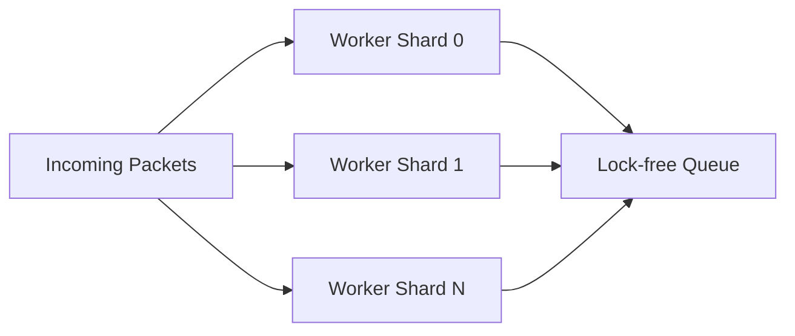

# Performance Optimizations

Nalix is engineered from the ground up to achieve maximum throughput and minimum latency in high-stakes networking environments. This page deep-dives into the core optimizations that make Nalix production-grade.

## 1. Zero-Allocation Data Path

Traditional networking stacks often suffer from excessive garbage collection (GC) pauses due to frequent buffer allocations. Nalix eliminates this by using:

### Buffer Pooling (`IBufferLease`)
Instead of `byte[]`, Nalix uses a sophisticated `BufferPoolManager`. Every incoming packet is leased into a memory-aligned buffer and must be returned via `Dispose()`.
- **Pre-sized Buckets**: Minimal fragmentation.
- **Span-first API**: Leverages `Span<byte>` for slicing without copying data.

### Poolable Contexts (`IPacketContext<T>`)
The `PacketContext` object itself is poolable. When a handler is invoked, the context is fetched from a local thread-safe pool and reset after the handler completes.

## 2. Shard-Aware Dispatching

To prevent "Head-of-Line Blocking" (where a single slow handler slows down all incoming packets), Nalix implements a multi-worker sharded dispatch system.

- **Parallel Execution**: Workers are scaled to match the logical CPU core count.
- **Wake-Signaling**: Uses `System.Threading.Channels` for coalesced signaling, reducing CPU wake-ups when traffic is bursty.

## 3. 56-Bit Snowflake Identifiers

Nalix uses a customized 56-bit Snowflake identifier for all internal task tracking and packet correlation. Unlike the standard 64-bit Snowflake, this version is optimized for:
- **Smaller Payload**: Fits more efficiently into packed headers.
- **High Resolution**: 1ms timestamp resolution with 12 bits for sequence (4096 IDs per ms per shard).
- **Network Safety**: Avoids issues with 53-bit precision limits in some client environments (e.g., JavaScript).

## 4. Frozen Registry Lookups

The `PacketRegistry` uses `System.Collections.Frozen.FrozenDictionary` for looking up packet deserializers.
- **O(1) Access**: Immutable lookup tables optimized for read-heavy hot paths.
- **Dev-time Scanning**: Assemblies are scanned once at startup, creating a static jump table for packet magic numbers.

## 5. Metadata Pre-compilation

Middlewares and Handlers are not resolved via slow reflection on every request.
- **Compiled Handlers**: Handler methods are wrapped in pre-compiled delegates or expression trees during `Build()`.
- **Attribute Caching**: Packet metadata (roles, timeouts, rate limits) is resolved once and cached alongside the packet type in the registry.

## 6. Compression Scaling (LZ4)

The `FrameTransformer` dynamically scales LZ4 hash tables based on the payload size.
- **Micro-Payloads**: Uses tiny, stack-allocated hash tables for sub-64KB packets.
- **Batch Processing**: Groups identical compression tasks to leverage SIMD instructions where available.

## Pro-Tip for Developers

To maintain these performance benefits in your own application:
1. **Always use `IPacketContext.Packet`** instead of creating new instances.
2. **Avoid `await Task.Delay`** in handlers; use the built-in `TimingWheel` for scheduled tasks.
3. **Prefer `ValueTask`** for handler return types to avoid unnecessary Task allocations on synchronized paths.
