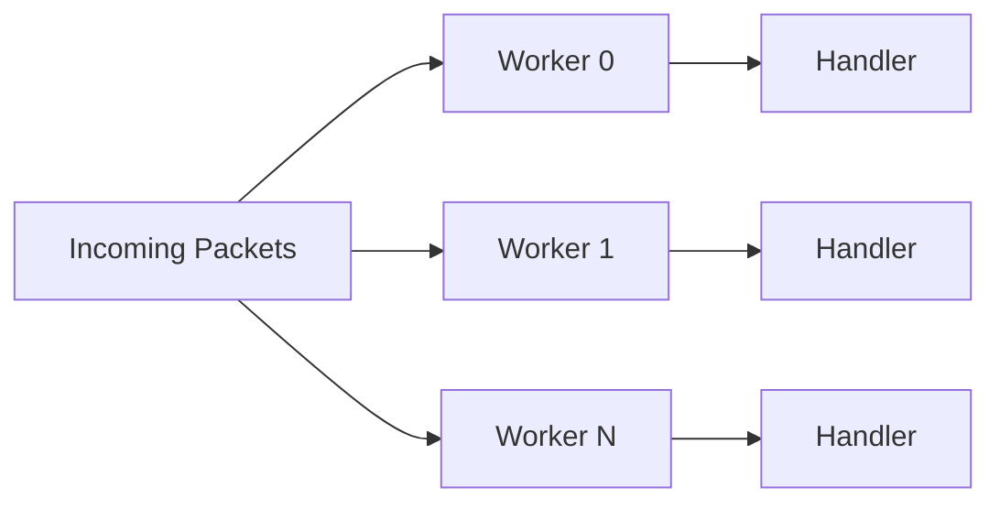

# Performance Optimizations

!!! warning "Advanced Topic"
    This page describes internal framework mechanics like Span limits, structure alignments, and GC overheads.

!!! info "Learning Signals"
    - :fontawesome-solid-layer-group: **Level**: Advanced
    - :fontawesome-solid-clock: **Time**: 15 minutes
    - :fontawesome-solid-book: **Prerequisites**: [Architecture](architecture.md)

Nalix is engineered to minimize latency and maximize throughput on the networking hot path. This page explains the specific techniques used and why they matter for production workloads.

## 1. Zero-Allocation Data Path

Traditional networking stacks suffer from GC pressure due to frequent buffer allocations. Nalix eliminates this by pooling all hot-path resources.

!!! tip
    Monitor GC pause time and allocated bytes as your primary performance indicators during load testing.

For a complete end-to-end walkthrough of how these optimizations work together in a production scenario, see the [Zero-Allocation Hot Path](../guides/zero-allocation-hot-path.md) guide.

### Buffer Pooling (BufferLease)

Instead of allocating `byte[]` per request, Nalix uses `BufferPoolManager`. Every incoming packet is leased into a pre-sized, memory-aligned buffer and must be returned via `Dispose()`.

- **Pre-sized buckets** — Minimize internal fragmentation by using size-class buckets.
- **Span-first API** — Leverages `Span<byte>` and `ReadOnlySpan<byte>` for slicing without copying data.
- **Deterministic lifetime** — `BufferLease` implements `IDisposable`, ensuring buffers return to the pool after handler execution.

### Poolable Contexts (IPacketContext)

The `PacketContext<TPacket>` object itself is poolable. When a handler is invoked, the context is fetched from a thread-safe pool and reset after the handler completes. This avoids per-request allocations for the most frequently created object in the dispatch path.

## 2. Shard-Aware Dispatching

To prevent head-of-line blocking — where a single slow handler stalls all incoming packets — Nalix implements a multi-worker sharded dispatch system.

- **Parallel execution** — Workers are scaled to match logical CPU cores in auto mode (`WithDispatchLoopCount(null)` on `PacketDispatchOptions<TPacket>`).
- **Wake-signaling** — Uses `System.Threading.Channels` for coalesced signaling. Under bursty traffic, multiple enqueue operations may trigger a single wake, reducing unnecessary CPU wake-ups.

## 3. 56-Bit Snowflake Identifiers

Nalix uses a customized 56-bit Snowflake identifier for internal task tracking and packet correlation.

| Design choice | Rationale |
|---|---|
| 56-bit (vs. standard 64-bit) | Fits efficiently into packed headers, avoids 53-bit precision limits in JavaScript-based clients |
| 1 ms timestamp resolution | Sufficient for networking use cases; enables 4,096 IDs per millisecond per shard (12-bit sequence) |
| Deterministic ordering | Snowflake IDs are sortable by creation time, enabling natural ordering in logs and diagnostics |

## 4. Frozen Registry Lookups

The `PacketRegistry` uses `System.Collections.Frozen.FrozenDictionary<uint, PacketDeserializer>` for packet type resolution.

- **O(1) access** — Immutable, read-optimized lookup tables built once at startup.
- **Function-pointer binding** — Packet deserialization is bound using `delegate* managed<ReadOnlySpan<byte>, TPacket>` (unsafe function pointers). This eliminates delegate allocation and reduces indirection compared to `Func<>` delegates.
- **FNV-1a magic keys** — Packet types are identified by a 32-bit FNV-1a hash of the type's full name, computed during registry construction.

## 5. Metadata Pre-Compilation

Middleware and handler metadata are not resolved via reflection on every request.

- **Compiled handlers** — Handler methods are wrapped in pre-compiled delegates during `Build()`. No reflection occurs during handler invocation.
- **Attribute caching** — Packet metadata (permissions, timeouts, rate limits, concurrency limits) is resolved once during handler registration and cached alongside the packet entry in the registry.

## 6. LZ4 Compression

The `LZ4Codec` provides pooled block compression and decompression optimized for networking payloads.

- **Pooled hash tables** — `LZ4HashTablePool` manages reusable hash tables to avoid allocation during compression.
- **Span-based API** — Both `Encode` and `Decode` accept `ReadOnlySpan<byte>` input and `Span<byte>` output, supporting zero-copy integration with the buffer pool.
- **Lease-based output** — `Encode(input, out BufferLease lease, out int bytesWritten)` produces a pooled buffer lease ready for direct network transmission.

## Maintaining Performance in Your Application

To preserve these performance characteristics in your own handlers and middleware:

1. **Always dispose `BufferLease` and `PacketLease<T>`** — Leaking pooled resources degrades throughput over time.
2. **Avoid blocking in handlers** — Use `async`/`await` for I/O. For scheduled work, use `TaskManager` or `TimingWheel` instead of `Task.Delay`.
3. **Prefer `ValueTask` for handler return types** — Avoids unnecessary `Task` allocations on synchronous (already-complete) code paths.
4. **Use `IPacketContext.Packet`** — Access the deserialized packet from the context rather than creating new instances.

## Benchmarks

For measured performance data across serialization, cryptography, compression, and infrastructure, see the [Benchmarks](../benchmarks/index.md) section.

## Recommended Next Pages

- [Architecture](./architecture.md) — Layered component overview
- [Packet System](./packet-system.md) — Serialization layouts and wire format
- [Buffer Management](../api/framework/memory/buffer-management.md) — Buffer pool API details
- [Object Pooling](../api/framework/memory/object-pooling.md) — Object recycling API details
- [LZ4](../api/framework/memory/lz4.md) — Compression API details
