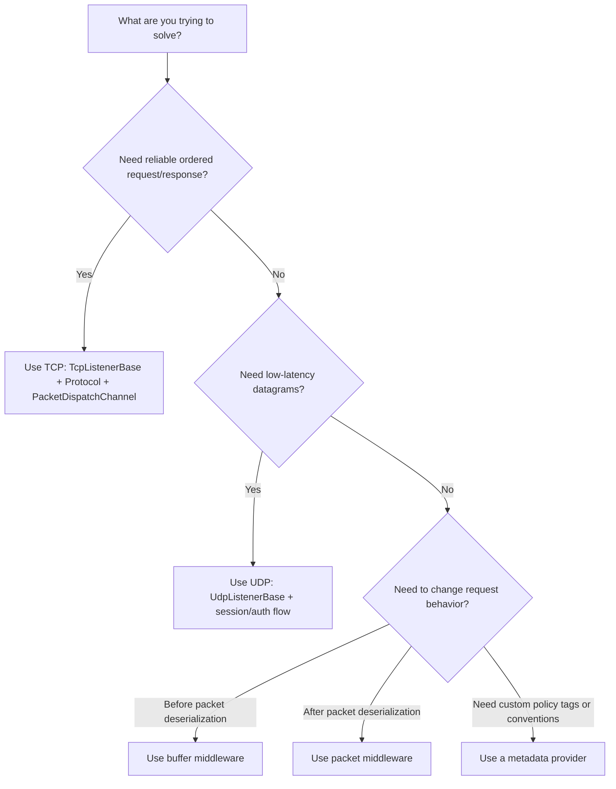
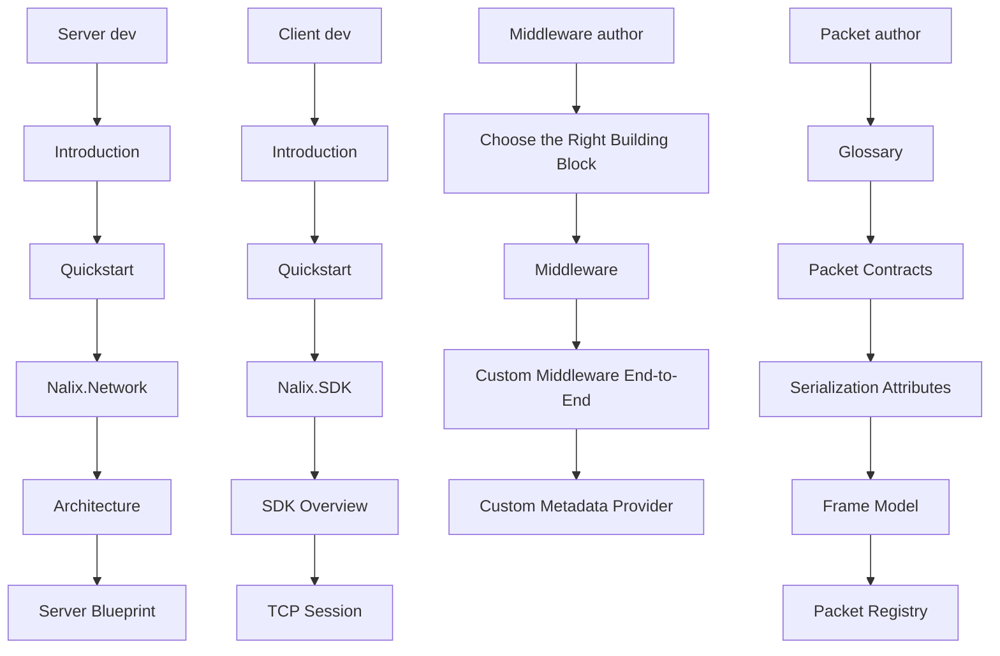

# Choose the Right Building Block

If you are new to Nalix, this page helps you choose the right entry point quickly.

Use it when you know the problem you are solving, but not yet which Nalix piece should own it.

## Decision diagram

## Decision Matrix

| You want to... | Use |
| :--- | :--- |
| Intercept, audit, or secure all/some packets | **Middleware** |
| Implement custom binary framing or binary security | **Protocol** |
| Customize how packets are queued, prioritized, or sharded | **Dispatch** |
| Implement business features or request logic | **Handler** |
| Tag handlers with region, tenant, or policy metadata | **Metadata Provider** |

## Quick rules

### Choose TCP when

- you want normal request/response
- ordering matters
- reliability matters
- you want the simplest starting path

Start with:

- `TcpListenerBase`
- `Protocol`
- `PacketDispatchChannel`

### Choose UDP when

- you want lower-latency datagrams
- you can tolerate packet loss
- you already understand session identity and auth requirements

Start with:

- `UdpListenerBase`
- a TCP-backed session/bootstrap path
- `IsAuthenticated(...)`

### Choose packet middleware when

- the packet is already deserialized
- you need `PacketContext`
- you care about permission, timeout, rate limit, audit, or handler policy
- the handler may be a built-in packet or a custom packet type

### Choose buffer middleware when

- you need raw bytes
- you want to decrypt, decompress, validate, or drop before deserialization

### Choose a metadata provider when

- you want custom attributes
- you want convention-based metadata
- you want middleware to read custom handler tags
- you want those tags to work consistently across built-in and custom packet handlers

## Common examples

| Need | Best fit |
| :--- | :--- |
| Public game login or command endpoint | TCP |
| Position/state update stream | UDP |
| Block unauthorized packets | Packet middleware |
| Decompress a frame before packet creation | Buffer middleware |
| Tag handlers by tenant/region/product | Metadata provider |

## Suggested first path for most clients

If you are unsure, choose this order:

1. TCP
2. standard packet attributes
3. packet middleware
4. metadata provider
5. UDP

That path is easier to debug and easier for teams to adopt.

## A safe default

If you do not have a strong reason to customize early, start with:

- TCP
- built-in packet attributes
- one small packet middleware
- no custom metadata provider yet

That gives you the cleanest learning path and the fewest moving parts.

## Related pages

- [Glossary](./glossary.md)
- [Middleware](./middleware.md)
- [TCP Request/Response](../guides/tcp-request-response.md)
- [UDP Auth Flow](../guides/udp-auth-flow.md)
- [Custom Middleware](../guides/custom-middleware-end-to-end.md)
- [Custom Metadata Provider](../guides/custom-metadata-provider.md)

## Reading paths by persona

If you are not sure where to begin, start with the persona that matches your current task.
