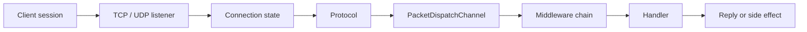
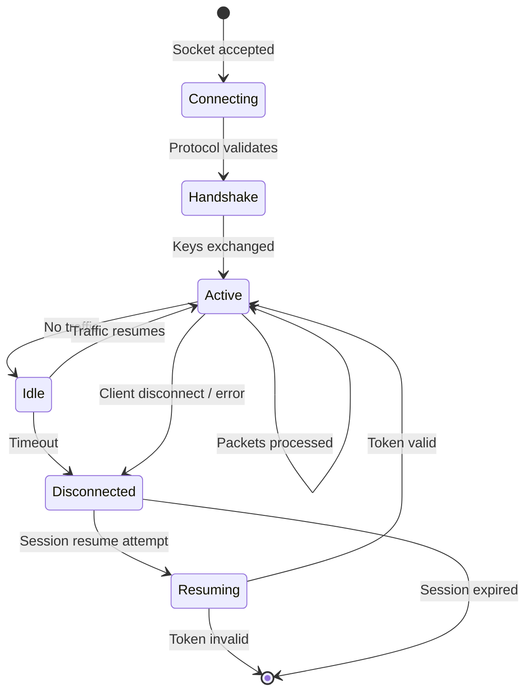

# Real-time Engine

Nalix is designed around a real-time server model with long-lived sessions, predictable dispatch flow, and explicit throttling controls. This page explains the runtime mindset behind the network layer — how sessions, dispatch, and protection work together.

## Mental Model



## Session Lifecycle

At runtime, Nalix maintains state around each connection — not just around individual messages. This persistent state is what makes real-time patterns possible.



Connection state includes:

| State | Description |
| :--- | :--- |
| Connection ID | Unique identifier for the session |
| Remote endpoint | Source IP and port |
| Permission level | Authorization level (`NONE`, `USER`, `ADMINISTRATOR`, etc.) |
| Cipher state | Active encryption algorithm and shared secret |
| Diagnostics | Bytes sent/received, uptime, ping time, error count |

This is why `Connection` and `ConnectionHub` sit at the center of the real-time model.

## Request Flow

A typical TCP request follows this path:

1. Socket accepted by `TcpListenerBase`.
2. `TcpListenerBase` registers the connection with the `ConnectionHub` and initiates the asynchronous receive loop.
3. The **Listener** receives a frame and executes the `FramePipeline` (decrypt/decompress).
4. The resolved **Protocol** receives the processed message via `ProcessMessage(...)`.
5. Messages are forwarded into `PacketDispatchChannel`.
6. Dispatch deserializes the packet, runs middleware, and invokes the handler.
7. Handler returns or sends a response.

For client applications, the simplest mental model is:

- **TCP** = reliable, ordered command/request flow
- **Dispatch** = application entry point
- **Middleware** = policy enforcement layer

## Low-Latency Datagrams (UDP)

Nalix supports a UDP runtime through `UdpListenerBase` for use cases where reliability is not required:

| Use case | Why UDP |
| :--- | :--- |
| Game state updates | Position/velocity updates where latest value matters, not every value |
| Telemetry | High-frequency sensor or metric data where occasional loss is acceptable |
| Discovery | Service discovery broadcasts |
| Non-critical signals | Heartbeats, status pings |

The UDP path still requires session identity and authentication. Think of it as the same application logic, but with a different transport characteristic:

- Session must be established over TCP first
- Each datagram includes a session token prefix
- Connection secret must be initialized
- `IsAuthenticated(...)` validates each datagram

## Throttling and Protection

Real-time systems fail fastest when they do not control pressure. Nalix integrates protection at multiple levels:

| Component | Layer | Purpose |
| :--- | :--- | :--- |
| `ConnectionGuard` | Socket | Reject endpoints before resource allocation |
| `DatagramGuard` | Transport | Lock-free per-IP UDP packet throttling (UDP Flood protection) |
| `TokenBucketLimiter` | Dispatch | Protect against request spikes with burst budgets |
| `PolicyRateLimiter` | Dispatch | Per-opcode and per-endpoint rate limiting |
| `ConcurrencyGate` | Dispatch | Limit concurrent in-flight handlers |
| `TimingWheel` | Transport | O(1) idle timeout management for connection cleanup |

These are not optional extras. They are part of making the engine stable under production traffic.

## Packet Metadata in the Real-time Path

Handler attributes become runtime behavior through cached metadata:

```csharp
[PacketOpcode(0x3001)]
[PacketPermission(PermissionLevel.USER)]
[PacketTimeout(3000)]
[PacketRateLimit(maxRequests: 30, windowSeconds: 10)]
[PacketConcurrencyLimit(maxConcurrent: 4)]
public ValueTask<PositionAck> HandlePosition(
    IPacketContext<PositionUpdate> context)
{
    // Metadata-driven enforcement happens before this code runs
}
```

Metadata is resolved once during handler registration, then reused through dispatch and middleware on every request. This keeps the real-time path fast and consistent.

## Recommended Next Pages

- [Architecture](../fundamentals/architecture.md) — Layered component overview
- [Middleware](./middleware-pipeline.md) — Buffer vs. packet middleware
- [Packet Dispatch](../../api/runtime/routing/packet-dispatch.md) — Dispatch API reference
- [TCP Request/Response](../../guides/networking/tcp-patterns.md) — TCP pattern guide
- [UDP Auth Flow](../../guides/networking/udp-security.md) — UDP authentication guide
