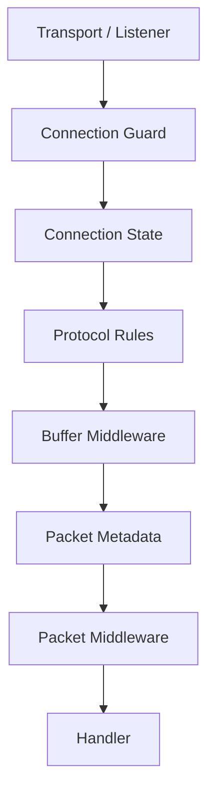

# Security Model

!!! info "Learning Signals"
    - :fontawesome-solid-layer-group: **Level**: Intermediate
    - :fontawesome-solid-clock: **Time**: 15 minutes
    - :fontawesome-solid-book: **Prerequisites**: [Architecture](architecture.md)

This page explains where security decisions happen in Nalix and how the different layers work together to protect your application.

Nalix does not treat security as a single isolated feature. Instead, security is distributed across the transport, connection, metadata, and middleware layers. This design lets you place checks at the cheapest and most appropriate point in the request path.

## Security Layers



### Layer 1: Transport Admission

`ConnectionGuard` operates at the socket level. It can reject connections based on IP address, rate of connection attempts, or other endpoint criteria — before any application resources are allocated.

### Layer 2: Connection State

`Connection` carries the live session context that many security decisions depend on:

- **Permission level** — `PermissionLevel` enum (e.g., `NONE`, `USER`, `ADMINISTRATOR`, `SYSTEM_ADMINISTRATOR`)
- **Session identity** — Connection ID and session token
- **Cipher state** — Active encryption algorithm and shared secret
- **Remote endpoint** — Source IP and port

### Layer 3: Protocol Rules

The `Protocol` implementation controls which connections are accepted (`ValidateConnection`) and how frames are processed. Custom protocol implementations can enforce additional admission rules.

### Layer 4: Handler Metadata

Security requirements are declared directly on handler methods using attributes:

```csharp
using System.Threading.Tasks;
using Nalix.Common.Networking.Packets;

[PacketController("AccountHandlers")]
public sealed class AccountHandlers
{
    [PacketOpcode(0x2001)]
    [PacketPermission(PermissionLevel.USER)]
    [PacketTimeout(5000)]
    [PacketRateLimit(maxRequests: 10, windowSeconds: 60)]
    public ValueTask<AccountResponse> GetProfile(
        IPacketContext<ProfileRequest> context)
    {
        // Only executed if permission, timeout, and rate limit checks pass
    }
}
```

These attributes are resolved once during handler registration and cached as `PacketMetadata`. Middleware reads the cached metadata at request time — no reflection on the hot path.

### Layer 5: Middleware Enforcement

Packet middleware is where request-level enforcement lives. Built-in middleware includes:

| Middleware | Enforces |
| :---: | :---: |
| `PermissionMiddleware` | Rejects packets from connections below the required `PermissionLevel` |
| `TimeoutMiddleware` | Cancels handler execution exceeding the declared timeout |
| `ConcurrencyGate` | Limits concurrent in-flight handlers |
| `PolicyRateLimiter` | Per-opcode and per-endpoint rate limiting |
| `TokenBucketLimiter` | Global or per-connection token-bucket throttling |

Buffer middleware can enforce earlier transport-level rules (decryption validation, frame integrity) before packet deserialization occurs.

## Handshake and Cryptography

Nalix includes a built-in X25519 key-agreement handshake flow:

1. Client generates an ephemeral X25519 key pair and sends `CLIENT_HELLO` with the public key and a nonce
2. Server generates its own ephemeral key pair, computes the shared secret, and sends `SERVER_HELLO`
3. Both sides derive session keys from the shared secret
4. Subsequent traffic is encrypted using the negotiated cipher (ChaCha20-Poly1305 or Salsa20-Poly1305)

Handshake state is carried on the `Connection` object. After handshake completion, the connection's `Secret` and cipher state are set, enabling transparent encryption/decryption in the pipeline.

## Session Resume

The session resume protocol allows clients to reconnect without repeating the full handshake. It uses the unified `SessionResume` packet with `SessionResumeStage`:

1. Client sends `SessionResume` with `Stage = REQUEST` and a session token
2. Server validates the token against `ISessionStore`
3. If valid, the server restores connection state (permissions, cipher, attributes) and responds with `Stage = RESPONSE`
4. If invalid, the server responds with a `ProtocolReason` indicating the failure

## UDP Authentication

UDP should be treated as an authenticated datagram path, not as a looser copy of TCP.

Requirements for secure UDP traffic:

- Session identity must already be established (typically over TCP)
- Each datagram must include the session token prefix (7 bytes)
- The connection secret must be initialized
- `IsAuthenticated(...)` must validate the datagram before processing
- Replay and timestamp checks should be enabled

## Recommended Security Posture

For most production deployments:

1. Establish a trusted session via TCP handshake
2. Keep identity and permission state on the `Connection` object
3. Declare packet-level rules with handler attributes
4. Enforce rules using the built-in middleware pipeline
5. Treat UDP as an authenticated extension — require pre-existing TCP session
6. Enable `ConnectionGuard` for socket-level admission control
7. Configure rate limiting and concurrency gates for public-facing endpoints

## Recommended Next Pages

- [Handshake Protocol](../api/security/handshake.md) — X25519 handshake details
- [Session Resume](../api/security/session-resume.md) — Resume protocol reference
- [Permission Levels](../api/security/permission-level.md) — Permission enum reference
- [AEAD and Envelope](../api/security/aead-and-envelope.md) — Encryption API
- [UDP Auth Flow](../guides/udp-auth-flow.md) — UDP authentication guide
- [Custom Middleware](../guides/custom-middleware-end-to-end.md) — Building security middleware
