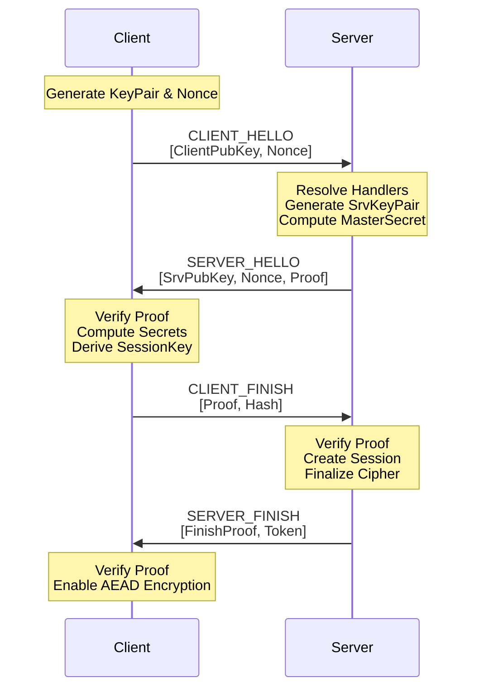

# Handshake Protocol

Nalix implements a high-security, zero-trust handshake protocol based on **X25519 (Curve25519)** Elliptic Curve Diffie-Hellman (ECDH). This protocol ensures that every session is encrypted with a unique session key that is never transmitted over the wire.

## Security Guarantees
- **Mutual Agreement**: Both client and server contribute to the final session key.
- **Perfect Forward Secrecy (PFS)**: Ephemeral keys are used for every session.
- **Identity Verification**: Supports pinned server public keys to prevent Man-in-the-Middle (MitM) attacks.
- **Transcript Integrity**: All handshake messages are hashed into a transcript to prevent tampering or replay attacks.

## The Handshake Workflow

The diagram below illustrates the communication between the **Nalix SDK** and the **Nalix Server** handlers.

## Protocol Stages

### 1. CLIENT_HELLO
The SDK initiates by sending its ephemeral public key and a cryptographically secure random nonce. No sensitive data is sent here.

### 2. SERVER_HELLO
The server responds with its own ephemeral public key and a `Proof`. The proof is a HMAC computed over the handshake transcript using the derived master secret, proving the server possesses the corresponding private key without revealing it.

### 3. CLIENT_FINISH
The SDK validates the server's proof. If valid, it computes its own `ClientProof` and sends it back. This confirms to the server that the client has successfully derived the same shared secret.

### 4. SERVER_FINISH
Final confirmation. The server sends a `SessionToken` which the client can use later for [Session Resumption](./session-resume.md). The connection is now fully encrypted using the derived session key.

## Implementation Details
- **Encryption**: Once established, all subsequent packets use **ChaCha20-Poly1305** AEAD.
- **Key Rotation**: Session keys are only valid for the duration of the physical connection or until a session resume occurs.

## Related Topics
- [Session Resumption](./session-resume.md)
- [Encryption Model](./encryption-model.md)
- [Zero-Allocation Hot Path](../foundations/zero-allocation.md)
