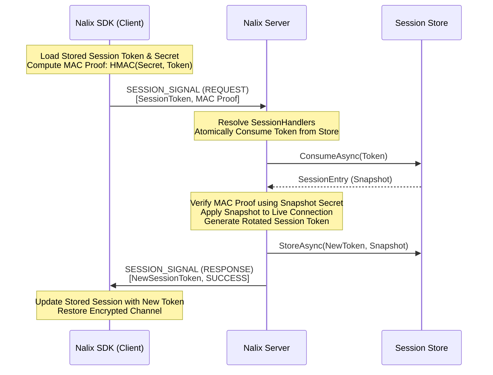

# Session Resumption

Session Resumption is a high-performance protocol in Nalix that allows clients to reconnect and restore their previous state without performing a full [X25519 Handshake](./handshake-protocol.md). This is critical for mobile applications where network switching (e.g., Wi-Fi to 5G) or brief disconnections are common.

## Key Features
- **Fast Reconnection**: Resumption happens in a single request-response cycle.
- **State Persistence**: Restores authentication level, permissions, and custom connection attributes.
- **Token Rotation**: Every successful resume generates a new, single-use session token to prevent "replay" or "hijacking" attacks.
- **Zero-Trust Validation**: Uses HMAC-based proof-of-possession to verify the client owns the session secret.

## The Resume Workflow

The following diagram illustrates how the **Nalix SDK** uses a stored token to resume a session on the **Nalix Server**.

## Atomic Token Consumption
To prevent **Race Conditions** and **Double-Resume** attacks, Nalix uses "Atomic Consumption". When a resume request arrives:
1.  The server attempts to remove the token from the `ISessionStore` immediately.
2.  If the token was already used or doesn't exist, the request is rejected instantly.
3.  This ensures that a stolen token cannot be used twice, even if two requests arrive at the same millisecond.

## Rotation and Security
The `SessionToken` is a "moving target". After a successful resumption:
-   The old token is invalidated.
-   A new token is issued to the client.
-   The secret (derived during the original handshake) remains the same, maintaining the secure entropy for the encryption layer.

## Implementation Guide
By default, the Nalix Hosting model handles session resumption automatically. However, you can control the behavior by implementing a custom `ISessionStore` (e.g., using Redis for distributed clusters).

## Related Topics
- [Handshake Protocol](./handshake-protocol.md)
- [Network Model](../../foundations/network-model.md)
- [Session Store APIs](../../../api/network/session-store.md)
