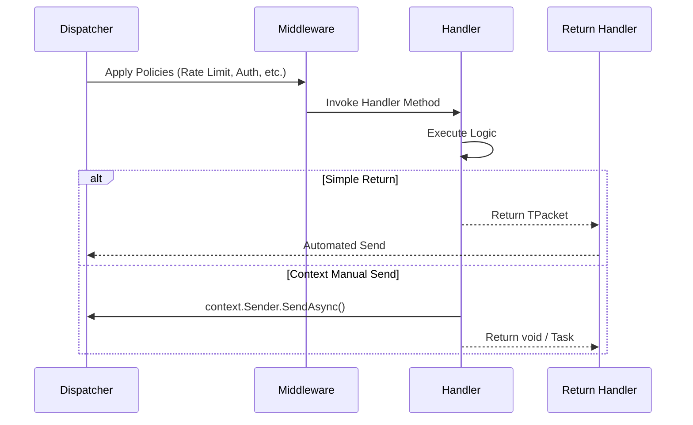

# Implementing Packet Handlers

Packet Handlers are the primary extension point for application logic in Nalix. They process incoming `IPacket` messages and decide how to respond to the client.

## 1. Core Pattern

A Nalix handler is a simple class annotated with `[PacketController]`. Methods within that class annotated with `[PacketOpcode]` are registered as individual packet handlers.

### Basic Pattern (Single Response)

Use this pattern for standard request/reply flows where the handler returns exactly one response.

```csharp
using System.Threading.Tasks;
using Contracts; // Contains PingRequest and PingResponse
using Nalix.Common.Abstractions;
using Nalix.Common.Networking;
using Nalix.Common.Networking.Packets;

namespace MyServer.Handlers;

[PacketController("CoreLogic")]
public sealed class GameHandlers
{
    [PacketOpcode(PingRequest.OpCodeValue)]
    public ValueTask<PingResponse> HandlePing(IPacketContext<PingRequest> context)
    {
        // Simple return results in an automatic reply send
        return ValueTask.FromResult(new PingResponse 
        { 
            Message = $"Pong: {context.Packet.Message}" 
        });
    }
}
```

### Advanced Pattern (Multiple Replies / Manual Control)

Use this pattern when you need to send multiple replies, push to other connections, or manage complex async workflows.

```csharp
using System.Threading.Tasks;
using Contracts;
using Nalix.Common.Networking.Packets;

namespace MyServer.Handlers;

[PacketController("AdvancedLogic")]
public sealed class ChatHandlers
{
    [PacketOpcode(ChatMessage.OpCodeValue)]
    public async ValueTask HandleBroadcast(IPacketContext<ChatMessage> context)
    {
        ChatMessage incoming = context.Packet;
        
        // 1. Send an immediate acknowledgement
        await context.Sender.SendAsync(new ChatAck { IsReceived = true });
        
        // 2. Perform side effects (e.g. broadcast to other players)
        // Global broadcast logic would use the IConnectionHub here
    }
}
```

---

## 2. Error Handling

Handlers should gracefully handle failures within the execution block. While the Nalix dispatcher catches unhandled exceptions to prevent worker crashes, you should provide meaningful protocol feedback.

```csharp
using System;
using System.Threading.Tasks;
using Nalix.Common.Networking.Packets;
using Nalix.Common.Networking.Protocols;

[PacketOpcode(0x2001)]
public async ValueTask HandleSecureAction(IPacketContext<SecureAction> context)
{
    try 
    {
        await ProcessSecureData(context.Packet);
    }
    catch (UnauthorizedAccessException ex)
    {
        // Log the error
        // Rejects the request with a protocol reason
        context.Connection.Disconnect(ProtocolReason.UNAUTHORIZED);
    }
    catch (Exception ex)
    {
        // General failure
        context.Connection.Disconnect(ProtocolReason.INTERNAL_ERROR);
    }
}
```

---

## 3. Handler Attributes

Attributes declare **policy** at registration time. The runtime uses this metadata to apply middleware before your handler even runs.

| Attribute | Purpose | When to use |
| :--- | :--- | :--- |
| `[PacketOpcode]` | Maps the method to a specific packet ID. | **Required** for all handlers. |
| `[PacketPermission]` | Restricts access by `PermissionLevel`. | Public-facing or sensitive logic. |
| `[PacketRateLimit]` | Applies per-connection throttling. | Protecting high-cost operations. |
| `[PacketEncryption]` | Requires the packet to be encrypted. | GDPR/Security sensitive data. |
| `[PacketTransport]` | Sets preferred protocol (TCP/UDP). | High-concurrency or low-latency logic. |

---

## 4. Registration Deep Dive

Handlers and Middlewares must be registered with the `NetworkApplicationBuilder` during startup to be active in the runtime.

### Fluent Registration (Hosted Server)

This is the recommended path for most applications. It provides automatic instance management and dependency injection.

```csharp
using Nalix.Network.Hosting;
using Nalix.Runtime.Dispatching;
using Nalix.Common.Networking.Packets;

var app = NetworkApplication.CreateBuilder()
    // 1. Register Handlers
    .AddHandlers<MyGameMarker>() // Scans entire assembly
    .AddHandler<ChatHandlers>()  // Explicit registration
    
    // 2. Register Middleware
    .ConfigureDispatch(options => 
    {
        // Buffer Pipeline (Pre-deserialization)
        options.WithBufferMiddleware(new EncryptionMiddleware());
        
        // Packet Pipeline (Post-deserialization)
        options.WithMiddleware(new AuditMiddleware(logger));
        options.WithMiddleware(new RateLimitMiddleware());
    })
    .Build();
```

### Manual Registration (Library/SDK)

If you are building a custom runtime or using the `PacketDispatchChannel` directly, use the specialized options:

```csharp
using Nalix.Runtime.Dispatching;
using Nalix.Common.Networking;
using Nalix.Common.Networking.Packets;

var channel = new PacketDispatchChannel(options =>
{
    // Manually bind the handler factory
    options.WithHandler(() => new ChatHandlers());

    // Manual middleware setup
    options.WithMiddleware(new AuditMiddleware(logger));
});
```

---

---

## 5. Execution Lifecycle



## Best Practices

- **Avoid blocking threads**: Always use `ValueTask` or `Task` for async I/O.
- **Statelessness**: Prefer stateless handlers to allow the dispatcher to reuse controller instances efficiently.
- **Opcode Management**: Keep opcodes defined as `const ushort` in your shared Contract project.
- **Namespace Consistency**: Always include `Nalix.Common.Networking.Packets` to resolve context types.
