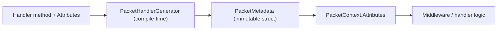

# Custom Metadata Providers

!!! danger "Deprecated"
    The runtime metadata provider extensibility model (`IPacketMetadataProvider`,
    `PacketMetadataBuilder`, `PacketMetadataProviders`) has been removed. Handler
    metadata is now resolved at **compile time** by the `PacketHandlerGenerator` source
    generator. The guide below explains the current approach.

## Current Model: Source-Generated Metadata

Nalix resolves handler metadata (opcode, timeout, permission, encryption, rate limit,
concurrency limit, transport preference) at compile time using the `PacketHandlerGenerator`
source generator. The generator reads the attributes on your handler methods and produces a
`PacketMetadata` struct directly — no runtime builder or provider registration is needed.

### How it works

1. You annotate handler methods with built-in attributes (`[PacketOpcode]`,
   `[PacketPermission]`, `[PacketEncryption]`, etc.).
2. The `PacketHandlerGenerator` scans all `[PacketHandler]` classes at compile time.
3. For each handler method, the generator emits code that constructs a `PacketMetadata`
   instance from the declared attributes.
4. At runtime, `PacketHandlerRegistry` registers the generated handlers without reflection.

### Using custom attributes with middleware

You can still define custom attributes and read them from middleware via
`PacketContext.Attributes.GetCustomAttribute<T>()`. The `PacketMetadata` struct stores
custom attributes in its `CustomAttributes` dictionary.

```csharp
[AttributeUsage(AttributeTargets.Method, AllowMultiple = false)]
public sealed class PacketTenantAttribute : Attribute
{
    public string Tenant { get; }

    public PacketTenantAttribute(string tenant) => Tenant = tenant;
}
```

Apply the attribute on a handler method:

```csharp
[PacketHandler("SampleInvoiceHandlers")]
public sealed class SampleInvoiceHandlers
{
    [PacketOpcode(0x2201)]
    [PacketTenant("billing")]
    public ValueTask<string> GetInvoice(IPacketContext<InvoicePacket> request)
        => ValueTask.FromResult("invoice");
}
```

Read the custom attribute in middleware:

```csharp
[MiddlewareOrder(-10)]
[MiddlewareStage(MiddlewareStage.Inbound)]
public sealed class TenantGuardMiddleware<TPacket> : IPacketMiddleware<TPacket>
    where TPacket : IPacket
{
    public async ValueTask InvokeAsync(
        IPacketContext<TPacket> context,
        Func<CancellationToken, ValueTask> next)
    {
        PacketTenantAttribute? tenant =
            context.Attributes.GetCustomAttribute<PacketTenantAttribute>();

        if (tenant is null)
        {
            await next(context.CancellationToken);
            return;
        }

        // Replace with your own tenant resolution logic
        bool allowed = context.Connection.Level >= PermissionLevel.USER;

        if (!allowed)
        {
            using var lease = PacketFactory<Directive>.Acquire();
            lease.Value.Initialize(
                ControlType.FAIL,
                ProtocolReason.UNAUTHORIZED, ProtocolAdvice.REAUTHENTICATE,
                sequenceId: context.Packet.Header.SequenceId);
            await context.Sender.SendAsync(lease.Value);
            return;
        }

        await next(context.CancellationToken);
    }
}
```

## Mental model



## Related pages

- [Packet Metadata API](../../api/abstractions/packet-metadata.md)
- [Custom Middleware Guide](./custom-middleware.md)
