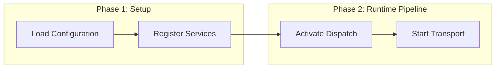

# Server Blueprint

!!! info "Learning Signals"
    - :fontawesome-solid-layer-group: **Level**: Intermediate
    - :fontawesome-solid-clock: **Time**: 15–20 minutes
    - :fontawesome-solid-book: **Prerequisites**: [Quickstart](../../quickstart.md)

This page provides the recommended architectural blueprint for a production-grade Nalix server. It moves beyond the single-file quickstart to a shape that scales as features, security policies, and diagnostic needs grow.

---

## 🏗️ Startup Architecture

A robust server follows a deterministic sequence:


```mermaid
flowchart LR
    subgraph Setup ["Phase 1: Setup"]
        direction TB
        Config["Load Configuration"]
        Reg["Register Services"]
    end

    subgraph Pipeline ["Phase 2: Runtime Pipeline"]
        direction TB
        Disp["Activate Dispatch"]
        Trans["Start Transport"]
    end

    Config --> Reg
    Reg --> Disp
    Disp --> Trans
```

!!! success "Why this blueprint?"
    Treating the server startup as a sequence of discrete layers ensures that when the socket starts accepting traffic, every security policy and reporting hook is already "warm" and ready.

---

## 📁 Recommended Directory Structure

Consistency is key for maintainability. We recommend the following layout for a Nalix server project:

```text
📂 Server/
├── 📂 Bootstrap/           # Service & Dispatch wiring
├── 📂 Protocols/           # Transport protocol definitions
├── 📂 Handlers/            # Application logic (Controllers)
├── 📂 Middleware/          # Security & Policy filters
├── 📂 Metadata/            # Custom convention providers
└── 📂 Hosting/             # Entry point & Lifecycle management
```

---

## 🚀 The Blueprint Steps

### 1. Configuration & Validation

Load and validate focused network options before starting the runtime. Fail-fast is better than a runtime error in a worker loop.

```csharp
var socket = ConfigurationManager.Instance.Get<NetworkSocketOptions>();
socket.Validate();

var dispatchOptions = ConfigurationManager.Instance.Get<DispatchOptions>();
dispatchOptions.Validate();

var connectionLimits = ConfigurationManager.Instance.Get<ConnectionLimitOptions>();
connectionLimits.Validate();
```

If you use the hosting builder, `src/Nalix.Hosting/NetworkApplicationBuilder.cs` already does this step for every `Configure<TOptions>(...)` registration by invoking public `Validate()` when the option type exposes it.

### 2. Registry Initialization

The `PacketRegistry` must be built once at startup. This freezes the catalog of discovered packets (via source generators) and prepares it for high-performance deserialization.

```csharp
using Nalix.Codec.DataFrames;

// Initialize the global registry
PacketRegistry.Configure(poolManager); // Optional: enable pooling
PacketRegistry.Build(); // Freeze the catalog
```

The hosting builder performs this step automatically during `app.Build()`.

### 3. Dispatch & Middleware Setup

Define your application pipeline in a centralized location.

```csharp
PacketDispatchChannel dispatch = new(options =>
{
    options.WithLogging(logger)
           .WithErrorHandling((ex, opcode) => logger.Error($"dispatch 0x{opcode:X4}", ex))
           .WithMiddleware(new AuthMiddleware())
           .WithMiddleware(new AuditMiddleware())
           .WithHandler(() => new AccountHandlers())
           .WithHandler(() => new MatchHandlers());
});
```

!!! tip "Centralized Wiring"
    Keep all `WithMiddleware` and `WithHandler` calls in a single bootstrap class. Spreading these across the codebase makes startup order nearly impossible to debug.

### 4. Protocol Implementation

Keep your protocol thin. It should strictly act as the bridge between raw frames and clean messages.

```csharp
public sealed class ServerProtocol : Protocol
{
    private readonly PacketDispatchChannel _dispatch;

    public ServerProtocol(PacketDispatchChannel dispatch)
    {
        _dispatch = dispatch;
        this.IsAccepting = true;
    }

    public override void ProcessMessage(object? sender, IConnectEventArgs args)
        => _dispatch.HandlePacket(args.Lease, args.Connection);
}
```

That shape matches `src/Nalix.Hosting/DefaultProtocol.cs`, which is the built-in implementation used when you do not need custom protocol hooks.

---

## ⚡ Lifecycle Management

Managing the **Activation** and **Shutdown** order is critical for preventing connection "dangling."

| phase | Action | Detail |
| --- | --- | --- |
| **Startup** | `dispatch.Activate()` | Warm up the dispatch pipeline before listeners begin accepting traffic. |
| **Startup** | `listener.Activate()` | Open the socket and begin accepting. |
| **Shutdown** | `listener.Deactivate()` + `Dispose()` | Stop accepting and release transport resources first. |
| **Shutdown** | `protocol.Dispose()` | Dispose protocols after listeners stop. |
| **Shutdown** | `dispatch.Deactivate()` | Stop the dispatch pipeline after listeners. |

This order comes directly from `src/Nalix.Hosting/NetworkApplication.cs`, where `ActivateAsync()` prepares callbacks, activates dispatch, then starts listeners; `DeactivateAsync()` reverses that order and finally waits for `ITaskManager.WaitGroupAsync("net/*")` and `"time/*"`.

---

## 📊 Diagnostics Surface

A production-ready blueprint always includes a way to query the internal health.

- `listener.GenerateReport()` - Listener-side transport state and counters.
- `protocol.GenerateReport()` - Protocol-side counters and post-process diagnostics.
- `dispatch.GenerateReport()` - Dispatch runtime state.

!!! info "Pro-Tip"
    Even if you don't have an Admin API, ensure your logs occasionally output these reports during periods of high traffic.

---

## Recommended Next Pages

- [Production Checklist](../deployment/production-checklist.md) { .md-button }
- [Custom Middleware](../extensibility/custom-middleware.md) { .md-button }
- [TCP Request/Response](../networking/tcp-patterns.md) { .md-button }
