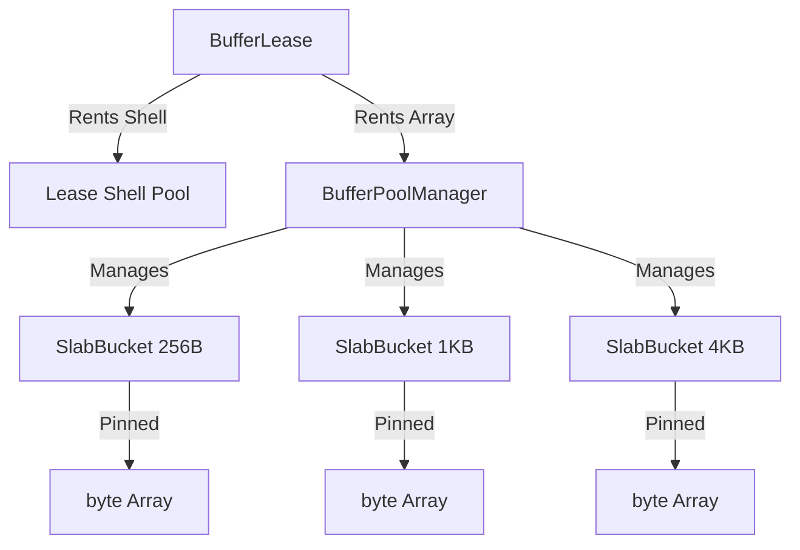

# BufferLease Utilization Guide

`BufferLease` is the cornerstone of memory management in Nalix. It provides a reference-counted, pooled abstraction over raw byte arrays, enabling zero-allocation networking pipelines.

!!! info "Learning Signals"
    - :fontawesome-solid-layer-group: **Level**: Advanced
    - :fontawesome-solid-clock: **Time**: 15 minutes
    - :fontawesome-solid-book: **Prerequisites**: [Zero-Allocation Hot Path](./zero-allocation-hot-path.md)

---

## 1. The Core Concept

In high-performance networking, the Garbage Collector (GC) is your primary bottleneck. Allocating `new byte[]` for every outgoing packet creates "heap noise" that leads to GC pauses.

Nalix solves this by using a **Pinned Slab Pool**. Instead of allocating new memory, you **rent** an existing buffer, use it, and **return** it to the pool. `BufferLease` automates this lifecycle.

### The Buffer Hierarchy



---

## 2. Constructing Outgoing Packets

To send data without allocations, follow the **Rent-Serialize-Commit-Send** pattern.

### Step-by-Step Implementation

```csharp
public async ValueTask BroadcastUpdate(IConnection connection, GameUpdate packet)
{
    // 1. RENT: Obtain a lease from the pool. 
    // This is O(1) and does not allocate on the heap.
    using var lease = BufferLease.Rent(packet.Length);

    // 2. SERIALIZE: Write directly into the full capacity of the lease.
    // lease.SpanFull gives you access to the entire rented array.
    int written = packet.Serialize(lease.SpanFull);

    // 3. COMMIT: Update the lease length to match the actual data written.
    // This ensures downstream components (compression, encryption) 
    // only process valid bytes.
    lease.CommitLength(written);

    // 4. SEND: Pass the ReadOnlyMemory<byte> to the transport.
    // The transport will transmit the data. The 'using' block 
    // ensures the buffer returns to the pool even if sending fails.
    await connection.TCP.SendAsync(lease.Memory);
}
```

---

## 3. Lifecycle & Reference Counting

`BufferLease` supports reference counting via `Retain()` and `Dispose()`.

### Retention Pattern

If you need to pass a lease to an asynchronous background task or a broadcast queue, you must call `Retain()`.

```csharp
public void HandleIncoming(IBufferLease lease)
{
    // We want to process this lease in the background
    lease.Retain(); // Increment ref count to 2
    
    _ = Task.Run(() => 
    {
        try 
        {
            ProcessLongRunning(lease.Memory);
        }
        finally 
        {
            lease.Dispose(); // Decrement ref count
        }
    });
    
    // Original lease is disposed here by the framework (ref count goes to 1)
}
```

---

## 4. Advanced: Ownership Transfer

In some scenarios, you might want to "detach" the underlying array from the lease (e.g., if you are passing it to a legacy API that manages its own memory).

```csharp
if (lease.ReleaseOwnership(out byte[]? buffer, out int start, out int length))
{
    // The lease is now 'empty' and won't return the buffer to the pool on Dispose.
    // YOU are now responsible for returning the 'buffer' to the pool manually!
    bufferPool.Return(buffer);
}
```

!!! danger "Memory Leaks"
    Releasing ownership bypasses the automatic safety of `BufferLease`. Only use this if you are implementing custom low-level infrastructure.

---

## 5. Performance Checklist

| Action | Impact | Why? |
| :--- | :--- | :--- |
| **Use `using var`** | Critical | Ensures deterministic return to the pool. |
| **Avoid `lease.Span` in `async`** | Critical | `Span<T>` cannot be used across `await` boundaries. |
| **Prefer `lease.Memory`** | High | `ReadOnlyMemory<byte>` is safe for async and zero-allocation. |
| **Match Capacity** | Medium | Renting a size close to your packet length reduces internal fragmentation. |

---

## Related Information

- [Zero-Allocation Hot Path](./zero-allocation-hot-path.md)
- [Buffer Management API Reference](../../api/framework/memory/buffer-management.md)
- [Transport Session APIs](./low-level-session-apis.md)
