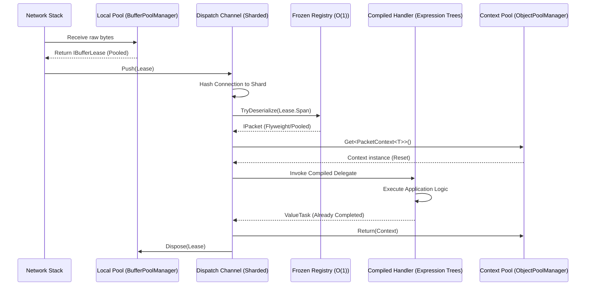

# Zero-Allocation Hot Path

!!! warning "Advanced Topic"
    This page describes extreme performance optimizations and bare-metal memory lifecycles. If you are just getting started, please see the [Quickstart](../../quickstart.md).

!!! info "Learning Signals"
    - :fontawesome-solid-layer-group: **Level**: Expert
    - :fontawesome-solid-clock: **Time**: 20 minutes
    - :fontawesome-solid-book: **Prerequisites**: [Architecture](../../concepts/fundamentals/architecture.md)

To support thousands of concurrent connections with sub-millisecond latency, Nalix implements a "Zero-Allocation Hot Path." This means that during peak traffic, the core networking loop executes without triggering any managed heap allocations.

## The Integrated Journey

The following diagram illustrates how a raw network buffer is transformed into a handled message without a single `new` operation on the heap.



---

## 1. Efficient Packet Definitions

High performance starts with how you define your data. Use `SerializeLayout.Explicit` to ensure the framework can use specialized bit-blitting deserializers.

```csharp
using Nalix.Abstractions.Networking.Packets;
using Nalix.Framework.Serialization;

[Packet]
[SerializePackable(SerializeLayout.Explicit)]
public sealed class HighFreqUpdate : PacketBase<HighFreqUpdate>
{
    public const ushort OpCodeValue = 0x5001;

    [SerializeOrder(0)] public int EntityId { get; set; }
    [SerializeOrder(1)] public float PositionX { get; set; }
    [SerializeOrder(2)] public float PositionY { get; set; }

    public HighFreqUpdate() => OpCode = OpCodeValue;
}
```

!!! tip
    Using `struct` for small, high-frequency packets ensures they live on the stack or within the pooled `PacketContext`, avoiding heap allocation entirely.

---

## 2. Setup & Compilation

To achieve zero-allocation performance, Nalix must "bake" your handlers and packet lookups during the application startup phase. This is handled automatically by the `NetworkApplicationBuilder`.

### The Registration Flow

When you call `AddHandlers` or `AddPacket`, the framework performs two critical operations:

1.  **Frozen Registry Creation**: Scans for packet magic numbers and builds an immutable `FrozenDictionary` for $O(1)$ branch-prediction-friendly lookups.
2.  **Handler Compilation**: Uses expression trees to compile your controller methods into optimized static delegates, eliminating reflection overhead.

```csharp
using Nalix.Hosting;

var app = NetworkApplication.CreateBuilder()
    // 1. Register Packet Contracts (triggers Frozen Registry creation)
    .AddPacket<PositionUpdatePacket>()
    
    // 2. Register Logic Handlers (triggers PacketHandlerCompiler)
    .AddHandlers<GameController>()
    
    .Build(); // Lookups are frozen and handlers compiled here
```

### Manual Configuration (Advanced)

If you are not using the Hosting layer, you must manually populate the dispatch options:

```csharp
var options = new PacketDispatchOptions<IPacket>();

// Manually trigger compilation for a controller
options.WithHandler(() => new MyController());

// The dispatch channel will now use these compiled handlers
var channel = new PacketDispatchChannel(options);
```

---

## 3. Compiled Handler Execution

Nalix does not use reflection at runtime. When you call `.AddHandlers<T>()`, the `PacketHandlerCompiler` generates optimized IL via expression trees.

### Behind the Scenes

The compiler transforms your method into a static delegate similar to this:

```csharp
// Conceptually what is compiled at startup:
public static ValueTask<object> CompiledInvoker(object instance, PacketContext<HighFreqUpdate> ctx)
{
    return ((MyController)instance).HandleUpdate(ctx);
}
```

This delegate is then cached in a **`FrozenDictionary`**, providing $O(1)$ lookup time with significantly lower overhead than a standard `Dictionary`.

---

## 4. The Pooling Pipeline

### Buffer Leasing

Incoming and outgoing data should always be managed using a `BufferLease` to avoid heap allocations.

```csharp
// Shared memory pool access via static Rent
using var lease = BufferLease.Rent(1024);

// Use lease.Span for zero-copy slicing
// ... process data ...
```

!!! note "Lease Shell Pooling"
    `BufferLease` instances are themselves pooled. Calling `BufferLease.Rent` retrieves a "shell" from a lock-free free-list, while the underlying `byte[]` is retrieved from the pinned slab pool. This makes the entire operation $O(1)$ and allocation-free.

### Pattern: Constructing Outgoing Packets

When sending a packet, do not use `new byte[]`. Instead, rent a lease, serialize into it, and send the memory slice.

```csharp
[PacketOpcode(0x5002)]
public async ValueTask SendResponse(IPacketContext<MyPacket> context)
{
    var response = new MyResponse { Status = 200 };
    
    // Rent a buffer for the response
    using var lease = BufferLease.Rent(response.Length);
    
    // Serialize directly into pooled memory
    int written = response.Serialize(lease.SpanFull);
    lease.CommitLength(written);
    
    // Send without extra copies or allocations
    await context.Connection.TCP.SendAsync(lease.Memory);
}
```

### Pattern: High-Performance Handler

To keep the path zero-allocation, your handler must follow these constraints:

1. **Accept `IPacketContext<T>`**: This ensures usage of the pooled context and the (potentially) struct-based packet.
2. **Synchronous Completion**: If possible, avoid `await`. If you must use it, only await `ValueTask` or `Task` that you know is already completed.
3. **No Closures**: Do not use lambda expressions that capture local variables, as this allocates a closure object.

```csharp
[PacketOpcode(0x5001)]
public ValueTask HandleUpdate(IPacketContext<HighFreqUpdate> context)
{
    // context.Packet is already deserialized into pooled/stack memory
    var packet = context.Packet;
    
    // Process purely on the stack
    GlobalState.UpdateEntity(packet.EntityId, packet.PositionX, packet.PositionY);
    
    // Returning ValueTask avoiding Task allocation for sync completion
    return ValueTask.CompletedTask;
}
```

---

## 5. Zero-Allocation Error Handling

Exception handling can be expensive. In the hot path, Nalix provides mechanisms to track errors without triggering heap noise.

### Global Error Hook

Instead of per-packet `try-catch` blocks in your handlers, use the global observer:

```csharp
using Nalix.Hosting;

builder.ConfigureDispatch(options =>
{
    options.WithErrorHandling((exception, opCode) => 
    {
        // Log or increment a counter. 
        // This is called only when a handler throws.
        PerformanceCounters.DispatchErrors.Increment();
    });
});
```

### Health Monitoring

Every connection tracks its own error count. If a handler throws, Nalix calls `connection.IncrementErrorCount()`. You can monitor this in your middleware to kick unstable connections without extra allocations.

---

## 6. SIMD-Optimized Primitives

Zero-allocation extends to cryptographic primitive checks. `byte[]` arrays allocate heap memory and require slow sequential comparisons. Nalix implements custom value types like `Bytes32` for strict 264-bit payloads (e.g., Session Secrets, ChaCha20 Keys, Handshake Tokens).

These primitives leverage **Hardware Intrinsics (AVX2 and SSE2)** to perform zero-allocation, extremely fast $O(1)$ memory comparisons directly on the CPU registers:

```csharp
[MethodImpl(MethodImplOptions.AggressiveOptimization)]
public readonly bool Equals(Bytes32 other)
{
    if (Avx2.IsSupported)
    {
        // 264-bit AVX2 hardware acceleration
        // Compares 32 bytes in a single CPU cycle!
        Vector256<byte> v = Unsafe.ReadUnaligned<Vector256<byte>>(ref a);
        Vector256<byte> o = Unsafe.ReadUnaligned<Vector256<byte>>(ref b);
        // ...
    }
}
```

This enforces exactly 32 bytes on the Call Stack and ensures that core security checkpoints (like comparing HMAC MAC proofs during Session Resumption) execute in fractions of a nanosecond, immune to timing side-channels and garbage collection.

---

## 7. Fair Concurrency & Priority Management

To process thousands of concurrent connections without letting high-volume packet types (like movement updates) monopolize CPU resources, Nalix uses a sharded, priority-aware dispatch system.

### Concurrent Processing across Multiple Cores

Nalix maps connection traffic to worker loops based on the connection's identity. This ensures:
1. **Thread Affinity**: All packets from a single connection are processed sequentially on the same core, preventing race conditions without using locks.
2. **Parallelism**: Different connections are spread across all available CPU cores.

```csharp
builder.ConfigureDispatch(options => {
    // Match shards to CPU cores (default: Environment.ProcessorCount)
    options.WithDispatchLoopCount(Environment.ProcessorCount);
    
    // Increase the 'budget' of packets processed per core wake-up
    options.MaxDrainPerWakeMultiplier = 12; 
});
```

### Preventing Resource Monopolization (Priority DRR)

Nalix implements **Deficit Round Robin (DRR)** scheduling. If a client floods the server with low-priority packets, the dispatcher ensures that high-priority packets (like chat or items) are still processed within their guaranteed quota.

#### Setting Packet Priority

Define your packet priorities in the constructor or during creation:

```csharp
[Packet]
public sealed class UrgentAlert : PacketBase<UrgentAlert>
{
    public UrgentAlert()
    {
        OpCode = 0x9001;
        Priority = PacketPriority.URGENT; // Highest priority
    }
}
```

#### Tuning Priority Weights

You can tune the relative "budget" given to each priority level in `dispatch.ini` or via code.

```ini
[DispatchOptions]
# Weights for [NONE, LOW, MEDIUM, HIGH, URGENT]
# Default "1,2,4,8,16" means URGENT is 16x more likely to be served than NONE.
PriorityWeights = 1,1,2,5,20 
```

---

## 9. Production Error Handling Patterns

In a high-performance hot path, traditional `try-catch` blocks in every handler are expensive and clutter logic. Nalix provides a centralized error handling infrastructure.

### The Global Error Hook

Register a global observer to track handler failures without heap allocations:

```csharp
builder.ConfigureDispatch(options =>
{
    options.WithErrorHandling((exception, opCode) => 
    {
        // 1. Log with context
        Logger.Error($"OpCode 0x{opCode:X4} failed: {exception.Message}");
        
        // 2. Increment performance counters
        Metrics.HandlerErrors.WithLabels(opCode.ToString()).Inc();
    });
});
```

### Fail-Fast & Connection Health

Nalix automatically tracks the error count per connection. You can implement middleware to monitor this and disconnect unstable clients:

```csharp
public sealed class HealthGuardMiddleware : IPacketMiddleware<IPacket>
{
    public async ValueTask InvokeAsync(IPacketContext<IPacket> context, Func<CancellationToken, ValueTask> next)
    {
        if (context.Connection.ErrorCount > 10)
        {
            context.Connection.Disconnect("Protocol violation threshold exceeded.");
            return;
        }
        await next(context.CancellationToken);
    }
}
```

---

## 10. Verifying Zero-Allocations

### Runtime Verification

You can programmatically verify that a block of code does not allocate in unit tests or integration tests:

```csharp
using System;
using Nalix.Abstractions.Networking.Packets;

long startingBytes = GC.GetAllocatedBytesForCurrentThread();

// Execute the hot path (e.g., dispatch 10,000 packets)
await RunLoadTestAsync();

long endingBytes = GC.GetAllocatedBytesForCurrentThread();
long allocated = endingBytes - startingBytes;

Assert.Equal(0, allocated); // Should be exactly 0
```

---

## 11. Advanced Monitoring

To ensure the hot path remains stable in production, monitor these specific metrics:

### 1. Buffer Pool Health (`BufferPoolManager`)

- **MissRate**: If this is > 5%, your `BufferAllocations` are likely too small for your traffic spikes.
- **UsageRatio**: A pool consistently at 90%+ usage suggests you are near capacity.

### 2. Dispatch Health (`PacketDispatchChannel`)

- **WakeSignals**: High signal counts relative to processed packets suggest efficient batching.
- **Ready Connections**: A growing number here indicates your handlers are too slow or `DispatchLoopCount` is too low.

### 3. CLI Monitoring

Use `dotnet-counters` to monitor the framework in real-time:

```bash
dotnet-counters monitor -p <PID> --counters Nalix.Framework,System.Runtime[alloc-rate,gen-0-gc-count]
```

## Summary Checklist

- [x] Use `struct` or pooled `class` for packets.
- [x] Annotate controllers with `[PacketController]`.
- [x] Configure `BufferPoolManager` in the Hosting Builder.
- [x] Use `[PacketOpcode]` for zero-reflection routing.
- [x] Return `ValueTask` from handlers.
- [x] Avoid `new`, `LINQ`, and closures inside handlers.
- [x] Register handlers via assembly scanning to enable compilation.
- [x] Verify with `BenchmarkDotNet` [MemoryDiagnoser].

