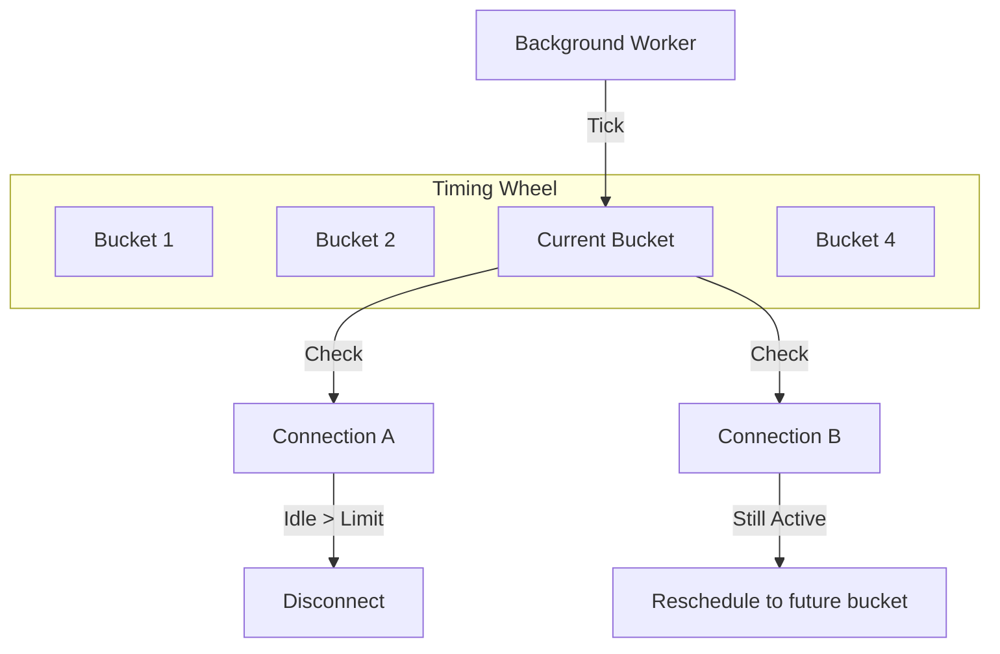

# Idle Connection Timeout

Nalix provides a built-in mechanism to automatically detect and disconnect client connections that have been inactive for a specified duration. This is critical for reclaiming resources and protecting against persistent connection exhaustion (Slowloris-style attacks).

!!! info "Learning Signals"
    - :fontawesome-solid-layer-group: **Level**: Intermediate
    - :fontawesome-solid-clock: **Time**: 10 minutes
    - :fontawesome-solid-book: **Prerequisites**: [Minimal Server](./minimal-server.md)

---

## 1. The Timing Wheel Mechanism

Instead of using a separate `Timer` for every connection (which is expensive and causes GC pressure), Nalix uses a **Hashed Timing Wheel**.

### How it Works
1. Connections are placed into "buckets" on a virtual wheel.
2. A single background worker "ticks" through these buckets at a fixed interval.
3. Only connections in the current bucket are checked for idleness.

This ensures that even with **100,000+ concurrent connections**, the CPU overhead remains constant and minimal.



---

## 2. Configuration

Idle timeout is managed via `NetworkSocketOptions` (to enable/disable) and `TimingWheelOptions` (to tune the timing).

### Method 1: Configuration Files (INI)

The framework's internal `Bootstrap` automatically loads these settings from `.ini` files in your executable directory.

**`network.ini`**
```ini
; Enable the idle timeout mechanism
EnableTimeout = true
```

**`timing.ini`**
```ini
; The duration in milliseconds before an idle connection is closed
IdleTimeoutMs = 60000

; The precision of the idle check (lower = more precise but higher CPU)
TickDuration = 1000

; Number of buckets in the wheel (higher = fewer collisions)
BucketCount = 512
```

---

## 3. Method 2: Fluent Builder (C#)

If you prefer to configure the server in code, use the `Configure<T>` methods on the `NetworkApplicationBuilder`.

```csharp
using Nalix.Hosting;
using Nalix.Network.Options;

var host = NetworkApplication.CreateBuilder()
    // Enable or disable the mechanism globally
    .Configure<NetworkSocketOptions>(options => 
    {
        options.EnableTimeout = true;
    })
    // Fine-tune the timeout duration
    .Configure<TimingWheelOptions>(options => 
    {
        options.IdleTimeoutMs = 30_000; // Disconnect after 30 seconds of silence
        options.TickDuration = 1000;    // Check once per second
    })
    .AddTcp<MyProtocol>()
    .Build();

await host.RunAsync();
```

---

## 4. Verifying Idle Disconnection

When the timing wheel disconnects a client, it emits a `Debug` or `Info` level log (depending on your logging configuration).

**Example Log Output:**
```text
[DEBUG] [NW.TimingWheel] timeout remote=192.168.1.50 idle=30005ms
[INFO]  [NW.TcpListenerBase] close=192.168.1.50
```

### Pro-Tip: TCP Keep-Alive
Idle timeout detects **application-level** silence. To detect **network-level** dead sockets (where the client crashed without closing the connection), also ensure `KeepAlive` is enabled in `NetworkSocketOptions`.

---

## Related Information

- [Timing Wheel API Reference](../../api/network/time/timing-wheel.md)
- [Network Socket Options](../../api/options/network/network-socket-options.md)
- [Production Checklist](../deployment/production-checklist.md)
