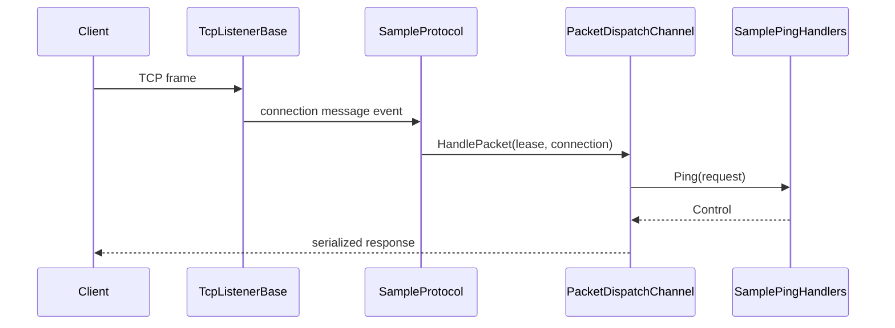

# Minimal Server Guide

!!! danger "Low-Level Implementation"
    This guide demonstrates how to manually wire the Nalix runtime **without** the `NetworkApplication` hosting builder. This is considered an advanced topic and is only recommended for specialized transport libraries or low-level performance tuning. 
    
    For 99% of applications, use the [Hosting Builder](../../quickstart.md) or [Server Boilerplate](../getting-started/server-boilerplate.md).

!!! info "Learning Signals"
    - :fontawesome-solid-layer-group: **Level**: Advanced
    - :fontawesome-solid-clock: **Time**: 10–15 minutes
    - :fontawesome-solid-book: **Prerequisites**: [Quickstart](../../quickstart.md)

The steps are:

1. Register shared services
2. Build a packet dispatcher
3. Forward messages from `Protocol` into dispatch
4. Start a `TcpListenerBase`
5. Send one request and receive one response

The sample stays intentionally small so you can copy the structure first and optimize later.

## Server

### 1. Register shared services

```csharp
InstanceManager.Instance.Register<ILogger>(logger);
InstanceManager.Instance.Register<IPacketRegistry>(packetRegistry);
```

### 2. Create handlers

```csharp
[PacketController("SamplePingHandlers")]
public sealed class SamplePingHandlers
{
    [PacketOpcode(0x1001)]
    public ValueTask<Control> Ping(IPacketContext<Control> request)
    {
        request.Packet.Type = ControlType.PONG;
        return ValueTask.FromResult(request.Packet);
    }
}
```

### 3. Build the dispatcher

```csharp
PacketDispatchChannel dispatch = new(options =>
{
    options.WithLogging(logger)
           .WithHandler(() => new SamplePingHandlers());
});

dispatch.Activate();
```

### 4. Bridge protocol to dispatch

```csharp
public sealed class SampleProtocol : Protocol
{
    private readonly PacketDispatchChannel _dispatch;

    public SampleProtocol(PacketDispatchChannel dispatch) => _dispatch = dispatch;

    public override void ProcessMessage(object? sender, IConnectEventArgs args)
        => _dispatch.HandlePacket(args.Lease, args.Connection);
}
```

### 5. Start the listener

```csharp
public sealed class SampleTcpListener : TcpListenerBase
{
    public SampleTcpListener(ushort port, IProtocol protocol, IConnectionHub hub)
        : base(port, protocol, hub) { }
}

IConnectionHub hub = new ConnectionHub();
SampleTcpListener listener = new(57206, new SampleProtocol(dispatch), hub);
listener.Activate();
```

!!! warning "Manual hub ownership"
    Current `TcpListenerBase` constructors require an `IConnectionHub`. The hosting
    builder creates and wires this dependency for you. In manual mode, create the
    hub explicitly and dispose it when your server shuts down.


The client uses the `Nalix.SDK` to connect and perform type-safe request/response operations:

```csharp
using Contracts;
using Nalix.SDK.Transport.Extensions;

// 1. Establish connection
await session.ConnectAsync();

// 2. Request/Response in one line
Control response = await session.RequestAsync<Control>(
    new Control { Type = ControlType.PING },
    options: RequestOptions.Default.WithTimeout(3_000)
);

Console.WriteLine(response.Type); // PONG
```

## Full flow



The same end-to-end structure works with a custom packet type if you replace `Control` with your own packet contract in the handler and client sample.

## What to customize next

- add middleware
- add packet attributes such as timeout, permission, or rate limit
- switch some handlers to `PacketContext<TPacket>` when you need explicit manual sending or when you are working with custom packets
- remember that the **Listener** handles raw frame transformation (Pipeline) while the **Protocol** handles pure messages via `ProcessMessage(...)`

## Recommended Next Pages

- [TCP Patterns Guide](./tcp-patterns.md)
- [Custom Middleware Guide](../extensibility/custom-middleware.md)
- [Packet Dispatch API](../../api/runtime/routing/packet-dispatch.md)
- [Quickstart Guide](../../quickstart.md)
