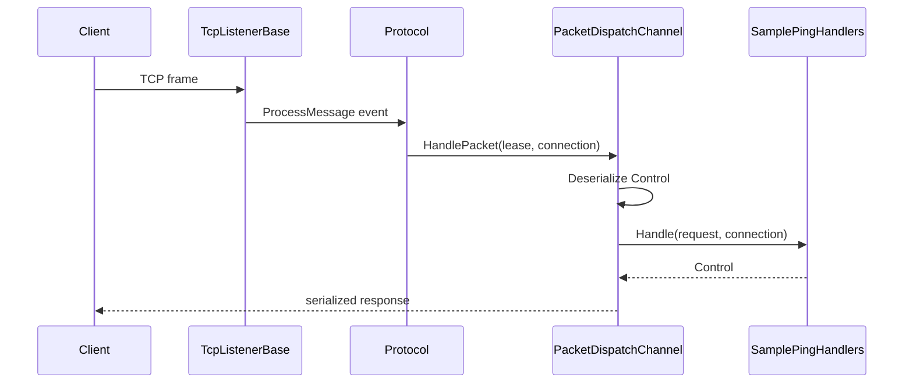

# TCP Patterns Guide

!!! danger "Low-Level Implementation"
    This guide demonstrates the manual instantiation of `TcpListenerBase` and `Protocol`. While powerful, this path bypasses the automatic feature discovery and dependency injection provided by the [Hosting Builder](../../quickstart.md).
    Use this only when embedding Nalix into existing engines or when building specialized transport layers.

!!! info "Learning Signals"
    - :fontawesome-solid-layer-group: **Level**: Advanced
    - :fontawesome-solid-clock: **Time**: 5–10 minutes
    - :fontawesome-solid-book: **Prerequisites**: [Quickstart](../../quickstart.md)

This manual flow demonstrates:

- `TcpListenerBase`
- `Protocol`
- `PacketDispatchChannel`
- a request packet
- a response returned from a handler

The goal is clarity, not production completeness.

Use it when you want one canonical TCP sample before adding middleware, metadata, or more complex client behavior.

## Scenario

Client sends a `Control` packet.

Server replies with a `Control` packet.

## Choosing Your Initialization Strategy

Before starting, you must decide how to initialize your server. Nalix provides two distinct paths:

### 1. High-Level Hosting Builder (Recommended)

Use `NetworkApplication.CreateBuilder()` to bootstrap your server.

- **When to use**: 99% of production applications.
- **Benefits**: Automatic handler discovery, Dependency Injection, built-in logging, easier middleware configuration, and support for multi-protocol listeners in a single application.

### 2. Direct Transport Listener

Manually instantiate `TcpListenerBase` and `Protocol` (as shown in the example below).

- **When to use**: Building specialized transport libraries, low-level testing, or embedding Nalix into a non-standard server architecture.
- **Benefits**: Absolute control over the listener lifecycle; zero overhead from the hosting layer.

---

## Server setup (Direct Transport Path)

### 1. Register shared services

```csharp
InstanceManager.Instance.Register<ILogger>(logger);
InstanceManager.Instance.Register<IPacketRegistry>(packetRegistry);
```

### 2. Create handler

```csharp
[PacketController("SamplePingHandlers")]
public sealed class SamplePingHandlers
{
    [PacketOpcode(0x1001)]
    public ValueTask<Control> Handle(Control request, IConnection connection)
    {
        request.Type = ControlType.PONG;
        return ValueTask.FromResult(request);
    }
}
```

### 3. Create dispatcher

```csharp
PacketDispatchChannel dispatch = new(options =>
{
    options.WithLogging(logger)
           .WithHandler(() => new SamplePingHandlers());
});

dispatch.Activate();
```

### 4. Create protocol

The `Protocol` class is the glue between the raw listener and your message dispatcher. You must implement `ProcessMessage` and can optionally override lifecycle hooks for custom error handling.

```csharp
public sealed class SampleProtocol : Protocol
{
    private readonly PacketDispatchChannel _dispatch;
    private readonly ILogger _logger;

    public SampleProtocol(PacketDispatchChannel dispatch, ILogger logger)
    {
        _dispatch = dispatch;
        _logger = logger;
    }

    /// <summary>
    /// Triggered when a raw frame has been decrypted and decompressed.
    /// This is where you route the payload to the dispatcher.
    /// </summary>
    public override void ProcessMessage(object? sender, IConnectEventArgs args)
        => _dispatch.HandlePacket(args.Lease, args.Connection);

    /// <summary>
    /// Custom hook to observe connection failures (e.g., handshake timeouts).
    /// </summary>
    protected override void OnConnectionError(IConnection connection, Exception ex)
    {
        _logger.Error($"Transport error on connection {connection.ID}: {ex.Message}");
    }

    /// <summary>
    /// Custom hook for admission control before frame processing begins.
    /// </summary>
    protected override bool ValidateConnection(IConnection connection)
    {
        // Add custom IP blacklisting or state checks here
        return base.ValidateConnection(connection);
    }
}
```

### 5. Start listener

When using the transport layer directly (outside of the Hosting builder), you must ensure that all required services are registered in the `InstanceManager`.

#### Required Dependencies (InstanceManager)

| Service | Type | Role |
| :--- | :--- | :--- |
| `ILogger` | `ILogger` | Structured logging |
| `IConnectionHub` | `IConnectionHub` | Connection tracking and batch operations |
| `TaskManager` | `TaskManager` | Background worker management |
| `TimingWheel` | `TimingWheel` | Lightweight timeout scheduling |
| `ObjectPoolManager` | `ObjectPoolManager` | Recyclable buffer/context management |

```csharp
// Setup dependencies
InstanceManager.Instance.Register<ILogger>(logger);
InstanceManager.Instance.Register<IConnectionHub>(new ConnectionHub());
InstanceManager.Instance.Register<TaskManager>(new TaskManager());

// Initialize and Activate
SampleTcpListener listener = new(57206, new SampleProtocol(dispatch, logger));
listener.Activate();
```

## Client flow

The client uses the `Nalix.SDK` to send a typed request and cleanly await the response without manual loop management:

```csharp
using Contracts;
using Nalix.SDK.Transport.Extensions;

// Orchestrated request/response in one line
Control response = await session.RequestAsync<Control>(
    new Control { Type = ControlType.PING },
    options: RequestOptions.Default.WithTimeout(3_000)
);

Console.WriteLine(response.Type); // PONG
```

## End-to-end flow



## Variant: send manually from handler

Instead of returning a response, you can send manually:

```csharp
[PacketOpcode(0x1001)]
public async ValueTask Handle(IPacketContext<Control> context, CancellationToken ct)
{
    await context.Sender.SendAsync(new Control { Type = ControlType.PONG }, ct);
}
```

Use this style when:

- you want multiple replies
- you need finer control over send timing
- you do not want to rely on return-type handling

## What clients should remember

- returning `Control` is the simplest normal request/response model
- `Protocol` just forwards messages (not raw frames) into dispatch
- the **Listener** is the bridge that handles raw transformation before calling the protocol handler
- `PacketDispatchChannel` owns middleware, deserialization, handler invocation, and result handling
- the same pattern works for custom packet types if you swap `Control` for your own packet contract

## Recommended Next Pages

- [Packet Dispatch](../../api/runtime/routing/packet-dispatch.md) — Dispatch API reference
- [Handler Return Types](../../api/runtime/routing/handler-results.md) — Supported return shapes
- [TCP Listener](../../api/network/tcp-listener.md) — Listener API reference
