# UDP Security Guide

!!! warning "Advanced Topic"
    This page deals with low-level protocol multiplexing and custom listener implementations.

!!! info "Learning Signals"
    - :fontawesome-solid-layer-group: **Level**: Advanced
    - :fontawesome-solid-clock: **Time**: 10 minutes
    - :fontawesome-solid-book: **Prerequisites**: [Client Session Initialization](./connecting-clients.md)

This guide explains the actual UDP session shape used by `UdpListenerBase` today, in a client-friendly way.

Use it when you already know you need UDP and want to understand the trust and replay rules before implementing a client.

## What the runtime expects

When `UdpListenerBase` receives a datagram, it expects the first 7 bytes to be the session token:

- session token (`Snowflake`, 7 bytes)
- payload

In source, the listener validates:

- the datagram is at least 7 bytes long
- the payload is at least the 10-byte Nalix packet header
- the packet flags include `PacketFlags.UNRELIABLE`
- the token resolves to a connection in `ConnectionHub`
- the remote endpoint still matches the connection's pinned endpoint
- the UDP replay window accepts the packet sequence
- your overridden `IsAuthenticated(...)` or hosting predicate returns `true`

## High-level flow

```mermaid
flowchart LR
    A["UDP datagram received"] --> B["Rate-limit remote IP"]
    B --> C["Read 7-byte session token prefix"]
    C --> D["Validate payload header and UDP flag"]
    D --> E["Find connection in ConnectionHub"]
    E --> F["Verify pinned endpoint"]
    F --> G["Check replay window"]
    G --> H["Call IsAuthenticated(...) or predicate"]
    H --> I["Bind UDP transport and inject payload"]
```



## Server shape

### 1. Subclass `UdpListenerBase`

```csharp
public sealed class SampleUdpListener : UdpListenerBase
{
    public SampleUdpListener(IProtocol protocol, IConnectionHub hub) : base(protocol, hub) { }

    protected override bool IsAuthenticated(IConnection connection, EndPoint remoteEndPoint, ReadOnlySpan<byte> payload)
    {
        // Add your own checks here:
        // - allowed endpoint
        // - session state
        // - region / shard ownership
        return connection.Secret is not null && connection.Secret.Length > 0;
    }
}
```

!!! tip "Preferred Modern Pattern"
    Instead of subclassing `UdpListenerBase`, use the hosting predicate before
    calling `Build()`:
    ```csharp
    using var app = NetworkApplication.CreateBuilder()
        .AddUdp<MyProtocol>((conn, ep, data) =>
            conn.Level >= PermissionLevel.USER)
        .Build();
    ```

### 2. Keep TCP and UDP tied to the same session

The UDP path assumes there is already a known connection in `ConnectionHub`.

That means a common pattern is:

1. authenticate or handshake on TCP first
2. create/populate the connection secret
3. store the session in `ConnectionHub`
4. allow UDP packets to reference that session ID

## Conceptual client packet layout

The listener currently validates these parts:

```text
[session-token][payload]
```

The token is the `Snowflake` session ID assigned to the connection after TCP login.

## Pseudocode for client-side send

```csharp
byte[] payload = BuildGamePayload();
byte[] sessionToken = connectionId.ToBytes();

byte[] datagram = Concat(sessionToken, payload);
await udp.SendAsync(datagram, serverEndPoint);
```

## Transport rules

The runtime does not add timestamp, nonce, or Poly1305 metadata to UDP datagrams.
Instead, it uses the session token plus the connection/auth state already established through TCP.

For clients, that means:

- send the 7-byte session token first
- keep the payload small enough to fit `MaxUdpDatagramSize`
- treat UDP as a fast datagram path, not a second authentication protocol

## What happens on failure

The listener records diagnostics for:

- short packets
- unknown sessions
- unauthenticated packets
- receive errors

Invalid packets are dropped before they reach your protocol logic.

## Recommended rollout

For a simple deployment:

1. establish session over TCP
2. assign/store session secret
3. return session ID to the client
4. let the client send UDP datagrams prefixed with the session token
5. verify in `IsAuthenticated(...)` that the session is ready for UDP

## Related pages

- [UDP Listener](../../api/network/udp-listener.md)
- [UDP Session](../../api/sdk/udp-session.md)
- [Connection Hub](../../api/network/connection/connection-hub.md)
- [Network Options](../../api/network/options/options.md)
