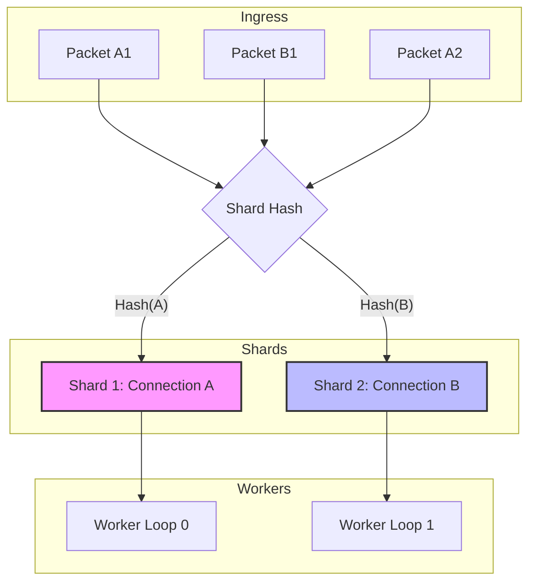

# Shard-Aware Dispatch

Nalix uses a shard-aware dispatch architecture to scale packet processing across multiple CPU cores while maintaining strict delivery order for individual connections.

## 1. The Affinity Model

A core challenge in high-performance networking is maintaining the order of packets within a session (e.g., TCP stream or UDP session) while scaling workers. Nalix solves this using **Hashed Connection Affinity**.

### How it works:
1.  When a packet arrives, the `PacketDispatchChannel` identifies the source `IConnection`.
2.  The connection is mapped to a specific internal **shard queue** based on its hash.
3.  Each shard is exclusively processed by one of the configured **Worker Loops** at any given time.
4.  This ensures that packets from Connection A never "leapfrog" each other, even if the server has 64 cores.



---

## 2. Configuring Shards

You can tune the parallelism of your application by adjusting the number of shards (worker loops) in the hosting builder.

```csharp
using Nalix.Network.Hosting;

var builder = NetworkApplication.CreateBuilder();

builder.ConfigureDispatch(options =>
{
    // Explicitly set 4 shard workers
    // Default: Math.Clamp(ProcessorCount, 1, 64)
    options.DispatchLoopCount = 4;
    
    // Performance Tuning:
    // How many packets one shard should "drain" from its queue before checking other shards.
    // Higher values increase throughput but may slightly increase tail latency for others.
    options.MaxDrainPerWakeMultiplier = 16; 
});
```

---

## 3. Advanced Interaction

### Influencing Shard Priority

While a shard processes packets sequentially, it is **Priority-Aware**. Each shard maintains multiple internal queues (Urgent, High, Normal, Low).

A custom `Protocol` can influence which queue a packet lands in by setting the **Priority Byte** in the Nalix header before hand-off:

```csharp
public override void ProcessMessage(object sender, IConnectEventArgs args)
{
    IBufferLease lease = args.Lease;
    
    // Example: Elevate priority for Handshake or Control packets
    if (IsHighPriority(lease))
    {
        // 13 is the default Priority offset in the Nalix header
        lease.Span[13] = (byte)PacketPriority.HIGH;
    }
    
    _dispatch.HandlePacket(lease, args.Connection);
}
```

### Custom Sharding Keys (Virtual Connections)

If you need to shard multiple transport connections into a single sequential worker (e.g., for multi-path clients), you can pass a **Virtual Connection** wrapper to the dispatcher.

The dispatcher hashes the connection instance, so sharing the same wrapper instance forces affinity:

```csharp
// Example: Sharding by PlayerAccountID instead of raw Socket Connection
public void RouteToPlayerShard(IConnection rawConnection, IBufferLease packet, IConnection playerShardProxy)
{
    // The dispatcher will use 'playerShardProxy' for hashing, 
    // ensuring all packets for this player hit the same worker.
    _dispatch.HandlePacket(packet, playerShardProxy);
}
```

---

## 4. Monitoring Shard Health

Use the built-in diagnostic reports to see if your shards are balanced or if specific connections are bottlenecking a shard.

```csharp
// Get a human-readable report of shard status
string report = dispatchChannel.GenerateReport();
Console.WriteLine(report);
```

The report provides:
- **Total Packets**: Total load across all shards.
- **Ready Connections**: Connections waiting for a worker to pick them up.
- **Top Connections**: Connections with the most pending work in their shard queue.

---

## Best Practices

- **Avoid Shard Blocking**: Never use `Thread.Sleep()` or long synchronous blocks in a handler. Since a worker processes one shard at a time, a blocked worker freezes all connections assigned to its shard.
- **CPU Scaling**: Aim for a `DispatchLoopCount` near your physical core count for CPU-bound logic, or higher if your handlers perform significant asynchronous waiting.
- **Batching**: Use `MaxDrainPerWake` settings to tune the "granularity" of the worker loops. Larger batches improve cache locality but can introduce jitter.
