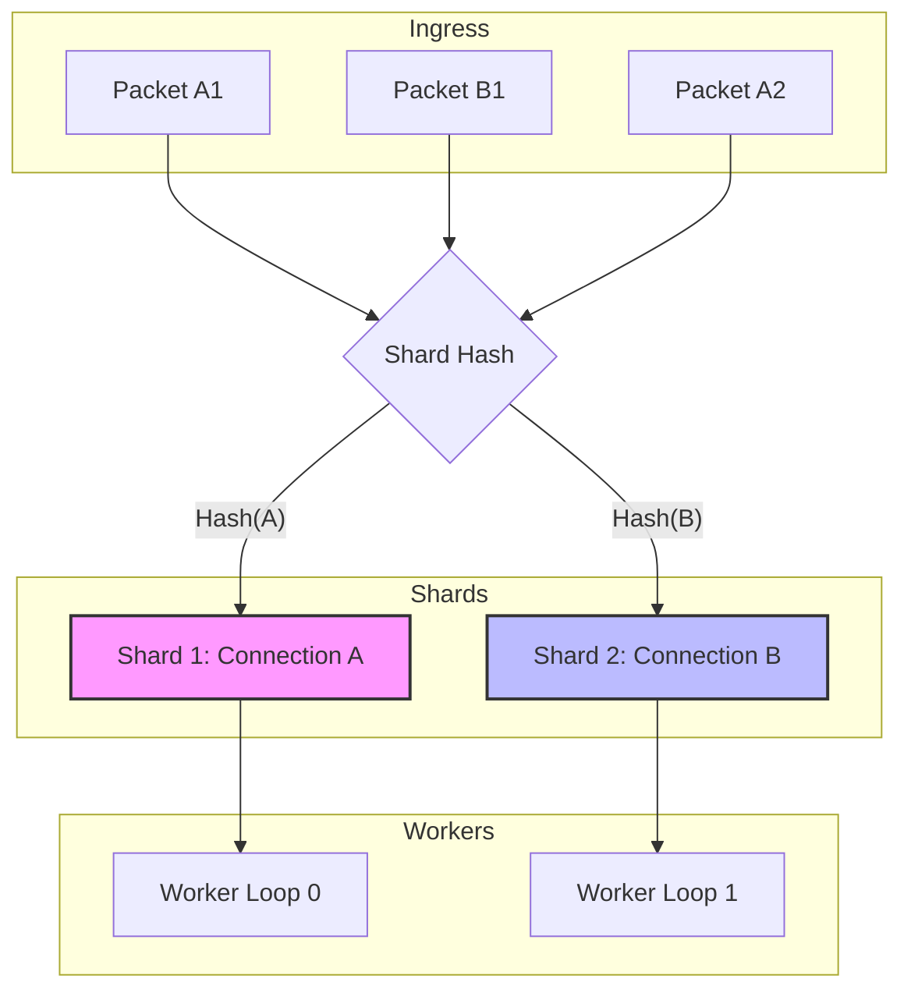

# Shard-Aware Dispatch

!!! warning "Advanced Topic"
    This page describes multi-threaded synchronization and complex parallel scaling architectures. If you are just getting started, please see the [Quickstart](../../quickstart.md).

!!! info "Learning Signals"
    - :fontawesome-solid-layer-group: **Level**: Advanced
    - :fontawesome-solid-clock: **Time**: 15 minutes
    - :fontawesome-solid-book: **Prerequisites**: [Architecture](../concepts/architecture.md)

Nalix uses a shard-aware dispatch architecture to scale packet processing across multiple CPU cores while maintaining strict delivery order for individual connections.

## 1. The Affinity Model

A core challenge in high-performance networking is maintaining the order of packets within a session (e.g., TCP stream or UDP session) while scaling workers. Nalix solves this using **Hashed Connection Affinity**.

### How it works:
1.  When a packet arrives, the `PacketDispatchChannel` identifies the source `IConnection`.
2.  The connection is mapped to a specific internal **shard queue** based on its hash.
3.  Each shard is exclusively processed by one of the configured **Worker Loops** at any given time.
4.  This ensures that packets from Connection A never "leapfrog" each other, even if the server has 64 cores.



---

## 2. Configuring Shards for Production

You can tune the parallelism of your application by adjusting the number of shards (worker loops) in the hosting builder.

### Production Optimization Checklist

| Option | Default | Tuning Strategy |
|---|---|---|
| `DispatchLoopCount` | `null` (auto) | Set explicitly for deterministic loop count, or keep auto mode. |
| `MinDispatchLoops` / `MaxDispatchLoops` | `1` / `64` | Clamp auto loop selection based on host capacity. |
| `MaxDrainPerWake` | `2,048` | Max packets a worker processes before yielding. Higher values improve cache locality. |
| `MaxDrainPerWakeMultiplier` | `8` | Multiplier applied to `DispatchLoopCount` for automatic batching. |

```csharp
using Nalix.Network.Hosting;

var builder = NetworkApplication.CreateBuilder();

builder.ConfigureDispatch(options =>
{
    // 1. Core Affinity: Match physical cores to avoid context switching
    options.WithDispatchLoopCount(Environment.ProcessorCount / 2);
    
    // 2. Auto-mode guardrails (used only when DispatchLoopCount is null)
    options.MinDispatchLoops = 2;
    options.MaxDispatchLoops = 32;
    
    // 3. Throughput Tuning: Process 16 packets per wake to improve cache locality
    options.MaxDrainPerWakeMultiplier = 16; 
});
```

---

## 3. Advanced Interaction

### Influencing Shard Priority

While a shard processes packets sequentially, it is **Priority-Aware**. Each shard maintains multiple internal queues (Urgent, High, Normal, Low).

A custom `Protocol` can influence which queue a packet lands in by setting the **Priority Byte** in the Nalix header before hand-off:

```csharp
using Nalix.Common.Networking;
using Nalix.Common.Networking.Packets;
using Nalix.Framework.Memory.Buffers;

public override void ProcessMessage(object sender, IConnectEventArgs args)
{
    IBufferLease lease = args.Lease;
    
    // Example: Elevate priority for Handshake or Control packets
    if (IsHighPriority(lease))
    {
        // 13 is the default Priority offset in the Nalix header
        lease.Span[13] = (byte)PacketPriority.HIGH;
    }
    
    _dispatch.HandlePacket(lease, args.Connection);
}
```

### Custom Sharding Keys (Virtual Connections)

In a typical scenario, packets are sharded by their underlying socket connection. However, you can force multiple physical sessions into the same sequential shard by wrapping them in a **Shard Proxy**.

#### Production Scenario: User-Based Affinity
If a player logs in from multiple devices (e.g., Phone and Tablet), and you need to ensure their state is updated sequentially across all devices, shard them by `UserID` instead of `ConnectionID`.

```csharp
using Nalix.Common.Networking;
using Nalix.Framework.Memory.Buffers;

public sealed class UserShardProxy : IConnection
{
    public long UserID { get; }
    
    // The dispatcher uses GetHashCode() for shard selection
    public override int GetHashCode() => UserID.GetHashCode();
    public override bool Equals(object obj) => obj is UserShardProxy other && other.UserID == UserID;

    // Delegate other members (Disconnect, Secret, etc.) to the primary active connection
}

// In your Protocol or Middleware:
public void RouteToUserShard(IConnection rawConnection, IBufferLease packet)
{
    // Retrieve the shared proxy instance for this user
    var proxy = SessionManager.GetProxy(rawConnection);
    _dispatch.HandlePacket(packet, proxy);
}
```

---

## 4. Error Handling & Backpressure

A robust production setup must handle dispatch failures and per-packet exceptions gracefully.

### Global Error Hook
Register a global observer to capture exceptions that escape handler logic before they trigger a protocol-level failure:

```csharp
using Nalix.Network.Hosting;
using Nalix.Common.Networking.Packets;

builder.ConfigureDispatch(options =>
{
    options.WithErrorHandling((exception, opCode) => 
    {
        Log.Error($"Dispatch failed for OpCode 0x{opCode:X4}: {exception.Message}");
    });
});
```

### Backpressure with DispatchOptions + DropPolicy
Per-connection queue backpressure is controlled by `DispatchOptions` (`MaxPerConnectionQueue` + `DropPolicy`):

- **DropNewest**: Rejects the incoming packet. Safest for real-time latency.
- **DropOldest**: Removes the head of the queue to make room. Ensures data freshness.
- **Block**: Stalls the calling thread (usually the protocol reader). Highest reliability, but can lead to socket timeouts if handlers are slow.

> [!WARNING]
> Use `DropPolicy.Block` with caution. If a background worker stalls, it can trigger a backpressure ripple that eventually blocks the TCP accept loop.

---

## 5. Monitoring Shard Health

Use the built-in diagnostic reports to identify hotspots or imbalanced shards.

```csharp
// Get a human-readable report of shard status
string report = dispatchChannel.GenerateReport();
Console.WriteLine(report);
```

The report provides:
- **Total Packets**: Total load across all shards.
- **Ready Connections**: Connections waiting for a worker to pick them up.
- **Top Connections**: Connections with the most pending work in their shard queue.

---

## Best Practices

- **Avoid Shard Blocking**: Never use `Thread.Sleep()` or long synchronous blocks in a handler. Since a worker processes one shard at a time, a blocked worker freezes all connections assigned to its shard.
- **CPU Scaling**: Aim for a `DispatchLoopCount` near your physical core count for CPU-bound logic.
- **Batching**: Use `MaxDrainPerWake` settings to tune the "granularity" of the worker loops. Larger batches improve cache locality but can introduce jitter.
