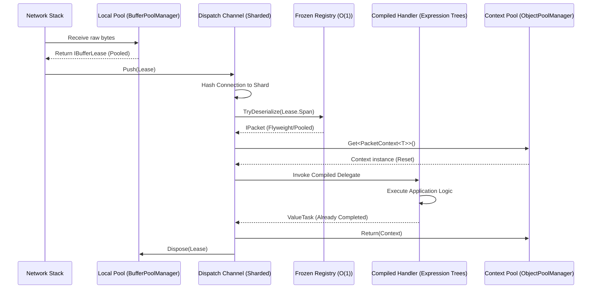

# Zero-Allocation Hot Path

To support thousands of concurrent connections with sub-millisecond latency, Nalix implements a "Zero-Allocation Hot Path." This means that during peak traffic, the core networking loop executes without triggering any managed heap allocations.

## The Integrated Journey

The following diagram illustrates how a raw network buffer is transformed into a handled message without a single `new` operation on the heap.



---

## 1. Efficient Packet Definitions

High performance starts with how you define your data. Use `SerializeLayout.Explicit` to ensure the framework can use specialized bit-blitting deserializers.

```csharp
using Nalix.Common.Networking.Packets;

[Packet(OpCodeValue)]
[SerializePackable(SerializeLayout.Explicit)]
public struct HighFreqUpdate : IPacket<HighFreqUpdate>
{
    public const ushort OpCodeValue = 0x5001;

    [SerializeMember(0)] public int EntityId;
    [SerializeMember(4)] public float PositionX;
    [SerializeMember(8)] public float PositionY;

    public ushort OpCode => OpCodeValue;
}
```

> [!TIP]
> Using `struct` for small, high-frequency packets ensures they live on the stack or within the pooled `PacketContext`, avoiding heap allocation entirely.

---

## 2. Compiled Handler Execution

Nalix does not use reflection at runtime. When you call `.AddHandlers<T>()`, the `PacketHandlerCompiler` generates optimized IL via expression trees.

### Behind the Scenes:
The compiler transforms your method into a static delegate similar to this:

```csharp
// Conceptually what is compiled at startup:
public static ValueTask<object> CompiledInvoker(object instance, PacketContext<HighFreqUpdate> ctx)
{
    return ((MyController)instance).HandleUpdate(ctx);
}
```

This delegate is then cached in a **`FrozenDictionary`**, providing $O(1)$ lookup time with significantly lower overhead than a standard `Dictionary`.

---

## 3. The Pooling Pipeline

### Buffer Leasing
Incoming data is always stored in a `BufferLease`.
```csharp
// Shared memory pool access
using var lease = bufferPool.Lease(1024);
// Use lease.Span for zero-copy slicing
```

### Context Reuse
The `PacketContext<T>` tracks a request's lifetime. Instead of allocating a new context per packet, Nalix fetches them from the `ObjectPoolManager`.

```csharp
[PacketOpcode(0x5001)]
public ValueTask HandleUpdate(IPacketContext<HighFreqUpdate> context)
{
    // context.Packet is already deserialized into the pooled/stack memory
    Process(context.Packet.EntityId);
    
    // Returning ValueTask avoids Task allocation if the method completes synchronously
    return ValueTask.CompletedTask;
}
```

---

## 4. Operational Setup

To enable this optimized path, ensure your hosting configuration is tuned for concurrency.

```csharp
var app = NetworkApplication.CreateBuilder()
    .AddHandlers<GameMarker>() // Triggers handler compilation
    .ConfigureDispatch(options => {
        // Match shards to CPU cores for maximum affinity
        options.DispatchLoopCount = Environment.ProcessorCount;
        // Pre-allocate the internal queue to handle bursts without blocking
        options.MaxInternalQueueSize = 250_000;
    })
    .Build();
```

---

## Monitoring Performance

You can verify that the hot path is behaving correctly by checking the pool statistics and dispatch reports.

```csharp
// In your diagnostics loop or admin command:
var report = app.Services.Get<PacketDispatchChannel>().GenerateReport();
Console.WriteLine(report);
```

**Key Metrics to Watch:**
- **WaitSignals**: High signal counts relative to processed packets suggest efficient batching.
- **Top Connections**: If one connection owns a disproportionate amount of a shard's queue, consider increasing shard counts.
- **Buffer Pressure**: Monitor `BufferPoolManager` metrics to ensure leases are being returned promptly.

## Summary Checklist
- [x] Use `struct` or pooled `class` for packets.
- [x] Annotate controllers with `[PacketController]`.
- [x] Return `ValueTask` from handlers.
- [x] Register handlers via assembly scanning to enable compilation.
- [x] Avoid `new` and `LINQ` inside the handler method.
