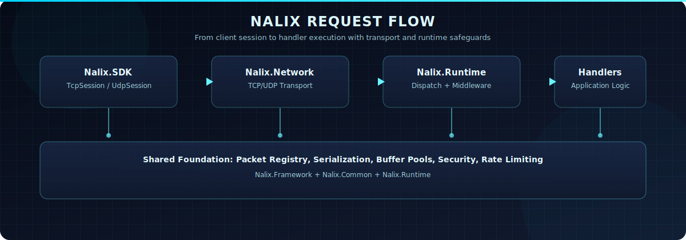
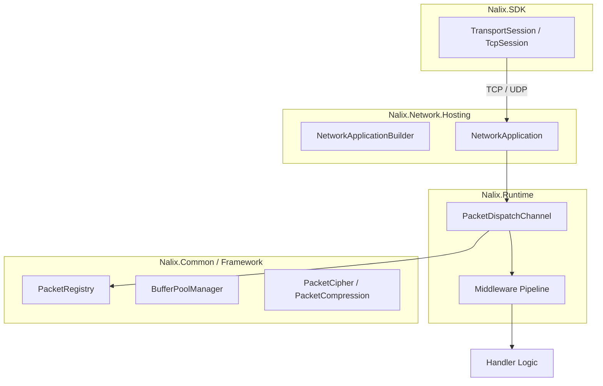

# Nalix

  

  
  
  

Nalix is a real-time TCP and UDP networking framework for .NET 10. It provides a unified packet model shared between client and server, zero-allocation hot paths, shard-aware dispatch pipelines, and middleware-driven packet processing with production-grade transport infrastructure.

---

[Get Started :material-arrow-right:](./quickstart.md){ .md-button .md-button--primary }
[View Packages](./packages/index.md){ .md-button }

---

## What does building with Nalix look like?

A typical Nalix application involves five clean steps:

1. :fontawesome-solid-message: **Define packets**: Create shared contracts using `[Packet]` attributes.
2. :fontawesome-solid-route: **Register handlers**: Map packets to logic via fluent routing.
3. :fontawesome-solid-network-wired: **Configure transport**: Select TCP/UDP and set security policies.
4. :fontawesome-solid-server: **Run the server**: Start the host using the `NetworkApplicationBuilder`.
5. :fontawesome-solid-plug: **Connect using SDK**: Leverage the client-side session to communicate.

👉 See [Quickstart](./quickstart.md) for a full, copy-pasteable example.

---

## 🚀 Recommended Path

If you're new to Nalix, follow this path to go from zero to production-ready:

1. :fontawesome-solid-book-open: [Introduction](./introduction.md) — Understand the design philosophy and mental model.
2. :fontawesome-solid-sitemap: [Architecture](./concepts/architecture.md) — Explore the layered component system.
3. :fontawesome-solid-bolt: [Quickstart](./quickstart.md) — Build your first Ping/Pong server in minutes.
4. :fontawesome-solid-vial: [End-to-End Guide](./guides/end-to-end.md) — Move beyond basics with a full feature implementation.
5. :fontawesome-solid-shield-halved: [Middleware](./guides/middleware.md) — Learn how to secure and scale your traffic.

👉 After this, you can explore the [API Reference](./api/index.md) as needed.

---

{ .nlx-hero-img }

### :fontawesome-solid-bolt: Zero-alloc hot path
Pooled buffers, pooled contexts, and frozen lookups reduce GC pressure for sustained low-latency traffic.

### :fontawesome-solid-sitemap: Shard-aware dispatch
Worker distribution prevents head-of-line blocking and scales packet handling across logical cores.

### :fontawesome-solid-shield-halved: Fault Isolation
Handler exceptions are trapped and logged without affecting other connections or crashing the worker loops.

---

## Why Nalix

| Capability | How Nalix delivers it |
|---|---|
| **Unified packet model** | Define packet types once in a shared assembly. Both `Nalix.Network` (server) and `Nalix.SDK` (client) consume the same contracts, attributes, and serialization metadata. |
| **Zero-allocation data paths** | Pooled buffers (`BufferLease`), pooled packet contexts, frozen registry lookups (`FrozenDictionary`), and function-pointer–based deserialization eliminate GC pressure on hot paths. |
| **Shard-aware dispatch** | `PacketDispatchChannel` distributes work across multiple worker loops to prevent head-of-line blocking. Workers scale to logical CPU core count. |
| **Middleware pipeline** | Two-layer middleware system: buffer middleware for raw frame processing (decryption, decompression, validation) and packet middleware for application policy (permissions, rate limiting, timeouts). |
| **Production transport** | Built-in connection guarding, token-bucket rate limiting, policy-based throttling, concurrency gates, and timing-wheel–based idle timeout management. |

## Architecture Overview

Nalix organizes networking into four clean layers.

## Start Here

Choose the path that matches your role.

=== "Server Developer"

    1. [Introduction](./introduction.md) — Design philosophy and mental model
    2. [Installation](./installation.md) — Package selection and prerequisites
    3. [Quickstart](./quickstart.md) — Build a Ping/Pong server end-to-end
    4. [Architecture](./concepts/architecture.md) — Layered component overview
    5. [Server Blueprint](./guides/server-blueprint.md) — Production-oriented project structure

=== "Client Developer"

    1. [Introduction](./introduction.md) — Design philosophy and mental model
    2. [Installation](./installation.md) — Package selection and prerequisites
    3. [Quickstart](./quickstart.md) — Connect a client to your first server
    4. [Nalix.SDK](./packages/nalix-sdk.md) — Client transport sessions and request helpers
    5. [TCP Session](./api/sdk/tcp-session.md) — Detailed session API

=== "Middleware / Extension Author"

    1. [Choose the Right Building Block](./concepts/choose-the-right-building-block.md) — Decision guide
    2. [Middleware](./concepts/middleware.md) — Buffer vs. packet middleware
    3. [Custom Middleware Guide](./guides/custom-middleware-end-to-end.md) — End-to-end walkthrough
    4. [Custom Metadata Provider](./guides/custom-metadata-provider.md) — Convention-based metadata

=== "Contributor"

    1. [Architecture](./concepts/architecture.md) — System design and component boundaries
    2. [Packet System](./concepts/packet-system.md) — Serialization and wire format
    3. [Packet Lifecycle](./concepts/packet-lifecycle.md) — Request path from socket to handler
    4. [Error Reporting](./concepts/error-reporting.md) — Runtime and protocol signaling
    5. [Glossary](./concepts/glossary.md) — Term definitions

## Core Packages

| Package | Purpose |
|---|---|
| [**Nalix.Network**](./packages/nalix-network.md) | TCP/UDP listeners, connections, protocol logic, and transport infrastructure |
| [**Nalix.Runtime**](./packages/nalix-runtime.md) | Packet dispatch, middleware execution, handler compilation, and session resume |
| [**Nalix.SDK**](./packages/nalix-sdk.md) | Client-side transport sessions, request/response helpers, and handshake flows |
| [**Nalix.Framework**](./packages/nalix-framework.md) | Configuration, service registry, serialization, packet registry, pooling, compression, and identifiers |
| [**Nalix.Network.Hosting**](./packages/nalix-network-hosting.md) | Fluent builder and application lifecycle for server bootstrap |
| [**Nalix.Common**](./packages/nalix-common.md) | Shared contracts, packet attributes, middleware primitives, and connection abstractions |

For the full package map, see [Packages Overview](./packages/index.md).

---

*Nalix is built by [PPN Corporation](https://github.com/ppn-systems). Licensed under Apache 2.0.*
