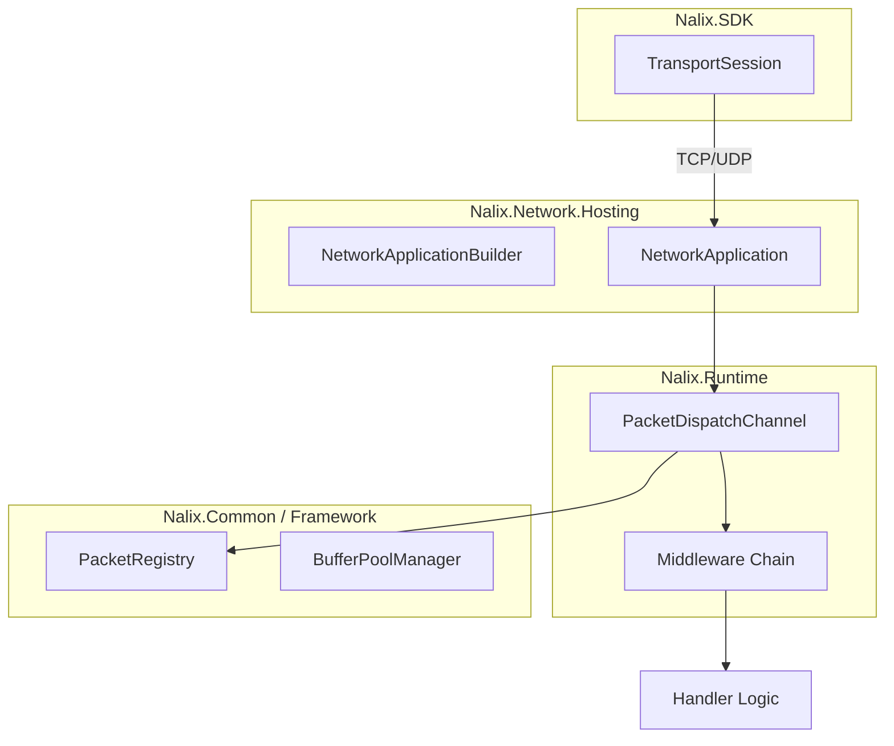

# Nalix

  

  
  
  

High-performance real-time networking stack for .NET. Build TCP and UDP systems with a shared packet model, zero-allocation data paths, and shard-aware dispatching.

---

  <a href="./quickstart" style="font-size: 20px; font-weight: bold; background-color: #00bcd4; color: white; padding: 10px 25px; text-decoration: none; border-radius: 5px;">🚀 Get Started</a>

---

## Why Nalix?

- **Unified Model**: Share packet POCOs and attributes between Server and Client.
- **Ultra Performance**: Zero-allocation hot paths, pooled buffers, and frozen lookups.
- **Shard-Aware**: Multi-worker dispatch avoids head-of-line blocking.
- **Production-Ready**: Built-in rate limiting, concurrency controls, and detailed diagnostics.

## High-Level Architecture

Nalix organizes networking into four clean layers.

## Start Here

If you are new to the project, follow this path:

1. [Introduction](./introduction.md) - The Nalix philosophy and mental model.
2. [Installation](./installation.md) - How to choose the right packages.
3. [Quickstart](./quickstart.md) - Run your first Ping/Pong end-to-end.
4. [Project Setup Guide](./guides/project-setup.md) - How to structure a multi-project solution.

## Core Packages

- **[Nalix.Network](./packages/nalix-network.md)**: Listeners, connections, and transport protocols.
- **[Nalix.Runtime](./packages/nalix-runtime.md)**: Dispatching, middleware, and handler compilation.
- **[Nalix.SDK](./packages/nalix-sdk.md)**: Client-side sessions and request/response helpers.
- **[Nalix.Framework](./packages/nalix-framework.md)**: Serialization, pooling, and identifiers.

---
*Nalix is built by [PPN Corporation](https://github.com/ppn-systems). Licensed under Apache 2.0.*
