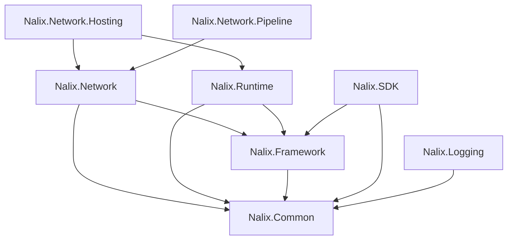

# Installation

This page explains how to select the right Nalix packages for your project and verify that your environment meets the prerequisites.

## Prerequisites

| Requirement | Minimum |
|---|---|
| **.NET SDK** | 10.0 or later ([download](https://dotnet.microsoft.com/download)) |
| **C# language version** | 14 (default with .NET 10) |
| **IDE** | Visual Studio 2026, JetBrains Rider 2025.3+, or VS Code with C# Dev Kit |

## Choose Your Package Set

Install only the packages required for your role. Every package is available on [NuGet](https://www.nuget.org/packages?q=Nalix).

### Server (hosted — recommended)

The hosted server model provides a fluent builder and managed lifecycle. This is the recommended starting point for new projects.

```bash
dotnet add package Nalix.Network.Hosting
dotnet add package Nalix.Network.Pipeline
dotnet add package Nalix.Logging
```

`Nalix.Network.Hosting` transitively references `Nalix.Network`, `Nalix.Runtime`, `Nalix.Framework`, and `Nalix.Common`.

### Server (manual wiring)

If you need full control over startup order without the hosting builder:

```bash
dotnet add package Nalix.Network
dotnet add package Nalix.Runtime
dotnet add package Nalix.Framework
dotnet add package Nalix.Common
dotnet add package Nalix.Logging
```

### Client

```bash
dotnet add package Nalix.SDK
```

`Nalix.SDK` transitively references `Nalix.Framework` and `Nalix.Common`.

### Shared contracts

If your packet definitions live in a separate assembly:

```bash
dotnet add package Nalix.Common
dotnet add package Nalix.Framework
```

### Summary

| Scenario | Packages |
|---|---|
| Hosted server | `Nalix.Network.Hosting`, `Nalix.Network.Pipeline`, `Nalix.Logging` |
| Manual server | `Nalix.Network`, `Nalix.Runtime`, `Nalix.Framework`, `Nalix.Common`, `Nalix.Logging` |
| Client | `Nalix.SDK` |
| Shared contracts | `Nalix.Common`, `Nalix.Framework` |
| Full stack | Server set + Client set, sharing one contracts assembly |

## Configuration File

Most server setups and many SDK examples load options from a `default.ini` file through `ConfigurationManager`. Create this file in your project output directory:

```ini
[NetworkSocketOptions]
Port=57206
Backlog=512

[DispatchOptions]
MaxPerConnectionQueue=4096
DropPolicy=DropNewest
BlockTimeout=00:00:01

[TransportOptions]
Address=127.0.0.1
Port=57206
ConnectTimeoutMillis=7000
MaxPacketSize=65536
```

!!! note "Dispatch loop scaling"
    Worker-loop count is configured on `PacketDispatchOptions<TPacket>` in code via `WithDispatchLoopCount(...)`.
    Use `WithDispatchLoopCount(null)` to keep auto-scaling behavior.

## Validate Options at Startup

Validate options before opening sockets or creating sessions. Invalid configuration is cheaper to catch during startup than during live traffic.

```csharp
using Nalix.Framework.Configuration;
using Nalix.Network.Options;
using Nalix.SDK.Options;

// Server
NetworkSocketOptions socket = ConfigurationManager.Instance.Get<NetworkSocketOptions>();
socket.Validate();

// Client
TransportOptions transport = ConfigurationManager.Instance.Get<TransportOptions>();
transport.Validate();
```

## Package Dependency Graph



## What to Read Next

- [Introduction](./introduction.md) — Design philosophy and mental model
- [Quickstart](./quickstart.md) — Build your first Ping/Pong service
- [Packages Overview](./packages/index.md) — What each package provides
