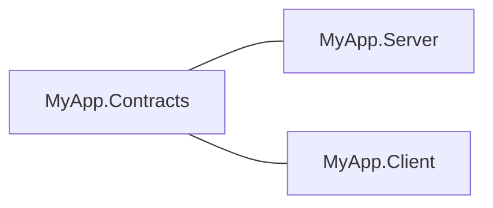

# Introduction

!!! info "Learning Signals"
    - :fontawesome-solid-layer-group: **Level**: Beginner / Intermediate
    - :fontawesome-solid-clock: **Time**: 5–10 minutes
    - :fontawesome-solid-book: **Prerequisites**: Basic C# Async Knowledge

Nalix is a modular networking framework for .NET 10 providing the high-performance transport, dispatch, and middleware infrastructure needed for real-time TCP and UDP services. It decouples the network stack into focused packages, ensuring that server code, client SDKs, and shared contracts depend only on the layers they need.

---

## 💎 Design Philosophy

Nalix is engineered around five core engineering principles.

-   :material-sync:{ .lg .middle } **Unified Model**
    ---
    Define packets once. Share binary contracts perfectly between server and client assemblies. Zero version drift.

-   :material-lightning-bolt:{ .lg .middle } **Zero-Alloc Hot Path**
    ---
    Pooled buffers and `FrozenDictionary` registry lookups eliminate GC pressure during heavy traffic spikes.

-   :material-layers-triple:{ .lg .middle } **Layered Decoupling**
    ---
    Strict separation between Transport (Socket Acceptance) and Runtime (Middleware & Logic).

-   :material-application-edit:{ .lg .middle } **Declarative Logic**
    ---
    Express policies (timeouts, permissions, limits) as C# Attributes. Cached at startup; zero reflection at runtime.

-   :material-power:{ .lg .middle } **Service Efficiency**
    ---
    Uses the optimized `InstanceManager` for allocation-free service resolution without standard DI container overhead.

---

## 🧠 The Mental Model

The journey of a Nalix packet is deterministic and clean.

> **Client** :material-arrow-right: **Transport** :material-arrow-right: **Protocol Bridge** :material-arrow-right: **Dispatch Channel** :material-arrow-right: **Middleware** :material-arrow-right: **Logic** :material-arrow-right: **Response**

### Structure Check
For any project beyond a prototype, ensure your assembly structure follows the **Contracts Pattern**:

---

## 🚫 What Nalix Is Not

::: danger "Wrong Tool for the Job"
Nalix is a specialized binary protocol engine. It is **not** suitable for:
:::

-   :octicons-x-16: **Web Applications**
    Nalix does not support HTTP/REST, WebSockets, or browser-based networking.

-   :octicons-x-16: **Game Logic Engine**
    We provide the data pipeline. Physics, ECS, and rendering stay in your engine of choice (Unity, Godot, Unreal).

-   :octicons-x-16: **Message Broker**
    Nalix is for real-time bidirectional communication, not store-and-forward persistence like Kafka or RabbitMQ.

---

## 🏗️ Reliability & Scale

!!! warning "Senior Developers Only"
    If you are building for mission-critical production environments, explore our advanced reliability models.

-   [**Failure Model**](./concepts/advanced/failure-model.md) — How we handle the unexpected.
-   [**Design Tradeoffs**](./concepts/advanced/design-tradeoffs.md) — Why performance leads.
-   [**Reliability Model**](./concepts/advanced/reliability-model.md) — High-level production confidence.

---

## 🚀 Recommended Path

1.  :material-sitemap: [**Architecture**](./concepts/architecture.md) — The big picture.
2.  :material-bolt: [**Quickstart**](./quickstart.md) — Build in 15 minutes.
3.  :material-shield-check: [**End-to-End**](./guides/end-to-end.md) — Secure implementation.

