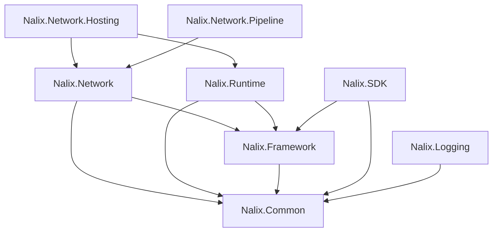

# Packages Overview

Nalix is composed of focused packages that can be used together or independently. This page provides a map of all packages, their responsibilities, and guidance on choosing the right combination.

!!! tip "Safe defaults"
    **Server:** Start with `Nalix.Network.Hosting` — it brings in the core networking and runtime.  
    **Client:** Start with `Nalix.SDK` — it includes `Nalix.Framework` and `Nalix.Common` transitively.

## Package Map

| Package | Purpose | Key Types |
|---|---|---|
| :fontawesome-solid-cube: [**Nalix.Common**](./nalix-common.md) | Shared contracts, packet attributes, middleware primitives, and connection abstractions | `IPacket`, `IConnection`, `PacketOpcodeAttribute`, `PacketControllerAttribute`, `IPacketContext<TPacket>` |
| :fontawesome-solid-box-open: [**Nalix.Framework**](./nalix-framework.md) | Configuration, service registry, serialization, packet registry, pooling, compression, and identifiers | `ConfigurationManager`, `InstanceManager`, `TaskManager`, `Snowflake`, `PacketRegistryFactory`, `PacketCipher`, `LZ4Codec` |
| :fontawesome-solid-gears: [**Nalix.Runtime**](./nalix-runtime.md) | Packet dispatch, middleware execution, handler compilation, and session resume | `PacketDispatchChannel`, `MiddlewarePipeline`, `PacketContext<TPacket>`, `PacketMetadata` |
| :fontawesome-solid-network-wired: [**Nalix.Network**](./nalix-network.md) | TCP/UDP listeners, connections, protocol bridge, session store, and connection guarding | `TcpListenerBase`, `UdpListenerBase`, `Protocol`, `ConnectionHub`, `SocketConnection` |
| :fontawesome-solid-microchip: [**Nalix.Network.Hosting**](./nalix-network-hosting.md) | Fluent server bootstrap, packet discovery, and application lifecycle | `NetworkApplication`, `INetworkApplicationBuilder`, `NetworkApplicationBuilder` |
| :fontawesome-solid-filter: [**Nalix.Network.Pipeline**](./nalix-network-pipeline.md) | Built-in packet middleware, throttling primitives, and time synchronization | `ConcurrencyGate`, `PolicyRateLimiter`, `TokenBucketLimiter`, `PermissionMiddleware`, `TimeSynchronizer` |
| :fontawesome-solid-mobile-screen: [**Nalix.SDK**](./nalix-sdk.md) | Client transport sessions, request/response correlation, handshake and resume flows | `TransportSession`, `TcpSession`, `UdpSession`, `TransportOptions`, `RequestOptions` |
| :fontawesome-solid-list-ul: [**Nalix.Logging**](./nalix-logging.md) | Structured logging with batched async sinks | `NLogix`, `NLogixOptions`, `INLogixTarget` |

## Dependency Graph

## Minimum Package Sets

| Scenario | Packages |
|---|---|
| **Hosted server** (recommended) | `Nalix.Network.Hosting`, `Nalix.Network.Pipeline`, `Nalix.Logging` |
| **Manual server** | `Nalix.Network`, `Nalix.Runtime`, `Nalix.Framework`, `Nalix.Common`, `Nalix.Logging` |
| **Client only** | `Nalix.SDK` |
| **Shared contracts** | `Nalix.Common`, `Nalix.Framework` |

## Package Detail Pages

- [Nalix.Common](./nalix-common.md)
- [Nalix.Framework](./nalix-framework.md)
- [Nalix.Runtime](./nalix-runtime.md)
- [Nalix.Network](./nalix-network.md)
- [Nalix.Network.Hosting](./nalix-network-hosting.md)
- [Nalix.Network.Pipeline](./nalix-network-pipeline.md)
- [Nalix.SDK](./nalix-sdk.md)
- [Nalix.Logging](./nalix-logging.md)
