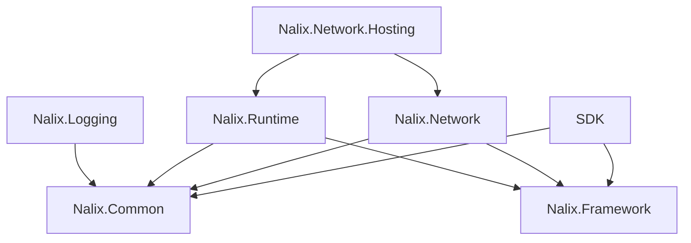

# Packages Overview

Use these packages together or separately depending on whether you are building the server, the client, or shared contracts.

!!! tip "Safe default package choice"
    If you are building a server, start with `Nalix.Network.Hosting` which brings in the core networking and runtime.
    If you are building a client, start with `Nalix.SDK`, `Nalix.Common`, and `Nalix.Framework`.

| Package | Use it for | Key types |
| --- | --- | --- |
| Nalix.SDK | Client transport sessions, request helpers, and control flows | `TransportSession`, `TcpSession`, `UdpSession`, `TransportOptions` |
| Nalix.Network | Listeners, connections, protocol flow, and connection guarding | `TcpListenerBase`, `UdpListenerBase`, `Protocol`, `ConnectionHub`, `SocketConnection` |
| Nalix.Runtime | Request dispatching, middleware execution, and handler compilation | `PacketDispatchChannel`, `MiddlewarePipeline`, `PacketContext<TPacket>`, `PacketMetadata` |
| Nalix.Network.Hosting | Fluent server bootstrap, packet discovery, and host lifecycle | `NetworkApplication`, `INetworkApplicationBuilder`, `NetworkApplicationBuilder` |
| Nalix.Network.Pipeline | Packet middleware, throttling, and time synchronization helpers | `ConcurrencyGate`, `PolicyRateLimiter`, `TokenBucketLimiter`, `TimeSynchronizer` |
| Nalix.Common | Shared abstractions, packet attributes, and networking primitives | `IPacket`, `IConnection`, `PacketOpcodeAttribute`, `PacketControllerAttribute`, `IPacketContext<TPacket>` |
| Nalix.Logging | Structured logging and targets | `NLogix`, `NLogixOptions`, `INLogixTarget` |
| Nalix.Framework | Configuration, service registry, scheduling, IDs, timing, serialization, and shared frame helpers | `ConfigurationManager`, `InstanceManager`, `TaskManager`, `Snowflake`, `Clock`, `PacketRegistryFactory`, `PacketCipher`, `PacketCompression` |
| Nalix.Analyzers | Compile-time diagnostics and code fixes | `NalixUsageAnalyzer`, `DiagnosticDescriptors` |

## Minimal wiring map

- **Client-only:** `Nalix.SDK` + `Nalix.Common` and optionally `Nalix.Framework`.
- **Server core:** `Nalix.Network` + `Nalix.Runtime` + `Nalix.Common`.
- **Hosted server (Recommended):** `Nalix.Network.Hosting`, which simplifies the composition of all server components.

## Quick example

